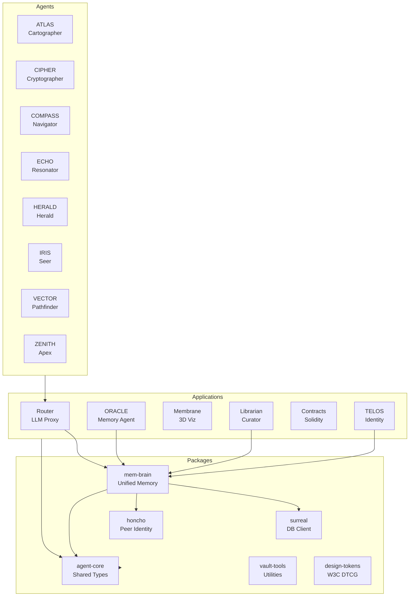
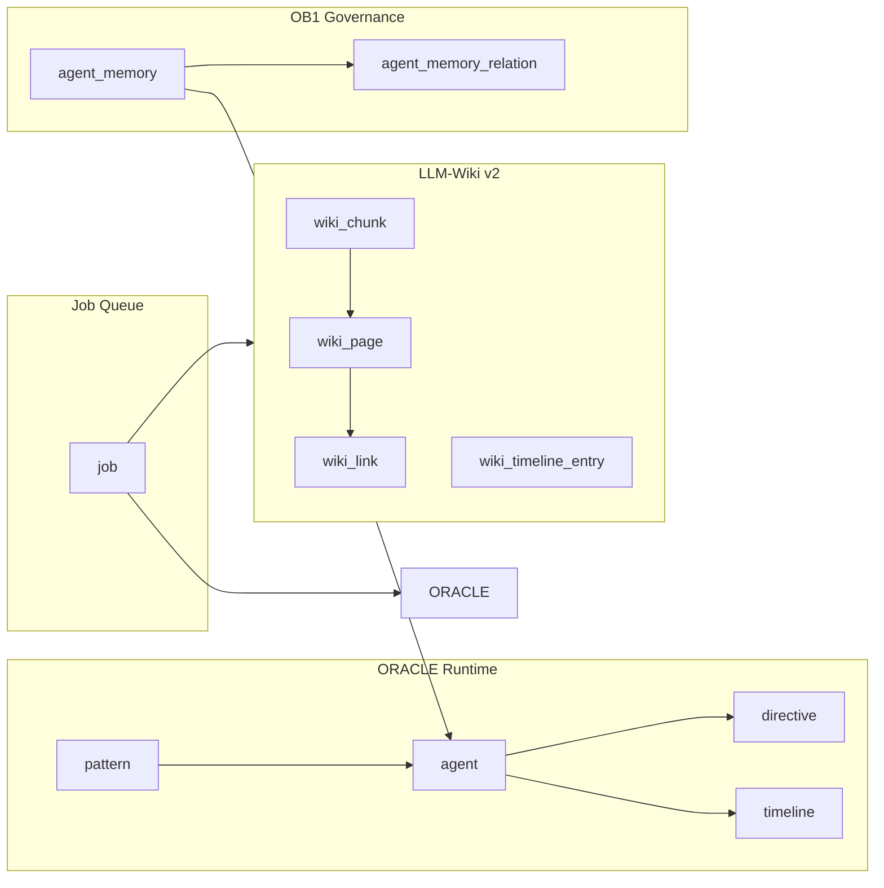

# Aigency Monorepo

> **Aigency** — Autonomous agent infrastructure with persistent memory, knowledge graphs, and crystallized wisdom.

[](https://app.codecov.io/github/AReid987/aigency-monorepo)
[](https://github.com/AReid987/aigency-monorepo/actions/workflows/coverage.yml)
[](https://github.com/AReid987/aigency-monorepo/actions/workflows/megalinter.yml)
[](https://coderabbit.ai)

---

## Architecture



### Memory Stack



---

## Packages

| Package | Description | Coverage | Tests |
|---------|-------------|----------|-------|
| [`agent-core`](./packages/agent-core) | Shared agent types, interfaces, constants |  | ✅ |
| [`mem-brain`](./packages/mem-brain) | Unified memory layer (SurrealDB + Honcho) |  | ✅ |
| [`surreal`](./packages/surreal) | SurrealDB 3.0 client, schema, LIVE queries |  | ✅ |
| [`honcho`](./packages/honcho) | Peer identity, workspaces, sessions |  | ✅ |
| [`vault-tools`](./packages/vault-tools) | Compilation, lint, flush utilities |  | ✅ |
| [`design-tokens`](./packages/design-tokens) | W3C DTCG design tokens | N/A | — |
| [`tsconfig`](./packages/tsconfig) | Shared TypeScript configurations | N/A | — |

## Applications

| App | Description | Status |
|-----|-------------|--------|
| [`router`](./apps/router) | LLM Router — OpenAI-compatible proxy with quota-aware routing | 🟢 |
| [`oracle`](./apps/oracle) | ORACLE — Persistent memory agent service | 🟢 |
| [`librarian`](./apps/librarian) | LIBRARIAN — Knowledge graph curator | 🟢 |
| [`membrane`](./apps/membrane) | Membrane — 3D knowledge graph visualization | 🟡 |
| [`telos`](./apps/telos) | TELOS — Deep context framework | 🟡 |
| [`contracts`](./apps/contracts) | Solidity smart contracts (Base L2) | 🔴 |
| [`docs`](./apps/docs) | Documentation static site | 🟢 |

---

## Development

### Prerequisites

- [Node.js](https://nodejs.org/) 20+
- [pnpm](https://pnpm.io/) 9+
- [SurrealDB](https://surrealdb.com/) 3.0+ (for mem-brain, oracle)
- [Foundry](https://getfoundry.sh/) (for contracts — optional)

### Setup

```bash
# Install dependencies
pnpm install

# Install git hooks (lefthook)
pnpm prepare

# Build all packages
pnpm build
```

### Commands

| Command | Description |
|---------|-------------|
| `pnpm dev` | Start all dev servers (Turborepo TUI) |
| `pnpm build` | Build all packages and apps |
| `pnpm test` | Run all tests |
| `pnpm test:coverage` | Run tests with coverage reports |
| `pnpm coverage:check` | Verify coverage thresholds |
| `pnpm typecheck` | Type-check all packages |
| `pnpm lint` | Lint all packages |
| `pnpm lint:fix` | Lint and auto-fix |
| `pnpm format` | Format all files with Biome |
| `pnpm autofix` | Run all auto-fixers (format + lint + imports + sort) |
| `pnpm autofix:check` | Check if autofixes are needed |
| `pnpm clean` | Clean all build artifacts |

### CodeRabbit Review

```bash
# Review uncommitted changes (default)
pnpm review

# Review staged changes only
pnpm review:staged

# Review committed changes since main
pnpm review:committed

# Review + auto-apply fixes
./scripts/automation/coderabbit-review.sh quick --autofix

# Apply fixes from latest review
./scripts/automation/apply-coderabbit-fixes.sh
```

### Coverage

Coverage is tracked per-package via [Codecov](https://app.codecov.io/github/AReid987/aigency-monorepo).

```bash
# Generate coverage reports locally
pnpm test:coverage

# Check if coverage meets thresholds
pnpm coverage:check
```

**Current targets:**

| Package | Target | Notes |
|---------|--------|-------|
| agent-core | 80% | Core types and utilities |
| mem-brain | 20% | Memory layer (complex integrations) |
| surreal | 10% | DB client wrappers |
| honcho | 10% | Peer identity client |
| vault-tools | 1% | Utility scripts |
| router | 55% | LLM proxy app |

---

## Git Hooks (Lefthook)

| Hook | Triggers |
|------|----------|
| `pre-commit` | Autofix, biome-check, biome-format-md-json, typecheck-affected |
| `pre-push` | lint, typecheck, test, coverage-check, coderabbit-review |

> **Note:** Known pre-existing failures in `apps/contracts` (requires `forge`) and `packages/design-tokens` (rootDir mismatch) may require `--no-verify` on commit until resolved.

---

## CI/CD

| Workflow | File | Trigger |
|----------|------|---------|
| Coverage | `.github/workflows/coverage.yml` | Push/PR to `main` |
| CodeRabbit Review | `.github/workflows/coderabbit.yml` | PR open/sync |
| MegaLinter | `.github/workflows/megalinter.yml` | PR to `main` |
| Automation | `.github/workflows/automation.yml` | Schedule / manual |

---

## License

MIT — see [LICENSE](./LICENSE) for details.
