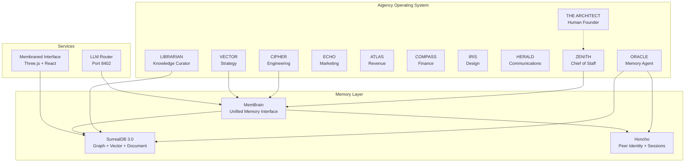

# Aigency Overview

> Aigency is a multi-agent AI operating system built as a Turborepo monorepo. It coordinates executive AI agents — each with distinct roles, identities, and substrates — around a shared memory layer (SurrealDB + Honcho) and a 3D spatial interface (Membrane).

## What Aigency Is

Aigency is the **runtime codebase** for a multi-agent AI operating system. It is not a wiki (that lives in `aigency-vault`) and not a knowledge store (that is the Mem_Brain folder). It is the executing system: TypeScript services, smart contracts, and the Membraned Interface (`CLAUDE.md:8-15`).

The system is organized around **11 registered identities**: 10 executive agents plus THE_ARCHITECT (human founder). Every agent has a callsign, color, substrate (inference runtime), and a TELOS identity document (`packages/agent-core/src/index.ts:26-38`).

## Core Philosophy

1. **Agent-native architecture** — The system is designed *for* agents, not merely *with* them. Every app and package exposes capabilities that agents consume.
2. **Memory as infrastructure** — SurrealDB provides graph + document + vector + LIVE query capabilities. Honcho provides peer identity and cross-session reasoning. Together they form Mem_Brain.
3. **Local-first inference** — MLX (M1 Pro) and Llama.cpp (Intel nodes on Tailnet) are preferred over cloud APIs. The LLM Router (`apps/router`) quota-preserves cloud calls.
4. **On-chain quality gates** — `HarvestMoon.sol` on Base L2 controls Crystal Graft minting based on vault health metrics.

## Workspace Layout

```
aigency-monorepo/
├── apps/         # Deployable services
├── packages/     # Shared libraries
├── agents/       # Agent identity manifests (agent.yaml)
└── wiki/         # This documentation
```

| Layer | Count | Purpose |
|-------|-------|---------|
| Apps | 6 | Router, Membrane, Oracle, Librarian, Contracts, TELOS |
| Packages | 7 | Agent Core, Surreal, Honcho, Mem-Brain, Design Tokens, Vault Tools, TSConfig |
| Agents | 8 | Zenith, Cipher, Vector, Echo, Atlas, Compass, Iris, Herald |

## Key Technologies

- **TypeScript 5.7** with strict mode (`packages/tsconfig/base.json:11`)
- **pnpm 9.15.4** workspaces + Turborepo 2.9.7 (`package.json:28-29`)
- **SurrealDB 3.0** — multi-model database (`CLAUDE.md:75`)
- **Honcho ^0.2.0** — peer identity / cross-session reasoning (`CLAUDE.md:76`)
- **React 18 + Three.js + @react-three/fiber** — 3D spatial UI (`apps/membrane/package.json:18-22`)
- **Foundry** — Solidity development on Base L2 (`CLAUDE.md:80`)

## System in One Diagram



## Next Steps

- [Setup Guide](./setup.md) — install dependencies and run the system
- [Quick Reference](./quick-reference.md) — commands, ports, environment variables
- [Architecture Deep Dive](../02-deep-dive/architecture.md) — how the pieces fit together
- [Agent System](../02-deep-dive/agent-system.md) — how agents are defined and routed
