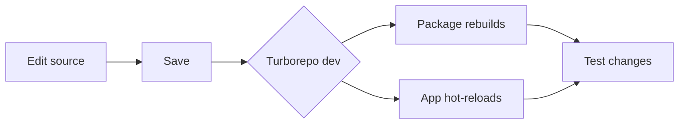

# Setup Guide

## Prerequisites

- **Node.js** >= 20 (`package.json:26`)
- **pnpm** >= 9.15.4 (`package.json:29`)
- **SurrealDB** 3.0+ (for Oracle / Mem_Brain)
- **Foundry** (for contracts — optional)

## 1. Clone and Install

```bash
cd /Users/antonioreid/CODE/00_PROJECTS/00_APPS/aigency-monorepo
pnpm install
```

This installs all workspace dependencies via pnpm workspaces (`pnpm-workspace.yaml:1-4`).

## 2. Start SurrealDB

Oracle and Mem_Brain require a running SurrealDB instance:

```bash
surreal start --user root --pass root
```

Default connection: `ws://localhost:8000/rpc` (`apps/oracle/src/index.ts:14-20`).

## 3. Build Packages

```bash
pnpm build
```

Turborepo runs the build pipeline with dependency ordering (`turbo.json:5-9`):
- Packages build first (`^build`)
- Apps build next
- Outputs go to `dist/`

## 4. Start Services

### All services (dev mode)

```bash
pnpm dev
```

### Individual services

```bash
pnpm router       # LLM Router on port 8402
pnpm membrane     # Membraned Interface (Vite dev server)
pnpm oracle       # ORACLE memory service
```

Or via filter:

```bash
pnpm --filter @aigency/router dev
pnpm --filter @aigency/oracle seed
pnpm --filter @aigency/librarian lint
```

## 5. Configure Router Providers

The router reads `apps/router/config/providers.yaml` and expects API keys via environment variables (`apps/router/src/config/index.ts:88-99`):

```bash
export PROVIDER_MISTRAL_API_KEY="your-key"
export PROVIDER_GROQ_API_KEY="your-key"
export PROVIDER_GEMINI_API_KEY="your-key"
export PROVIDER_CEREBRAS_API_KEY="your-key"
```

Providers without API keys are silently filtered out at startup (`apps/router/src/config/index.ts:99`).

## 6. Seed ORACLE

Bootstrap agent records in SurrealDB:

```bash
pnpm --filter @aigency/oracle seed
```

This inserts all 11 agents from `AGENT_REGISTRY` into the `agent` table (`apps/oracle/src/index.ts:22-38`).

## 7. Verify Installation

```bash
# Router health
curl http://localhost:8402/health

# List models
curl http://localhost:8402/v1/models

# Run tests
pnpm test
```

## Environment Variables

| Variable | Used By | Default |
|----------|---------|---------|
| `SURREAL_URL` | Oracle, Librarian | `ws://localhost:8000/rpc` |
| `SURREAL_NS` | Oracle, Librarian | `aigency` |
| `SURREAL_DB` | Oracle, Librarian | `mem_brain` |
| `SURREAL_USER` | Oracle, Librarian | `root` |
| `SURREAL_PASS` | Oracle, Librarian | `root` |
| `VAULT_ROOT` | Librarian | `../../aigency-vault` |
| `PROVIDER_*_API_KEY` | Router | — |

## Common Issues

**No providers configured**
> The router throws `No providers configured. Server cannot start.` if no provider API keys are set (`apps/router/src/server.ts:279-285`). Set at least one `PROVIDER_*_API_KEY`.

**SurrealDB connection refused**
> Ensure SurrealDB is running before starting Oracle or Librarian. The `SurrealClient.connect()` call will fail with a network error if the DB is unreachable (`packages/surreal/src/client.ts:18-29`).

**ConfigNotInitializedError**
> The router config uses a singleton pattern. `initializeConfig()` must be called before `getConfig()` (`apps/router/src/config/index.ts:65-161`). The server startup handles this automatically.

## Development Workflow



Turborepo's `dev` task has `cache: false` and `persistent: true` (`turbo.json:10-13`), so changes propagate without stale caches.
