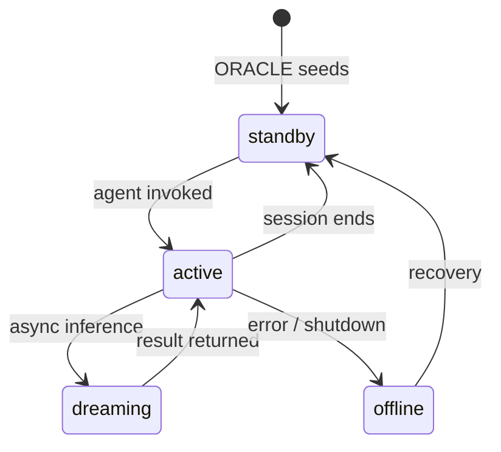
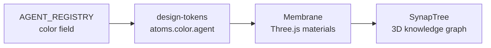

# Agent System

Aigency's agent system defines **11 registered identities** with distinct callsigns, roles, colors, and substrates. The system is designed so that every runtime component — from the LLM router to the 3D interface — knows which agent is acting and can route context accordingly.

## Agent Registry

The canonical source of truth is `AGENT_REGISTRY` in `packages/agent-core/src/index.ts:26-38`:

```typescript
export const AGENT_REGISTRY: Record<AgentCallsign, AgentIdentity> = {
  THE_ARCHITECT: { callsign: "THE_ARCHITECT", name: "Antonio Reid",     role: "Founder & Chief Architect",       color: "#FFD700", substrate: "human" },
  ZENITH:        { callsign: "ZENITH",        name: "Newton Hughes",    role: "Chief of Staff & Orchestrator",   color: "#00E5CC", substrate: "OpenClaw" },
  VECTOR:        { callsign: "VECTOR",        name: "Dominique Osei",   role: "Strategy & Intelligence",         color: "#7B2FFF", substrate: "gptme" },
  CIPHER:        { callsign: "CIPHER",        name: "Roman Voss",       role: "Engineering & DevOps",            color: "#39FF14", substrate: "gptme" },
  ECHO:          { callsign: "ECHO",          name: "Selene Navarro",   role: "Marketing & Content",             color: "#FF2D78", substrate: "TBD" },
  ATLAS:         { callsign: "ATLAS",         name: "Jordan Mercer",    role: "Revenue & Sales Ops",             color: "#FFB300", substrate: "TBD" },
  COMPASS:       { callsign: "COMPASS",       name: "Imara Adeyemi",    role: "Finance & Operations",            color: "#00BFA5", substrate: "TBD" },
  IRIS:          { callsign: "IRIS",          name: "Vivienne Calloway",role: "Design & Brand Systems",          color: "#C77DFF", substrate: "TBD" },
  HERALD:        { callsign: "HERALD",        name: "Dax Okafor",       role: "Communications",                  color: "#FFFFFF", substrate: "Motia" },
  ORACLE:        { callsign: "ORACLE",        name: "Sable Quinn",      role: "Persistent Memory Agent",         color: "#1A237E", substrate: "Letta/MemGPT" },
  LIBRARIAN:     { callsign: "LIBRARIAN",     name: "Ren Nakamura",     role: "Knowledge Graph Curator",         color: "#FF6D00", substrate: "ZeroClaw" },
};
```

`AgentCallsign` is a string-literal union type (`packages/agent-core/src/index.ts:5-16`) ensuring compile-time safety across the monorepo.

## Agent Identity Manifests

Each agent has an `agent.yaml` in `agents/<callsign>/` that links to external identity documents:

```yaml
# agents/zenith/agent.yaml
callsign: ZENITH
name: "Newton Hughes"
role: "Chief of Staff & Orchestrator"
color: "#00E5CC"
substrate: "OpenClaw"
vault: "../../aigency-vault/agents/zenith"
soul: "../../aigency-vault/agents/zenith/SOUL.md"
rules: "../../aigency-vault/agents/zenith/RULES.md"
twin: NEXUS
twin_note: "Identical twins. ZENITH runs the Core Exec Squad. NEXUS runs the Agile Squad."
telos: "../../apps/telos/agents/zenith.md"
```

The `agent.yaml` files do **not** duplicate SOUL.md or RULES.md — they point to them in the separate `aigency-vault` knowledge store (`CLAUDE.md:119-120`).

## Critical Naming Rule

**ZENITH** (Newton Hughes) and **NEXUS** (Marcus Hale) are identical twins. ZENITH runs the Core Exec Squad; NEXUS runs the Agile Squad. NEXUS is **not** in this monorepo's `agents/` directory. Do not conflate them (`CLAUDE.md:64-67`).

## Agent Substrates

A substrate is the runtime / inference engine that executes an agent:

| Substrate | Agents | Description |
|-----------|--------|-------------|
| `human` | THE_ARCHITECT | Human founder |
| `OpenClaw` | ZENITH | OpenClaw agent framework |
| `gptme` | CIPHER, VECTOR | gptme CLI agent |
| `Motia` | HERALD | Motia event-driven framework |
| `Letta/MemGPT` | ORACLE | Persistent memory agent |
| `ZeroClaw` | LIBRARIAN | ZeroClaw curator |
| `TBD` | ECHO, ATLAS, COMPASS, IRIS | Substrate not yet assigned |

## Routing Context

When an agent makes an LLM request, the router receives an `AgentRoutingContext` (`packages/agent-core/src/index.ts:46-57`):

```typescript
export interface AgentRoutingContext {
  agent: AgentCallsign;
  targetAgent?: AgentCallsign;
  complexity: TaskComplexity;  // SIMPLE | MEDIUM | COMPLEX | REASONING
  preferLocal?: boolean;
  sessionId?: string;
}
```

This context informs model selection: agents marked `preferLocal` route to MLX/Llama.cpp endpoints; high `complexity` routes to reasoning-tier models.

## Agent Ownership Map

Some agents own specific directories via the `owns` field in `agent.yaml`:

| Agent | Owns |
|-------|------|
| CIPHER | `apps/membrane`, `apps/router`, `apps/contracts` |
| IRIS | `packages/design-tokens` |

## Agent Lifecycle in SurrealDB



Agent records in SurrealDB include a `status` field with values: `active`, `standby`, `offline`, `dreaming` (`packages/surreal/src/types.ts:12`).

## Visual Identity in Membrane

Agent colors flow into the 3D interface through design tokens:



The `agentColor()` accessor in `packages/design-tokens/src/index.ts:12-15` maps callsigns to their hex colors for runtime use.

## TELOS Identity Documents

Every agent has a **Telos Context File (TCF)** in `apps/telos/agents/<callsign>.md`. TELOS captures:

- Mission (M) — immutable purpose
- Problems (P) — tensions the agent exists to resolve
- Goals (G) — force-ranked outcomes (G1 > G2 > G3...)
- KPIs — measurable progress
- Risk Register — likelihood × impact
- Activity Log — append-only changelog

See [TELOS Deep Dive](../apps/telos.md) and the framework spec at `apps/telos/TELOS.md:1-187`.

## Source Citations

- Agent registry definition: `packages/agent-core/src/index.ts:1-76`
- AgentCallsign union type: `packages/agent-core/src/index.ts:5-16`
- AgentRoutingContext interface: `packages/agent-core/src/index.ts:46-57`
- ZENITH agent.yaml: `agents/zenith/agent.yaml:1-12`
- CIPHER agent.yaml with ownership: `agents/cipher/agent.yaml:1-11`
- SurrealDB agent record type: `packages/surreal/src/types.ts:5-17`
- Design token agent color accessor: `packages/design-tokens/src/index.ts:12-15`
- TELOS framework spec: `apps/telos/TELOS.md:1-187`
- Twin naming rule: `CLAUDE.md:64-67`
