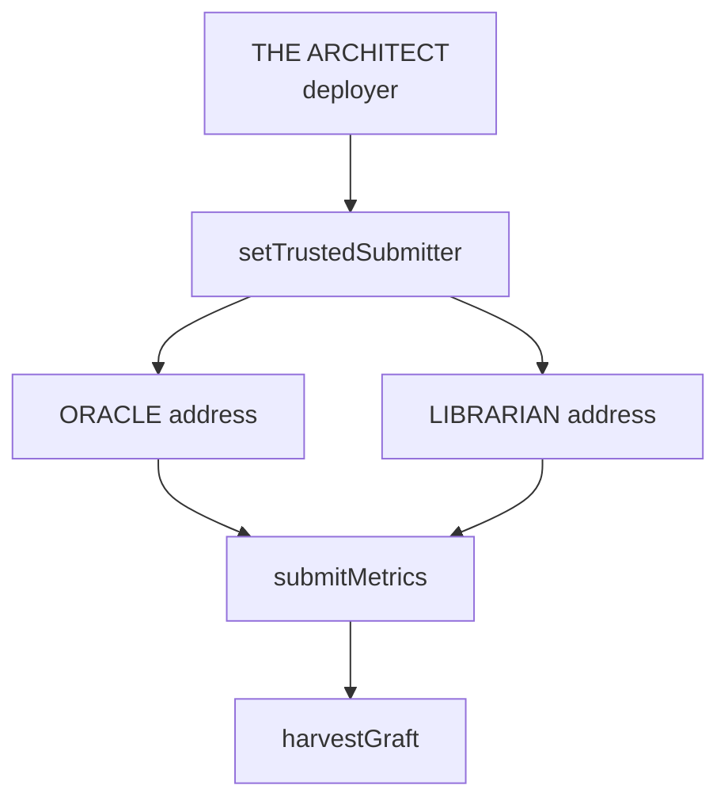
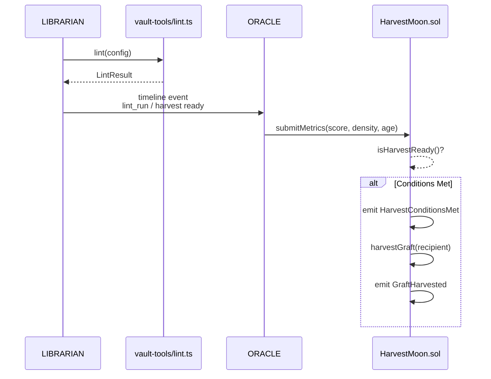

# Contracts

Aigency's smart contracts live on **Base L2** (chain ID 8453) and provide on-chain quality gates for the knowledge vault. The primary contract is `HarvestMoon.sol`, which controls when a Crystal Graft (ERC-721 NFT) can be minted based on off-chain vault metrics.

## Overview

| Property | Value |
|----------|-------|
| Package | `@aigency/contracts` |
| Chain | Base L2 (8453) / Base Sepolia (84532) |
| Framework | Foundry |
| Primary Contract | `HarvestMoon.sol` |
| Token Standard | ERC-721 (planned: `AigencyGraft.sol`) |

## HarvestMoon.sol

`HarvestMoon` is a quality gate contract. It stores vault metrics submitted by ORACLE and determines whether minting conditions are met.

### State Variables

```solidity
address public immutable architect;
mapping(address => bool) public trustedSubmitters;

uint256 public lintHealthScore;   // 0–100
uint256 public wikiDensity;       // 0.00–1.00 (scaled ×1e4)
uint256 public vaultAgeDays;
uint256 public lastUpdated;
uint256 public lastHarvestAt;
uint256 public graftCount;
```

(`apps/contracts/src/HarvestMoon.sol:11-22`)

### Threshold Constants

```solidity
uint256 public constant LINT_THRESHOLD      = 85;    // ≥ 85/100
uint256 public constant DENSITY_THRESHOLD   = 7000;  // ≥ 0.70 (×1e4)
uint256 public constant AGE_THRESHOLD_DAYS  = 90;
uint256 public constant HARVEST_COOLDOWN    = 30 days;
uint256 public constant SUBMIT_TIMELOCK     = 24 hours;
```

(`apps/contracts/src/HarvestMoon.sol:24-28`)

These values match the default lint thresholds in `@aigency/vault-tools` (`packages/vault-tools/src/config.ts:20-23`).

### Key Functions

#### `submitMetrics`

```solidity
function submitMetrics(
    uint256 _lintScore,    // 0–100
    uint256 _wikiDensity,  // 0.0–1.0 × 1e4
    uint256 _ageDays
) external;
```

- Only callable by `trustedSubmitters`
- Validates `_lintScore <= 100` and `_wikiDensity <= 10000`
- Updates state and emits `MetricsSubmitted`
- If `isHarvestReady()`, emits `HarvestConditionsMet`

(`apps/contracts/src/HarvestMoon.sol:56-75`)

#### `isHarvestReady`

```solidity
function isHarvestReady() public view returns (bool);
```

Returns `true` when ALL of the following hold:
1. `lastUpdated != 0`
2. `block.timestamp >= lastUpdated + SUBMIT_TIMELOCK` (24h since last submit)
3. `block.timestamp >= lastHarvestAt + HARVEST_COOLDOWN` (30d since last harvest)
4. `lintHealthScore >= LINT_THRESHOLD` (≥ 85)
5. `wikiDensity >= DENSITY_THRESHOLD` (≥ 7000)
6. `vaultAgeDays >= AGE_THRESHOLD_DAYS` (≥ 90)

(`apps/contracts/src/HarvestMoon.sol:80-89`)

#### `harvestGraft`

```solidity
function harvestGraft(address recipient) external returns (uint256 graftId);
```

- Only callable by trusted submitters
- Requires `isHarvestReady()`
- Increments `graftCount`
- Emits `GraftHarvested(graftId, recipient, timestamp)`
- TODO: wire `AigencyGraft.mint(recipient, graftId)` after NFT deploy

(`apps/contracts/src/HarvestMoon.sol:93-102`)

### Events

```solidity
event MetricsSubmitted(uint256 lintScore, uint256 density, uint256 ageDays, uint256 timestamp);
event GraftHarvested(uint256 indexed graftId, address indexed recipient, uint256 timestamp);
event HarvestConditionsMet(uint256 timestamp);
```

(`apps/contracts/src/HarvestMoon.sol:31-34`)

### Access Control



The architect is set as the initial trusted submitter in the constructor (`apps/contracts/src/HarvestMoon.sol:38-41`).

## Future Contracts

| Contract | Standard | Purpose |
|----------|----------|---------|
| `AigencyGraft.sol` | ERC-721 | Crystal Graft NFT |
| `AigencyGraftAccess.sol` | ERC-20 | Access token for graft holders |

These are referenced in `CLAUDE.md:103-104` as upcoming work.

## Build Commands

```bash
pnpm --filter @aigency/contracts build          # forge build
pnpm --filter @aigency/contracts test           # forge test -vvv
pnpm --filter @aigency/contracts deploy:testnet # Base Sepolia
pnpm --filter @aigency/contracts deploy:mainnet # Base Mainnet
```

(`apps/contracts/package.json:6-12`)

## On-Chain / Off-Chain Integration



## Source Citations

- HarvestMoon contract: `apps/contracts/src/HarvestMoon.sol:1-114`
- Contract package config: `apps/contracts/package.json:1-16`
- Lint thresholds: `packages/vault-tools/src/config.ts:20-23`
- Lint result interface: `packages/vault-tools/src/lint.ts:8-20`
