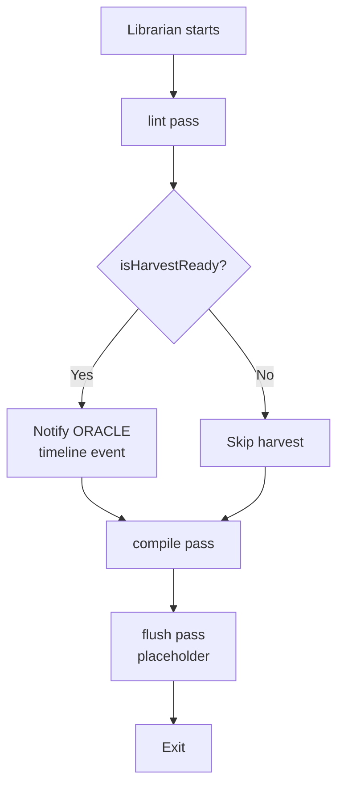

# Librarian

**LIBRARIAN** (Ren Nakamura) is the knowledge graph curator service. It runs on a schedule (cron or GitHub Actions) to lint the vault, compile raw session notes into wiki articles, and notify ORACLE when Harvest Moon conditions are met.

## Overview

| Property | Value |
|----------|-------|
| Package | `@aigency/librarian` |
| Role | Knowledge Graph Curator |
| Color | `#FF6D00` |
| Substrate | ZeroClaw |
| Workflow | lint → harvest-check → compile → flush |

## Workflow



## Implementation

```typescript
async function main() {
  const vaultRoot = process.env.VAULT_ROOT ?? join(process.cwd(), "../../aigency-vault");
  const config = loadConfig(vaultRoot);

  console.log("[LIBRARIAN] Running lint pass...");
  const result = lint(config);

  console.log(`[LIBRARIAN] Health: ${result.healthScore}/100 | ...`);

  if (result.isHarvestReady) {
    console.log("[LIBRARIAN] HARVEST MOON CONDITIONS MET");
    await SurrealClient.connect({...});
    await SurrealClient.db.create("timeline", {
      event_type: "lint_run",
      agent: "LIBRARIAN",
      summary: "Harvest moon conditions met",
      metadata: { health_score, wiki_density, vault_age_days },
    });
  }

  console.log("[LIBRARIAN] Running compile pass...");
  const compileResult = await compile(config);
}
```

(`apps/librarian/src/index.ts:1-47`)

## Lint Pass

The lint pass is delegated to `@aigency/vault-tools` (`packages/vault-tools/src/lint.ts:28-93`):

### LintResult

```typescript
export interface LintResult {
  healthScore: number;      // 0–100
  wikiDensity: number;      // 0.0–1.0
  vaultAgeDays: number;
  isHarvestReady: boolean;
  breakdown: {
    totalRawFiles: number;
    totalWikiFiles: number;
    staleSoulFiles: string[];
    missingRulesFiles: string[];
    agentsWithoutWiki: string[];
  };
}
```

### Health Score Calculation

Starting from 100, deductions apply:

| Issue | Deduction |
|-------|-----------|
| Missing SOUL.md | -5 per agent |
| Missing RULES.md | -5 per agent |
| Agent has raw but no wiki | -3 per agent |
| Wiki density < 0.5 | -20 |
| Wiki density < 0.7 | -10 |

(`packages/vault-tools/src/lint.ts:62-68`)

### Harvest Thresholds

```typescript
const isHarvestReady =
  healthScore >= t.minHealthScore &&      // default: 85
  wikiDensity >= t.minWikiDensity &&       // default: 0.70
  vaultAgeDays >= t.minVaultAgeDays;       // default: 90
```

(`packages/vault-tools/src/lint.ts:75-78`)

These thresholds match the on-chain constants in `HarvestMoon.sol` (`apps/contracts/src/HarvestMoon.sol:24-28`).

## Compile Pass

The compile pass transforms raw session notes into polished wiki articles using an LLM (`packages/vault-tools/src/compile.ts:54-87`):

1. Read `agents/<callsign>/raw/*.md` and `_global/raw/*.md`
2. Skip files that already have a compiled wiki counterpart
3. Send raw content to LLM with system prompt
4. Write result to `wiki/*.md`

### LLM Backends

| Backend | Endpoint | Use Case |
|---------|----------|----------|
| `mlx` / `llama_cpp` | `http://localhost:8080/v1/chat/completions` | Local inference |
| `claude` | Anthropic API | Heavy compilation tasks |
| `openai` | OpenAI API | Cloud fallback |

(`packages/vault-tools/src/compile.ts:17-52`)

### System Prompt

```
You are the LIBRARIAN (Ren Nakamura), knowledge graph curator for Aigency.
Your task: transform a raw session note into a polished wiki article.
- Extract key decisions, patterns, and insights
- Write in clear, direct prose — no fluff
- Preserve all technical specifics
- Format with ## headers, no bullet dumps
- Output markdown only
```

(`packages/vault-tools/src/compile.ts:9-15`)

## Flush Pass

The flush pass syncs session logs to SurrealDB's `timeline` table. It is currently a placeholder:

```typescript
export async function flush(config: VaultConfig): Promise<{ flushed: number }> {
  console.warn("[flush] Not yet implemented — requires @aigency/surreal");
  return { flushed: 0 };
}
```

(`packages/vault-tools/src/flush.ts:7-15`)

## Vault Configuration

```typescript
export interface VaultConfig {
  vaultRoot: string;
  llmBackend: "mlx" | "llama_cpp" | "claude" | "openai";
  mlxEndpoint?: string;
  tailnetNodes?: string[];
  compilationModel?: string;
  lintThresholds: {
    minHealthScore: number;   // 85
    minWikiDensity: number;   // 0.70
    minVaultAgeDays: number;  // 90
  };
}
```

(`packages/vault-tools/src/config.ts:4-15`)

Default config loads from `<vaultRoot>/config/vault.json` or falls back to built-in defaults.

## Source Citations

- Librarian workflow: `apps/librarian/src/index.ts:1-47`
- Lint implementation: `packages/vault-tools/src/lint.ts:1-93`
- Compile implementation: `packages/vault-tools/src/compile.ts:1-87`
- Flush placeholder: `packages/vault-tools/src/flush.ts:1-15`
- Vault config: `packages/vault-tools/src/config.ts:1-33`
- HarvestMoon thresholds: `apps/contracts/src/HarvestMoon.sol:24-28`
- Package config: `apps/librarian/package.json:1-29`
