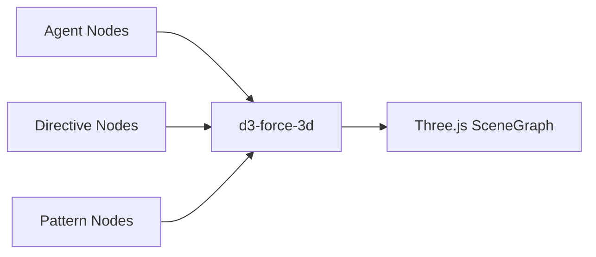

# Membrane

The **Membraned Interface** (`@aigency/membrane`) is Aigency's 3D spatial frontend — a Three.js knowledge graph with frosted glass UI overlays. It renders agent relationships, directives, and timeline data from SurrealDB in real time.

## Overview

| Property | Value |
|----------|-------|
| Package | `@aigency/membrane` |
| Renderer | Three.js + @react-three/fiber |
| Build Tool | Vite |
| State | Zustand + TanStack Query |
| Animation | Framer Motion |

## Current State

The Membrane is in **scaffolding phase**. `apps/membrane/src/App.tsx:1-30` sets up a fullscreen canvas with a dark background from design tokens and ambient lighting. The SynapTree knowledge graph and floating panels are not yet implemented.

## Architecture

```mermaid
graph TB
    subgraph "Render Layer"
        C[Canvas<br/>@react-three/fiber]
        S[SynapTree<br/>3D Graph]
        L[Lighting]
        P[PostProcessing]
    end

    subgraph "UI Layer"
        F[Floating Panels<br/>pointerEvents: none]
        Q[QuerySurface]
        D[DirectiveFeed]
        T[TimelineRail]
    end

    subgraph "Data Layer"
        Z[Zustand<br/>Local State]
        RQ[React Query<br/>Server State]
        LIVE[Surreal LIVE<br/>Real-time]
    end

    C --> S
    C --> L
    C --> P
    F --> Q
    F --> D
    F --> T
    S --> Z
    D --> RQ
    T --> LIVE
```

## Dependencies

```json
{
  "three": "^0.170.0",
  "react": "^18.3.1",
  "@react-three/fiber": "^8.17.10",
  "@react-three/drei": "^9.117.3",
  "@react-three/postprocessing": "^2.16.3",
  "d3-force-3d": "^3.0.5",
  "zustand": "^5.0.2",
  "@tanstack/react-query": "^5.62.3",
  "framer-motion": "^11.14.1"
}
```

(`apps/membrane/package.json:14-28`)

## App Component

```tsx
export function App() {
  const bg = tokens.atoms.color.base.canvas.$value as string;

  return (
    <div style={{ width: "100vw", height: "100vh", background: bg, position: "relative" }}>
      <Canvas style={{ position: "absolute", inset: 0 }} camera={{ position: [0, 0, 50], fov: 60 }}>
        <ambientLight intensity={0.1} />
      </Canvas>
      <div style={{ position: "relative", zIndex: 10, pointerEvents: "none" }}>
        {/* TODO: QuerySurface, DirectiveFeed, TimelineRail */}
      </div>
    </div>
  );
}
```

(`apps/membrane/src/App.tsx:7-29`)

## Design Tokens Integration

Membrane imports tokens from `@aigency/design-tokens`:

- **Canvas background**: `tokens.atoms.color.base.canvas.$value`
- **Agent node colors**: `agentColor(callsign)`
- **Node shapes**: `nodeShape(nodeType)`
- **Temporal opacity**: `opacityForAge(ageHours)`

(`packages/design-tokens/src/index.ts:1-29`)

## Planned Components

| Component | Layer | Purpose |
|-----------|-------|---------|
| SynapTree | 3D | Force-directed knowledge graph of agents, directives, patterns |
| QuerySurface | UI | Cmd+K search bar for ORACLE queries |
| DirectiveFeed | UI | Left-edge panel showing active directives |
| TimelineRail | UI | Bottom scrubber for timeline events |

## Force-Directed Graph

The `d3-force-3d` dependency (`apps/membrane/package.json:24`) will drive the SynapTree layout:



Nodes will be positioned in 3D space with forces for:
- Link distance (agent-to-directive, directive-to-pattern)
- Charge repulsion (prevents overlap)
- Centering gravity (keeps graph in view)

## Real-Time Data

SurrealDB LIVE queries will stream updates into the 3D scene:

```typescript
// Conceptual usage
LIVE.subscribe<DirectiveRecord>("directive", (action, record) => {
  // Add/remove/update 3D node
}, "status = 'active'");
```

(`packages/surreal/src/live.ts:18-38`)

## Build Commands

```bash
pnpm --filter @aigency/membrane dev      # Vite dev server
pnpm --filter @aigency/membrane build    # Production build
pnpm --filter @aigency/membrane preview  # Preview production build
```

(`apps/membrane/package.json:8-12`)

## Ownership

CIPHER owns Membrane implementation (`agents/cipher/agent.yaml:9`). Design tokens are owned by IRIS (`agents/iris/agent.yaml:9`).

## Source Citations

- App component: `apps/membrane/src/App.tsx:1-30`
- Package config: `apps/membrane/package.json:1-39`
- Design tokens: `packages/design-tokens/src/index.ts:1-29`
- LIVE queries: `packages/surreal/src/live.ts:1-54`
- Agent ownership: `agents/cipher/agent.yaml:1-11`, `agents/iris/agent.yaml:1-11`
