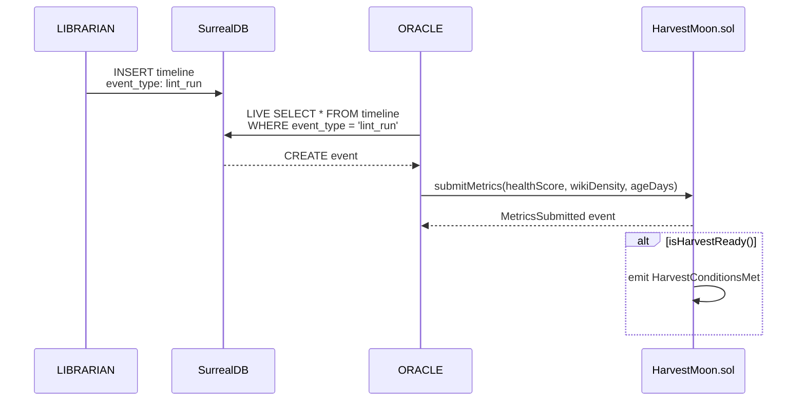

# Oracle

**ORACLE** (Sable Quinn) is the persistent memory agent service. It bootstraps SurrealDB schema, seeds agent records, and serves as the bridge between off-chain vault metrics and on-chain `HarvestMoon.sol` quality gates.

## Overview

| Property | Value |
|----------|-------|
| Package | `@aigency/oracle` |
| Role | Persistent Memory Agent |
| Color | `#1A237E` |
| Substrate | Letta/MemGPT |
| Dependencies | `@aigency/agent-core`, `@aigency/mem-brain`, `@aigency/surreal`, `@aigency/honcho`, `@aigency/vault-tools` |

## Responsibilities

1. **Bootstrap SurrealDB** — idempotent agent record insertion on startup
2. **Seed agents** — create all 11 `agent` records from `AGENT_REGISTRY`
3. **Subscribe to events** — listen for `lint_run` timeline events
4. **Honcho workspace** — initialize peer identity layer

## Bootstrap Flow

```mermaid
graph TB
    A[ORACLE starts] --> B[Connect to SurrealDB]
    B --> C[Iterate AGENT_REGISTRY]
    C --> D[INSERT INTO agent<br/>ON DUPLICATE KEY UPDATE]
    D --> E[Log "Ready"]
    E --> F[Listen for lint_run<br/>LIVE queries]
```

## Implementation

```typescript
async function main() {
  console.log("[ORACLE] Initializing...");

  await SurrealClient.connect({
    url: process.env.SURREAL_URL ?? "ws://localhost:8000/rpc",
    namespace: process.env.SURREAL_NS ?? "aigency",
    database: process.env.SURREAL_DB ?? "mem_brain",
    username: process.env.SURREAL_USER ?? "root",
    password: process.env.SURREAL_PASS ?? "root",
  });

  const db = SurrealClient.db;
  for (const [callsign, identity] of Object.entries(AGENT_REGISTRY)) {
    await db.query(
      `INSERT INTO agent ... ON DUPLICATE KEY UPDATE updated_at = time::now()`,
      { id: `agent:${callsign.toLowerCase()}`, callsign, ... }
    );
  }

  console.log("[ORACLE] Ready. Listening for lint_run events...");
}
```

(`apps/oracle/src/index.ts:1-47`)

## Agent Record Schema

Each agent record in SurrealDB follows `AgentRecord` (`packages/surreal/src/types.ts:5-17`):

| Field | Type | Description |
|-------|------|-------------|
| `id` | string | `agent:<callsign>` |
| `callsign` | AgentCallsign | Canonical identifier |
| `name` | string | Human-readable name |
| `role` | string | Functional role |
| `color` | string | Hex color for UI |
| `substrate` | string | Runtime engine |
| `status` | enum | active / standby / offline / dreaming |
| `soul_hash` | string | SHA-256 of SOUL.md content |
| `created_at` | datetime | Record creation |
| `updated_at` | datetime | Last update |

## Seed Command

```bash
pnpm --filter @aigency/oracle seed
```

This runs `tsx src/seed.ts` (though the current `src/index.ts` includes the bootstrap logic inline).

## Connection to HarvestMoon

ORACLE is the intended off-chain submitter for `HarvestMoon.sol` metrics:



The TODO for this flow is noted at `apps/oracle/src/index.ts:43-44`.

## Honcho Integration

ORACLE uses `@aigency/honcho` for peer identity and cross-session reasoning:

- `getPeer("ORACLE")` — get or create Honcho peer record
- `startSession("ORACLE", metadata)` — begin a new session
- `dream("ORACLE", query)` — trigger async background inference

(`packages/honcho/src/client.ts:27-79`)

## MemBrain Usage

ORACLE imports `@aigency/mem-brain` for the unified memory API:

```typescript
import { MemBrain } from "@aigency/mem-brain";
```

This provides:
- `getActiveDirectives()` — fetch active work items
- `createDirective(data)` — insert new directive
- `searchPatterns(embedding)` — vector similarity search
- `logEvent(type, agent, summary)` — audit logging
- `oracleDream(query)` — Honcho dream wrapper

(`packages/mem-brain/src/mem-brain.ts:1-127`)

## Source Citations

- ORACLE bootstrap: `apps/oracle/src/index.ts:1-47`
- Agent record type: `packages/surreal/src/types.ts:5-17`
- Honcho client: `packages/honcho/src/client.ts:1-80`
- MemBrain API: `packages/mem-brain/src/mem-brain.ts:1-127`
- HarvestMoon contract: `apps/contracts/src/HarvestMoon.sol:1-114`
- Package config: `apps/oracle/package.json:1-30`
