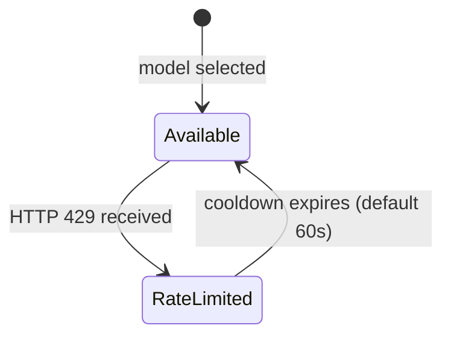
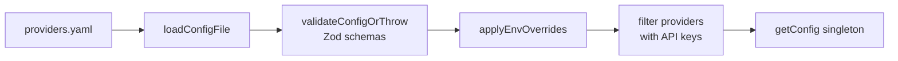

# Router

The **LLM Router** (`@aigency/router`) is an OpenAI-compatible HTTP proxy that routes chat completion requests to optimal LLM providers based on request complexity, quota preservation, and rate-limit state. It is the central inference gateway for all Aigency agents.

## Overview

| Property | Value |
|----------|-------|
| Package | `@aigency/router` |
| Port | 8402 (`apps/router/config/providers.yaml:5`) |
| Protocol | OpenAI-compatible `/v1/chat/completions` |
| Classification | 14-dimension scoring |
| Fallback | Automatic chain of up to 3 models |

## Architecture

```mermaid
graph TB
    subgraph "Router"
        direction TB
        S[HTTP Server<br/>Port 8402]
        C[classifyRequest()]
        R[routeRequest()]
        RL[RateLimitTracker]
        QT[QuotaTracker]
        CFG[Config Singleton]

        S --> C
        C --> R
        R --> RL
        R --> QT
        CFG --> R
    end

    subgraph "Providers"
        M[Mistral]
        G[Groq]
        GM[Gemini]
        CE[Cerebras]
        OR[OpenRouter]
    end

    S --> M
    S --> G
    S --> GM
    S --> CE
    S --> OR
```

## Request Classification

`classifyRequest()` scores incoming requests across 8 dimensions (`apps/router/src/router.ts:96-214`):

| Dimension | Points | Trigger |
|-----------|--------|---------|
| Token count | 0-3 | > 500 chars (medium), > 2000 (long) |
| Code presence | 0-2 | Code blocks (```), inline code (`) |
| Reasoning keywords | 0-3 | analyze, compare, evaluate, step by step... |
| Math/calculation | 0-2 | Equations, formulas, calculate |
| Multi-turn | 0-2 | > 2 messages (1 pt), > 5 (2 pts) |
| Question complexity | 0-2 | how/why/explain + ? |
| Technical domain | 0-2 | algorithm, database, security... |
| Creative task | 0-1 | write, create, generate, draft |

Score maps to tier (`apps/router/src/router.ts:192-201`):

```
score >= 10 → REASONING
score >= 6  → COMPLEX
score >= 3  → MEDIUM
else        → SIMPLE
```

## Routing Decision

`routeRequest()` selects the best model using a **quota preservation strategy** (`apps/router/src/router.ts:219-290`):

1. Filter out rate-limited models
2. Filter by tier compatibility (model can handle its tier or below)
3. Sort by: quota size (largest first), then exact tier match
4. Select top model; build fallback chain from next 3 best

Quota sizes are ranked: `huge` > `large` > `medium` > `small` > `tiny` (`apps/router/src/router.ts:259`).

## Rate Limit Tracking



`RateLimitTracker` maintains a Map of `modelId → expiryTimestamp` (`apps/router/src/router.ts:50-90`). Cooldown defaults to 60 seconds (`apps/router/src/router.ts:42`).

## Quota Tracking

`QuotaTracker` persists daily/monthly counters to disk (`apps/router/src/quota-tracker.ts:29-339`):

- Auto-saves every 5 minutes
- Resets daily counters after 24h
- Resets monthly counters after 30 days
- Alerts at 80% (warning) and 95% (critical)

## Server Endpoints

| Endpoint | Method | Purpose |
|----------|--------|---------|
| `/health` | GET | Status + provider/model counts |
| `/v1/models` | GET | OpenAI-compatible model list |
| `/v1/chat/completions` | POST | Main routing endpoint |

(`apps/router/src/server.ts:301-362`)

The `/v1/chat/completions` handler (`apps/router/src/server.ts:97-265`):
1. Reads request body
2. Classifies request
3. Routes to optimal model
4. Tries fallback chain on failure
5. Streams successful response
6. Returns 502 if all models fail

## Configuration System

The router uses a **singleton configuration** with Zod validation (`apps/router/src/config/index.ts:65-144`):



### Zod Schemas

```typescript
export const ModelSchema = z.object({
  id: z.string().min(1),
  name: z.string().min(1),
  contextWindow: z.number().positive(),
  maxOutput: z.number().positive(),
  capabilities: z.array(z.string()),
  quota: QuotaSchema,
  tier: z.enum(['simple', 'medium', 'complex', 'reasoning']),
});
```

(`apps/router/src/config/schema.ts:26-34`)

### Environment Overrides

API keys and enabled flags are read from environment variables prefixed with `PROVIDER_` (`apps/router/src/config/index.ts:88-99`):

```bash
PROVIDER_MISTRAL_API_KEY=...
PROVIDER_GROQ_API_KEY=...
PROVIDER_GEMINI_API_KEY=...
```

Providers without keys are silently removed at startup.

## Provider Configuration

Default providers are defined in `apps/router/config/providers.yaml:22-218`:

| Provider | Models | Base URL |
|----------|--------|----------|
| Mistral | `mistral-large-latest`, `mistral-small-latest` | `https://api.mistral.ai/v1` |
| Groq | `llama-3.3-70b-versatile`, `llama-3.1-8b-instant` | `https://api.groq.com/openai/v1` |
| Gemini | `gemini-2.0-flash-exp`, `gemini-1.5-flash`, `gemini-1.5-pro` | `https://generativelanguage.googleapis.com/v1beta` |
| Cerebras | `llama-3.3-70b`, `llama-3.1-8b` | `https://api.cerebras.ai/v1` |
| OpenRouter | `google/gemini-2.0-flash-exp:free`, `meta-llama/llama-3.1-8b-instruct:free` | `https://openrouter.ai/api/v1` |
| VoidAI | `void-1` | `https://api.voidai.com/v1` |
| z.ai | `z-coder` | `https://api.z.ai/v1` |
| Kimi | `moonshot-v1-128k` | `https://api.moonshot.cn/v1` |

## Error Handling

The server implements retry logic for provider errors (`apps/router/src/server.ts:76-92`):

| Status | Retry? |
|--------|--------|
| 429 (Rate Limit) | Yes + mark rate-limited |
| 500+ | Yes |
| 400 (Bad Request) | No |

Timeout is 3 minutes (`apps/router/src/server.ts:151`).

## Source Citations

- Router classification logic: `apps/router/src/router.ts:96-214`
- Router decision logic: `apps/router/src/router.ts:219-290`
- RateLimitTracker: `apps/router/src/router.ts:50-90`
- QuotaTracker: `apps/router/src/quota-tracker.ts:29-339`
- HTTP server: `apps/router/src/server.ts:1-406`
- Config singleton: `apps/router/src/config/index.ts:1-213`
- Zod schemas: `apps/router/src/config/schema.ts:1-107`
- Provider YAML: `apps/router/config/providers.yaml:1-218`
