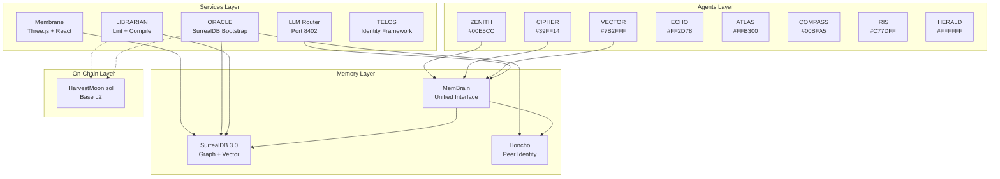
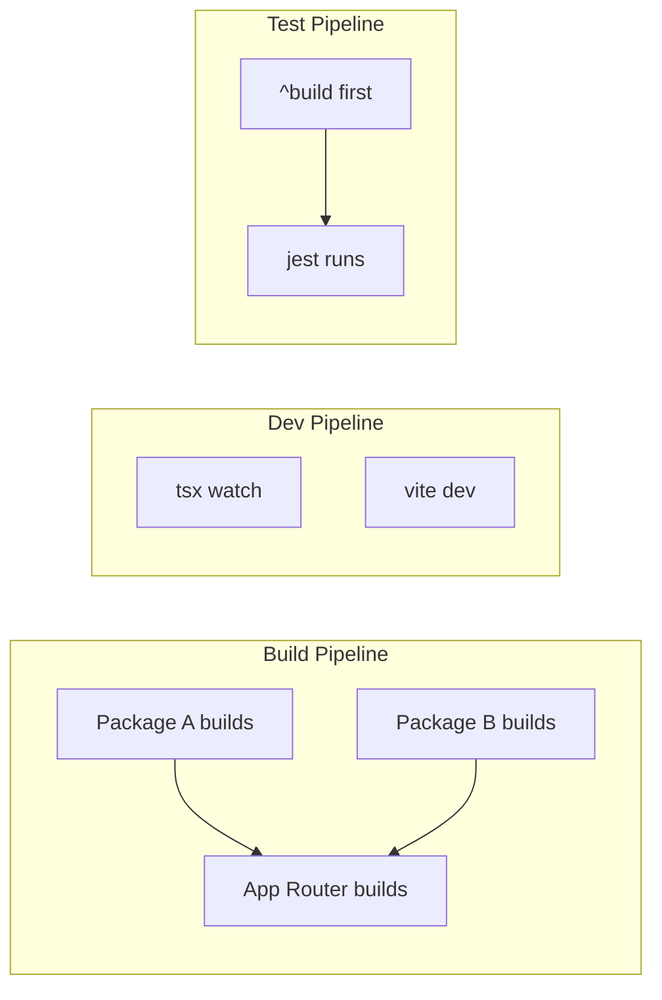
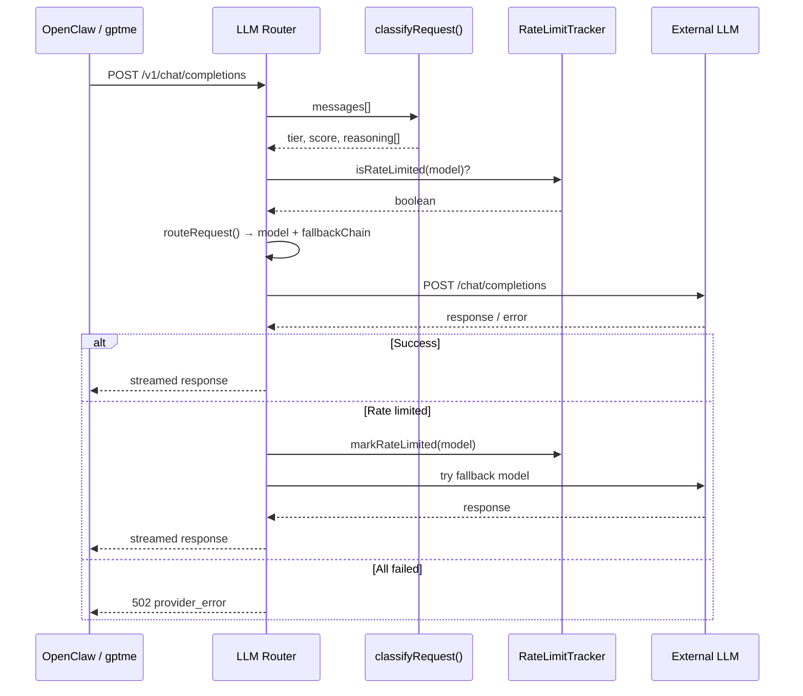

# Architecture

Aigency is a **multi-agent AI operating system** structured as a Turborepo monorepo. The architecture separates deployable services (`apps/`), shared libraries (`packages/`), and agent identity manifests (`agents/`). All components communicate through a unified memory layer that combines SurrealDB (graph + document + vector) with Honcho (peer identity + cross-session reasoning).

## High-Level Architecture



## Design Principles

| Principle | Implementation |
|-----------|---------------|
| **Agent-native** | Every service exposes capabilities consumed by agents; routing context includes `AgentCallsign` (`packages/agent-core/src/index.ts:46-57`) |
| **Memory as infrastructure** | SurrealDB handles graph/document/vector; Honcho handles peer sessions; MemBrain unifies both (`packages/mem-brain/src/mem-brain.ts:25-35`) |
| **Local-first inference** | MLX (M1 Pro) + Llama.cpp (Tailnet Intel nodes) preferred over cloud APIs (`CLAUDE.md:77`) |
| **Quota preservation** | Router classifies requests by complexity and routes to models with largest remaining quotas (`apps/router/src/router.ts:257-270`) |
| **Quality-gated minting** | `HarvestMoon.sol` requires lint health >= 85, wiki density >= 0.70, vault age >= 90 days (`apps/contracts/src/HarvestMoon.sol:24-28`) |

## Workspace Dependency Graph

```mermaid
graph BT
    AC[@aigency/agent-core]
    TS[@aigency/tsconfig]
    SR[@aigency/surreal]
    HO[@aigency/honcho]
    MB[@aigency/mem-brain]
    VT[@aigency/vault-tools]
    DT[@aigency/design-tokens]

    SR --> AC
    HO --> AC
    MB --> AC
    MB --> SR
    MB --> HO
    VT --> AC
    DT --> TS

    subgraph "Apps"
        RO[@aigency/router]
        ME[@aigency/membrane]
        OR[@aigency/oracle]
        LI[@aigency/librarian]
        TE[@aigency/telos]
    end

    RO --> AC
    ME --> AC
    ME --> SR
    ME --> DT
    OR --> AC
    OR --> SR
    OR --> HO
    OR --> MB
    OR --> VT
    LI --> AC
    LI --> VT
    LI --> SR
    TE --> AC
```

## Turborepo Pipeline



Tasks are defined in `turbo.json:4-29`:

- **`build`**: depends on `^build`, outputs to `dist/**`
- **`dev`**: `cache: false`, `persistent: true`
- **`test`**: depends on `^build`, outputs `coverage/**`
- **`lint`**: inputs `$TURBO_DEFAULT$`
- **`typecheck`**: depends on `^build`

## Data Flow: Request Lifecycle



This flow is implemented in `apps/router/src/server.ts:97-265`.

## Memory Architecture

```mermaid
graph TB
    subgraph "SurrealDB"
        direction TB
        A[agent table<br/>status, soul_hash]
        D[directive table<br/>priority, owner]
        P[pattern table<br/>embedding: float[]]
        T[timeline table<br/>event_type, metadata]
        E1[decided_by edge]
        E2[informed_by edge]
        E3[supersedes edge]
    end

    subgraph "Honcho"
        direction TB
        W[Workspace<br/>aigency-dev / aigency-prod]
        PE[Peer<br/>one per callsign]
        SE[Session<br/>messages + metadata]
        M[Message<br/>content + is_user]
    end

    subgraph "MemBrain API"
        MB[MemBrain class]
    end

    MB --> A
    MB --> D
    MB --> P
    MB --> T
    MB --> PE
    MB --> SE
```

SurrealDB schemas mirror `packages/surreal/src/types.ts:5-81`. Honcho primitives are Workspaces → Peers → Sessions → Messages (`packages/honcho/src/index.ts:3-4`).

## On-Chain Integration

```mermaid
graph LR
    subgraph "Off-Chain"
        L[LIBRARIAN]
        V[vault-tools/lint.ts]
    end

    subgraph "Base L2"
        HM[HarvestMoon.sol]
    end

    subgraph "NFT"
        AG[AigencyGraft.sol<br/>ERC-721]
    end

    L --> V
    V -->|lintHealthScore<br/>wikiDensity<br/>vaultAgeDays| HM
    HM -->|isHarvestReady()| AG
```

`HarvestMoon.sol` acts as a quality gate. ORACLE (off-chain) submits metrics; the contract validates thresholds before allowing `harvestGraft()` to mint an ERC-721 Crystal Graft (`apps/contracts/src/HarvestMoon.sol:56-102`).

## Configuration Strategy

The router uses a **layered configuration system** (`apps/router/src/config/index.ts:65-144`):

1. Load YAML config file (`providers.yaml`)
2. Validate with Zod schemas (`apps/router/src/config/schema.ts`)
3. Apply environment variable overrides (`apps/router/src/config/env-override.ts`)
4. Filter out providers missing API keys
5. Return singleton via `getConfig()`

This ensures type-safe, environment-aware configuration without secrets in version control.

## Source Citations

- Agent registry and routing context: `packages/agent-core/src/index.ts:1-76`
- Turborepo task pipeline: `turbo.json:1-30`
- Router request classification: `apps/router/src/router.ts:96-214`
- Router server HTTP handling: `apps/router/src/server.ts:1-406`
- SurrealDB record types: `packages/surreal/src/types.ts:1-81`
- Honcho client wrapper: `packages/honcho/src/client.ts:1-80`
- MemBrain unified API: `packages/mem-brain/src/mem-brain.ts:1-127`
- HarvestMoon quality gate: `apps/contracts/src/HarvestMoon.sol:1-114`
- TELOS framework spec: `apps/telos/TELOS.md:1-187`
