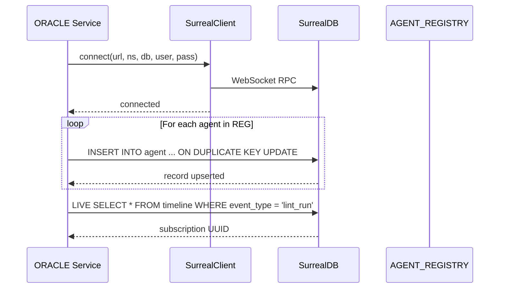

# Data Layer

Aigency's data layer is a **dual-store memory architecture**: SurrealDB handles structured data, graph relationships, and vector search; Honcho handles peer identity, sessions, and cross-session reasoning. The `MemBrain` class in `@aigency/mem-brain` unifies both behind a single API.

## Dual-Store Architecture

```mermaid
graph TB
    subgraph "MemBrain Unified API"
        MB[MemBrain class]
    end

    subgraph "SurrealDB 3.0"
        direction TB
        T1[agent table]
        T2[directive table]
        T3[pattern table]
        T4[timeline table]
        G1[decided_by edge]
        G2[informed_by edge]
        G3[supersedes edge]
        V1[vector::similarity::cosine]
    end

    subgraph "Honcho"
        direction TB
        W[Workspace]
        P[Peer<br/>one per callsign]
        S[Session]
        M[Message]
        D[dream()<br/>async inference]
    end

    MB --> T1
    MB --> T2
    MB --> T3
    MB --> T4
    MB --> P
    MB --> S
    MB --> D
```

## SurrealDB Schema

The `@aigency/surreal` package defines TypeScript record types that mirror the database schema (`packages/surreal/src/types.ts:1-81`):

### Tables

| Table | Key Fields | Purpose |
|-------|-----------|---------|
| `agent` | `callsign`, `status`, `soul_hash` | Runtime agent state |
| `directive` | `status`, `priority`, `owner` | Active work items |
| `pattern` | `embedding`, `confidence`, `category` | Learned behaviors |
| `timeline` | `event_type`, `agent`, `metadata` | Audit log |

### Graph Edges

| Edge | `in` | `out` | Meaning |
|------|------|-------|---------|
| `decided_by` | directive | agent | Who decided this |
| `informed_by` | directive | pattern | What patterns informed it |
| `supersedes` | new directive | old directive | Replacement chain |

### Agent Record Structure

```typescript
export interface AgentRecord {
  id: string;                   // "agent:<callsign>"
  callsign: AgentCallsign;
  name: string;
  role: string;
  color: string;
  substrate: string;
  status: "active" | "standby" | "offline" | "dreaming";
  current_focus?: string;
  soul_hash: string;            // SHA-256 of SOUL.md
  created_at: string;
  updated_at: string;
}
```

(`packages/surreal/src/types.ts:5-17`)

### Directive Record Structure

```typescript
export interface DirectiveRecord {
  id: string;                   // "directive:<ulid>"
  title: string;
  body: string;
  status: "active" | "pending" | "completed" | "superseded";
  priority: "critical" | "high" | "medium" | "low";
  owner: AgentCallsign;
  created_at: string;
  due_at?: string;
  completed_at?: string;
  tags: string[];
}
```

(`packages/surreal/src/types.ts:19-30`)

### Pattern Record with Vector Embedding

```typescript
export interface PatternRecord {
  id: string;                   // "pattern:<ulid>"
  title: string;
  body: string;
  category: "decision" | "behavior" | "anti-pattern" | "process";
  confidence: number;           // 0.0 – 1.0
  source_agent: AgentCallsign;
  embedding: number[];          // 1536-dim for text-embedding-3-small
  occurrence_count: number;
  first_seen: string;
  last_seen: string;
}
```

(`packages/surreal/src/types.ts:32-43`)

## SurrealClient Singleton

Connection management is handled by a singleton class (`packages/surreal/src/client.ts:1-51`):

```typescript
export class SurrealClient {
  static async connect(config: SurrealClientConfig): Promise<Surreal>;
  static get db(): Surreal;
  static async disconnect(): Promise<void>;
  static async reconnect(): Promise<Surreal>;
}
```

The singleton ensures only one WebSocket connection exists per process. `reconnect()` is useful after network drops (`packages/surreal/src/client.ts:46-50`).

## LIVE Queries

SurrealDB's `LIVE SELECT` enables real-time subscriptions:

```typescript
export const LIVE = {
  async subscribe<T>(table: string, callback, where?: string): Promise<() => void>;
  async onEvent<T>(eventType: string, callback): Promise<() => void>;
  async onAgentStatus(callback): Promise<() => void>;
};
```

(`packages/surreal/src/live.ts:1-54`)

The `subscribe` function returns an unsubscribe function that kills the query UUID via `db.kill(uuid)`.

## Honcho Peer Identity

Honcho models identity as Workspaces → Peers → Sessions → Messages (`packages/honcho/src/index.ts:3-4`).

### HonchoClient API

```typescript
export class HonchoClient {
  async getPeer(callsign: AgentCallsign): Promise<Peer>;
  async startSession(callsign: AgentCallsign, metadata?): Promise<Session>;
  async addMessage(callsign, sessionId, content, isUser, metadata?): Promise<Message>;
  async dream(callsign: AgentCallsign, query: string): Promise<string>;
}
```

(`packages/honcho/src/client.ts:14-80`)

The `dream()` method triggers **async background inference** — Honcho's cross-session reasoning capability. ORACLE uses this for persistent memory operations (`packages/mem-brain/src/mem-brain.ts:124-126`).

## MemBrain Unified Interface

`MemBrain` is the single entry point for all agent memory operations (`packages/mem-brain/src/mem-brain.ts:1-127`):

### Directive Operations

```typescript
async getActiveDirectives(): Promise<DirectiveRecord[]>;
async createDirective(data): Promise<DirectiveRecord>;
```

`getActiveDirectives` queries `SELECT * FROM directive WHERE status = 'active' ORDER BY priority` (`packages/mem-brain/src/mem-brain.ts:39-45`).

### Pattern Search (Vector Similarity)

```typescript
async searchPatterns(embedding: number[], limit = 5): Promise<PatternRecord[]>;
```

Uses SurrealDB's `vector::similarity::cosine` with a 0.75 threshold (`packages/mem-brain/src/mem-brain.ts:61-72`):

```sql
SELECT *, vector::similarity::cosine(embedding, $vec) AS score
FROM pattern
WHERE vector::similarity::cosine(embedding, $vec) > 0.75
ORDER BY score DESC
LIMIT $limit
```

### Timeline Logging

```typescript
async logEvent(eventType, agent, summary, metadata?): Promise<void>;
```

Creates a record in the `timeline` table with ISO 8601 timestamps (`packages/mem-brain/src/mem-brain.ts:76-90`).

### LIVE Subscriptions

```typescript
subscribeToDirectives(callback);
subscribeToTimeline(callback);
```

Both wrap `LIVE.subscribe` with pre-built WHERE clauses (`packages/mem-brain/src/mem-brain.ts:94-104`).

### Honcho Bridge

```typescript
async startAgentSession(callsign, metadata?);
async addAgentMessage(callsign, sessionId, content, isUser?);
async oracleDream(query: string): Promise<string>;
```

(`packages/mem-brain/src/mem-brain.ts:108-126`)

## Data Flow: ORACLE Bootstrap



This flow is implemented in `apps/oracle/src/index.ts:1-47`.

## Timeline Event Types

The `timeline` table captures these event types (`packages/surreal/src/types.ts:47-56`):

| Event Type | Emitted By | Meaning |
|------------|-----------|---------|
| `session_start` | MemBrain | Agent session began |
| `session_end` | MemBrain | Agent session ended |
| `directive_created` | MemBrain | New directive inserted |
| `directive_completed` | MemBrain | Directive status changed |
| `pattern_detected` | MemBrain | New pattern learned |
| `lint_run` | Librarian | Vault lint completed |
| `compile_run` | Librarian | Wiki compilation done |
| `graft_harvested` | HarvestMoon | NFT minted |
| `agent_status_change` | MemBrain | Agent went active/offline |

## Source Citations

- SurrealDB record types: `packages/surreal/src/types.ts:1-81`
- SurrealClient singleton: `packages/surreal/src/client.ts:1-51`
- LIVE query helpers: `packages/surreal/src/live.ts:1-54`
- HonchoClient: `packages/honcho/src/client.ts:1-80`
- Honcho types: `packages/honcho/src/types.ts:1-18`
- MemBrain unified API: `packages/mem-brain/src/mem-brain.ts:1-127`
- ORACLE bootstrap: `apps/oracle/src/index.ts:1-47`
- Timeline event types: `packages/surreal/src/types.ts:47-56`
