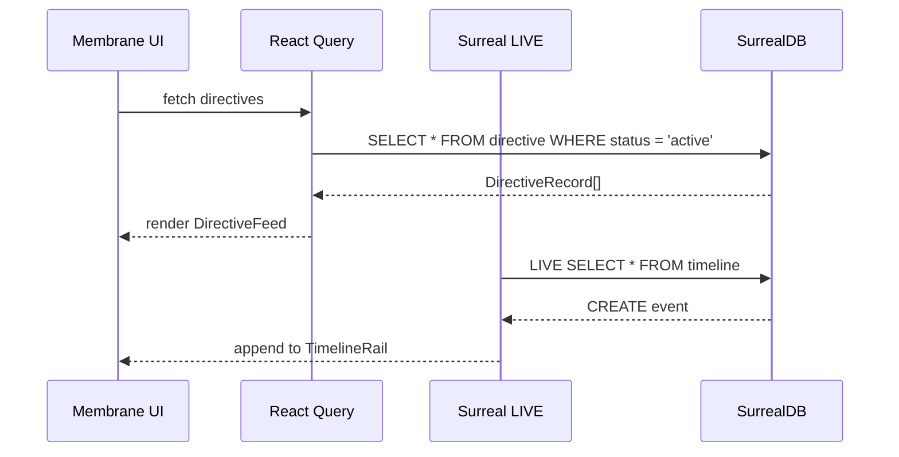

# Frontend

Aigency's frontend is the **Membraned Interface** — a 3D spatial knowledge graph rendered with Three.js and React, overlaid with frosted glass panels. It consumes design tokens from `@aigency/design-tokens` and connects to SurrealDB for live data.

## Membrane Architecture

```mermaid
graph TB
    subgraph "Membrane App"
        direction TB
        A[App.tsx] --> C[Canvas<br/>@react-three/fiber]
        A --> F[Floating Panels<br/>pointerEvents: none]

        C --> S[SynapTree<br/>3D Knowledge Graph]
        C --> L[ambientLight]

        F --> Q[QuerySurface<br/>Cmd+K bar]
        F --> D[DirectiveFeed<br/>left edge]
        F --> T[TimelineRail<br/>bottom scrubber]
    end

    subgraph "Data Sources"
        DT[@aigency/design-tokens]
        SR[@aigency/surreal<br/>LIVE queries]
    end

    S --> DT
    S --> SR
    D --> SR
    T --> SR
```

## Current Implementation

The Membrane is in early scaffolding. `apps/membrane/src/App.tsx:1-30` renders:

```tsx
export function App() {
  const bg = tokens.atoms.color.base.canvas.$value as string;

  return (
    <div style={{ width: "100vw", height: "100vh", background: bg }}>
      <Canvas style={{ position: "absolute", inset: 0 }} camera={{ position: [0, 0, 50], fov: 60 }}>
        <ambientLight intensity={0.1} />
      </Canvas>
      <div style={{ position: "relative", zIndex: 10, pointerEvents: "none" }}>
        {/* TODO: QuerySurface, DirectiveFeed, TimelineRail */}
      </div>
    </div>
  );
}
```

Planned components (not yet implemented):
- **SynapTree** — 3D knowledge graph visualization (`TODO` in App.tsx)
- **QuerySurface** — Cmd+K ORACLE query bar
- **DirectiveFeed** — Left-edge active directives panel
- **TimelineRail** — Bottom timeline scrubber

## Design Tokens

`@aigency/design-tokens` exports W3C DTCG tokens in three tiers (`packages/design-tokens/src/index.ts:1-29`):

| Tier | Example | Purpose |
|------|---------|---------|
| Atoms | `color.agent.zenith`, `opacity.fresh` | Primitive values |
| Molecules | (future) | Composed atoms |
| Organisms | (future) | Component-level tokens |

### Token Accessors

```typescript
export const agentColor = (callsign: string): string;
export const nodeShape = (nodeType: string): string;
export const opacityForAge = (ageHours: number): number;
```

(`packages/design-tokens/src/index.ts:11-29`)

`opacityForAge` maps temporal decay to visual opacity:

| Age | Opacity Token |
|-----|---------------|
| < 24h | `fresh` |
| < 72h | `semi-fresh` |
| < 1 week | `aging` |
| < 1 month | `stale` |
| < 3 months | `archived` |
| >= 3 months | `deprecated` |

## Technology Stack

| Package | Version | Purpose |
|---------|---------|---------|
| `react` | ^18.3.1 | UI framework |
| `three` | ^0.170.0 | 3D engine |
| `@react-three/fiber` | ^8.17.10 | React renderer for Three.js |
| `@react-three/drei` | ^9.117.3 | Helpers (controls, shapes, etc.) |
| `@react-three/postprocessing` | ^2.16.3 | Screen effects |
| `d3-force-3d` | ^3.0.5 | Force-directed graph layout |
| `zustand` | ^5.0.2 | State management |
| `@tanstack/react-query` | ^5.62.3 | Server state |
| `framer-motion` | ^11.14.1 | UI animations |

(`apps/membrane/package.json:14-28`)

## Build Setup

Membrane uses Vite for bundling (`apps/membrane/package.json:8-12`):

```bash
pnpm --filter @aigency/membrane dev     # Vite dev server
pnpm --filter @aigency/membrane build   # Production build
```

The package depends on `@aigency/agent-core`, `@aigency/surreal`, and `@aigency/design-tokens` as workspace dependencies.

## Visual Design Language

The Membrane follows IRIS's **SynapTree** design system:

- **Dark canvas** — `#0a0a12` background for 3D scene
- **Agent-colored nodes** — Each agent's registry color maps to graph nodes
- **Frosted glass panels** — CSS `backdrop-filter: blur()` for overlays
- **Temporal opacity** — Older data fades via `opacityForAge()`
- **No traditional chrome** — No title bars, menus, or sidebars; everything lives in 3D space or floating panels

## Planned Data Flow



The `@aigency/surreal` `LIVE.subscribe()` helper is designed for this exact pattern (`packages/surreal/src/live.ts:18-38`).

## Source Citations

- Membrane App component: `apps/membrane/src/App.tsx:1-30`
- Design tokens package: `packages/design-tokens/src/index.ts:1-29`
- Token JSON structure: `packages/design-tokens/src/synapttree-design-tokens.json`
- Membrane dependencies: `apps/membrane/package.json:1-39`
- LIVE query helpers: `packages/surreal/src/live.ts:1-54`
- Agent color mapping: `packages/design-tokens/src/index.ts:12-15`
