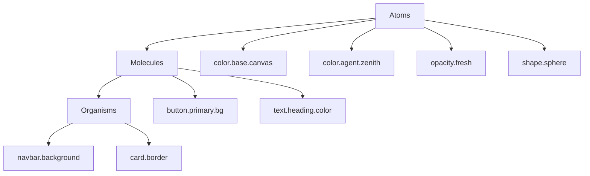

# Design Tokens

`@aigency/design-tokens` exports W3C DTCG (Design Token Community Group) tokens for the SynapTree design system. Tokens are structured in three tiers: atoms, molecules, and organisms.

## Overview

| Property | Value |
|----------|-------|
| Package | `@aigency/design-tokens` |
| Standard | W3C DTCG |
| Tiers | atoms → molecules → organisms |
| Owner | IRIS (`agents/iris/agent.yaml:9`) |

## Token Structure



## Exports

```typescript
import tokens from "./synapttree-design-tokens.json";

export { tokens };
export default tokens;

export const agentColor = (callsign: string): string;
export const nodeShape = (nodeType: string): string;
export const opacityForAge = (ageHours: number): number;
```

(`packages/design-tokens/src/index.ts:1-29`)

## Accessors

### agentColor

Maps a callsign to its registry color:

```typescript
export const agentColor = (callsign: string): string => {
  const key = callsign.toLowerCase().replace("_", "") as keyof typeof tokens.atoms.color.agent;
  return (tokens.atoms.color.agent as Record<string, { $value: string }>)[key]?.$value ?? "#FFFFFF";
};
```

(`packages/design-tokens/src/index.ts:12-15`)

### nodeShape

Maps a node type to a Three.js geometry:

```typescript
export const nodeShape = (nodeType: string): string => {
  const key = nodeType.toLowerCase() as keyof typeof tokens.atoms.shape;
  return (tokens.atoms.shape as Record<string, { $value: string }>)[key]?.$value ?? "SphereGeometry";
};
```

(`packages/design-tokens/src/index.ts:17-20`)

### opacityForAge

Maps temporal decay to visual opacity:

```typescript
export const opacityForAge = (ageHours: number): number => {
  if (ageHours < 24)   return tokens.atoms.opacity.fresh.$value as number;
  if (ageHours < 72)   return tokens.atoms.opacity["semi-fresh"].$value as number;
  if (ageHours < 168)  return tokens.atoms.opacity.aging.$value as number;
  if (ageHours < 720)  return tokens.atoms.opacity.stale.$value as number;
  if (ageHours < 2160) return tokens.atoms.opacity.archived.$value as number;
  return tokens.atoms.opacity.deprecated.$value as number;
};
```

(`packages/design-tokens/src/index.ts:22-29`)

| Age | Token |
|-----|-------|
| < 24h | `fresh` |
| < 72h | `semi-fresh` |
| < 1 week (168h) | `aging` |
| < 1 month (720h) | `stale` |
| < 3 months (2160h) | `archived` |
| >= 3 months | `deprecated` |

## Token JSON

The raw tokens live in `packages/design-tokens/src/synapttree-design-tokens.json`. This file follows the W3C DTCG format with `$value`, `$type`, and `$description` fields for each token.

## Package Config

```json
{
  "name": "@aigency/design-tokens",
  "exports": {
    ".": { "import": "./dist/index.mjs", "require": "./dist/index.js", "types": "./dist/index.d.ts" },
    "./tokens.json": "./src/synapttree-design-tokens.json"
  }
}
```

(`packages/design-tokens/package.json:1-29`)

## Usage in Membrane

```tsx
import { tokens } from "@aigency/design-tokens";

const bg = tokens.atoms.color.base.canvas.$value as string;
```

(`apps/membrane/src/App.tsx:2-8`)

## Source Citations

- Token accessors: `packages/design-tokens/src/index.ts:1-29`
- Token JSON: `packages/design-tokens/src/synapttree-design-tokens.json`
- Package config: `packages/design-tokens/package.json:1-29`
- Membrane usage: `apps/membrane/src/App.tsx:1-30`
