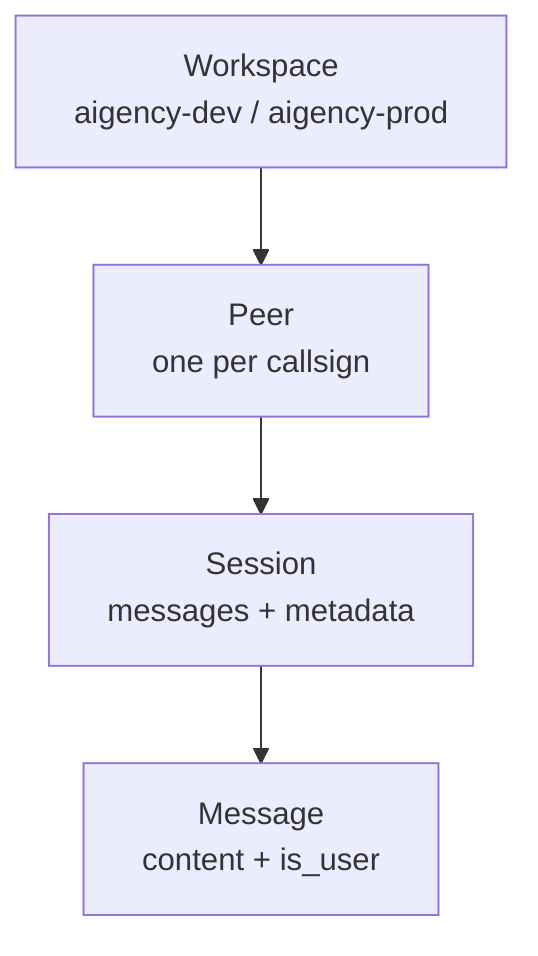

# Honcho

`@aigency/honcho` wraps the `honcho-ai` SDK with Aigency-specific workspace structure. It provides peer identity, session management, and cross-session reasoning ("dreaming") for all 11 agents.

## Overview

| Property | Value |
|----------|-------|
| Package | `@aigency/honcho` |
| Underlying SDK | `honcho-ai` ^0.2.0 |
| Primitives | Workspaces → Peers → Sessions → Messages |
| Key Feature | Async background inference (`dream()`) |

## Honcho Primitives



(`packages/honcho/src/index.ts:3-4`)

## HonchoClient

```typescript
export class HonchoClient {
  constructor(config: HonchoClientConfig);
  async getPeer(callsign: AgentCallsign): Promise<Peer>;
  async startSession(callsign, metadata?): Promise<Session>;
  async addMessage(callsign, sessionId, content, isUser, metadata?): Promise<Message>;
  async dream(callsign, query): Promise<string>;
}
```

(`packages/honcho/src/client.ts:14-80`)

### Configuration

```typescript
export interface HonchoClientConfig {
  apiKey: string;
  workspaceId: string;   // "aigency-dev" | "aigency-prod"
  baseUrl?: string;      // default: https://demo.honcho.dev
}
```

(`packages/honcho/src/client.ts:6-12`)

### getPeer

Get or create a peer record for an agent callsign:

```typescript
async getPeer(callsign: AgentCallsign) {
  const peers = await this.client.apps.users.list(this.workspaceId, {
    filter: JSON.stringify({ callsign }),
  });
  if (peers.items.length > 0) return peers.items[0];
  return this.client.apps.users.create(this.workspaceId, { metadata: { callsign } });
}
```

(`packages/honcho/src/client.ts:27-37`)

### startSession

Begin a new session for an agent:

```typescript
async startSession(callsign: AgentCallsign, metadata?: Record<string, unknown>) {
  const peer = await this.getPeer(callsign);
  return this.client.apps.users.sessions.create(this.workspaceId, peer.id, {
    metadata: { agent: callsign, started_at: new Date().toISOString(), ...metadata },
  });
}
```

(`packages/honcho/src/client.ts:40-45`)

### addMessage

Append a message to an existing session:

```typescript
async addMessage(callsign, sessionId, content, isUser, metadata?) {
  const peer = await this.getPeer(callsign);
  return this.client.apps.users.sessions.messages.create(
    this.workspaceId, peer.id, sessionId,
    { content, is_user: isUser, metadata }
  );
}
```

(`packages/honcho/src/client.ts:48-62`)

### dream

Trigger Honcho's **async background inference** for cross-session reasoning:

```typescript
async dream(callsign: AgentCallsign, query: string): Promise<string> {
  const peer = await this.getPeer(callsign);
  const sessions = await this.client.apps.users.sessions.list(this.workspaceId, peer.id);
  if (sessions.items.length === 0) throw new Error(`No sessions for ${callsign}`);

  const latestSession = sessions.items[0];
  const result = await this.client.apps.users.sessions.chat(
    this.workspaceId, peer.id, latestSession.id,
    { queries: [query] }
  );

  return result.content ?? "";
}
```

(`packages/honcho/src/client.ts:65-79`)

This is the mechanism by which ORACLE performs persistent memory operations across disconnected sessions.

## Types

```typescript
export interface AigencyPeer {
  id: string;
  callsign: AgentCallsign;
  workspaceId: string;
  metadata: Record<string, unknown>;
  created_at: string;
}

export interface AigencySession {
  id: string;
  peerId: string;
  agent: AgentCallsign;
  started_at: string;
  ended_at?: string;
  metadata: Record<string, unknown>;
}
```

(`packages/honcho/src/types.ts:1-18`)

## Deprecation Note

`honcho-ai@0.2.0` is marked deprecated on npm. The monorepo should verify whether the Honcho team has moved to a new package name before implementing the full peer/session layer (`CLAUDE.md:123-125`).

## Source Citations

- HonchoClient: `packages/honcho/src/client.ts:1-80`
- Aigency types: `packages/honcho/src/types.ts:1-18`
- Package exports: `packages/honcho/src/index.ts:1-6`
- Package config: `packages/honcho/package.json:1-33`
