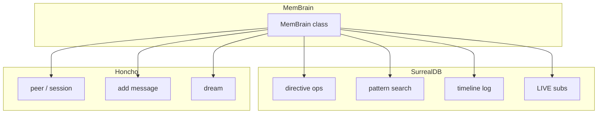

# Mem-Brain

`@aigency/mem-brain` is the **unified memory interface** for Aigency's 10 executive agents. It abstracts over SurrealDB (knowledge graph + temporal state) and Honcho (peer identity + cross-session reasoning) behind a single API.

## Overview

| Property | Value |
|----------|-------|
| Package | `@aigency/mem-brain` |
| Dependencies | `@aigency/agent-core`, `@aigency/surreal`, `@aigency/honcho` |
| Purpose | Single entry point for all agent memory |

## Architecture



## MemBrain Class

```typescript
export class MemBrain {
  constructor(config: MemBrainConfig);
  async connect(): Promise<void>;

  // Directive operations
  async getActiveDirectives(): Promise<DirectiveRecord[]>;
  async createDirective(data): Promise<DirectiveRecord>;

  // Pattern operations
  async searchPatterns(embedding, limit?): Promise<PatternRecord[]>;

  // Timeline
  async logEvent(eventType, agent, summary, metadata?): Promise<void>;

  // LIVE subscriptions
  subscribeToDirectives(callback): Promise<() => void>;
  subscribeToTimeline(callback): Promise<() => void>;

  // Honcho bridge
  async startAgentSession(callsign, metadata?);
  async addAgentMessage(callsign, sessionId, content, isUser?);
  async oracleDream(query): Promise<string>;
}
```

(`packages/mem-brain/src/mem-brain.ts:25-127`)

## Configuration

```typescript
export interface MemBrainConfig {
  surreal: {
    url: string;
    namespace: string;
    database: string;
    username: string;
    password: string;
  };
  honcho: {
    apiKey: string;
    workspaceId: string;
    baseUrl?: string;
  };
}
```

(`packages/mem-brain/src/mem-brain.ts:10-23`)

## Directive Operations

### getActiveDirectives

```typescript
async getActiveDirectives(): Promise<DirectiveRecord[]> {
  const db = SurrealClient.db;
  const [rows] = await db.query<[DirectiveRecord[]]>(
    "SELECT * FROM directive WHERE status = 'active' ORDER BY priority"
  );
  return rows;
}
```

(`packages/mem-brain/src/mem-brain.ts:39-45`)

### createDirective

```typescript
async createDirective(data): Promise<DirectiveRecord> {
  const db = SurrealClient.db;
  const [record] = await db.create<DirectiveRecord>("directive", {
    ...data,
    created_at: new Date().toISOString(),
  });
  await this.logEvent("directive_created", data.owner, `Directive created: ${data.title}`);
  return record;
}
```

(`packages/mem-brain/src/mem-brain.ts:47-57`)

## Pattern Search

Vector similarity search using SurrealDB's cosine similarity:

```typescript
async searchPatterns(embedding: number[], limit = 5): Promise<PatternRecord[]> {
  const db = SurrealClient.db;
  const [rows] = await db.query<[PatternRecord[]]>(
    `SELECT *, vector::similarity::cosine(embedding, $vec) AS score
     FROM pattern
     WHERE vector::similarity::cosine(embedding, $vec) > 0.75
     ORDER BY score DESC
     LIMIT $limit`,
    { vec: embedding, limit }
  );
  return rows;
}
```

(`packages/mem-brain/src/mem-brain.ts:61-72`)

Threshold is **0.75** cosine similarity. Embeddings are expected to be 1536-dimensional (`packages/surreal/src/types.ts:39`).

## Timeline Logging

```typescript
async logEvent(eventType, agent, summary, metadata = {}) {
  const db = SurrealClient.db;
  await db.create("timeline", {
    event_type: eventType,
    agent,
    summary,
    metadata,
    created_at: new Date().toISOString(),
  });
}
```

(`packages/mem-brain/src/mem-brain.ts:76-90`)

## LIVE Subscriptions

```typescript
subscribeToDirectives(callback) {
  return LIVE.subscribe<DirectiveRecord>("directive", callback, "status = 'active'");
}

subscribeToTimeline(callback) {
  return LIVE.subscribe<TimelineRecord>("timeline", callback);
}
```

(`packages/mem-brain/src/mem-brain.ts:94-104`)

## Honcho Bridge

```typescript
async startAgentSession(callsign, metadata?) {
  const session = await this.honcho.startSession(callsign, metadata);
  await this.logEvent("session_start", callsign, `Session started: ${session.id}`);
  return session;
}

async addAgentMessage(callsign, sessionId, content, isUser = false) {
  return this.honcho.addMessage(callsign, sessionId, content, isUser);
}

async oracleDream(query: string): Promise<string> {
  return this.honcho.dream("ORACLE", query);
}
```

(`packages/mem-brain/src/mem-brain.ts:108-126`)

## Source Citations

- MemBrain class: `packages/mem-brain/src/mem-brain.ts:1-127`
- Package exports: `packages/mem-brain/src/index.ts:1-6`
- Package config: `packages/mem-brain/package.json:1-33`
