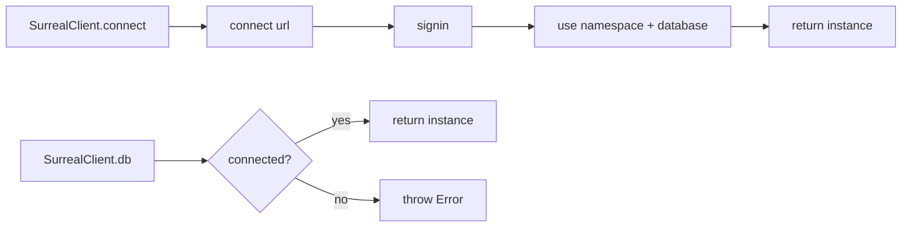

# Surreal

`@aigency/surreal` wraps the `surrealdb` JavaScript SDK with Aigency-specific connection management, record types, and LIVE query helpers. It is the primary database interface for the monorepo.

## Overview

| Property | Value |
|----------|-------|
| Package | `@aigency/surreal` |
| Underlying SDK | `surrealdb` ^1.0.0 |
| DB Version | SurrealDB 3.0 |
| Exports | Client, LIVE helpers, record types |

## Exports

```typescript
export { SurrealClient } from "./client.js";
export { LIVE } from "./live.js";
export type { AgentRecord, DirectiveRecord, PatternRecord, TimelineRecord } from "./types.js";
```

(`packages/surreal/src/index.ts:1-6`)

## SurrealClient

A singleton connection manager (`packages/surreal/src/client.ts:1-51`):

```typescript
export interface SurrealClientConfig {
  url: string;          // e.g. "ws://localhost:8000/rpc"
  namespace: string;    // e.g. "aigency"
  database: string;     // e.g. "mem_brain"
  username: string;
  password: string;
}
```

### Connection Lifecycle



(`packages/surreal/src/client.ts:18-35`)

### Reconnection

```typescript
static async reconnect(): Promise<Surreal> {
  if (!_config) throw new Error("[surreal] No config to reconnect with.");
  _instance = null;
  return SurrealClient.connect(_config);
}
```

(`packages/surreal/src/client.ts:46-50`)

## Record Types

### AgentRecord

```typescript
export interface AgentRecord {
  id: string;                   // "agent:<callsign>"
  callsign: AgentCallsign;
  name: string;
  role: string;
  color: string;
  substrate: string;
  status: "active" | "standby" | "offline" | "dreaming";
  current_focus?: string;
  soul_hash: string;
  created_at: string;
  updated_at: string;
}
```

(`packages/surreal/src/types.ts:5-17`)

### DirectiveRecord

```typescript
export interface DirectiveRecord {
  id: string;                   // "directive:<ulid>"
  title: string;
  body: string;
  status: "active" | "pending" | "completed" | "superseded";
  priority: "critical" | "high" | "medium" | "low";
  owner: AgentCallsign;
  created_at: string;
  due_at?: string;
  completed_at?: string;
  tags: string[];
}
```

(`packages/surreal/src/types.ts:19-30`)

### PatternRecord

```typescript
export interface PatternRecord {
  id: string;                   // "pattern:<ulid>"
  title: string;
  body: string;
  category: "decision" | "behavior" | "anti-pattern" | "process";
  confidence: number;
  source_agent: AgentCallsign;
  embedding: number[];          // 1536-dim
  occurrence_count: number;
  first_seen: string;
  last_seen: string;
}
```

(`packages/surreal/src/types.ts:32-43`)

### TimelineRecord

```typescript
export interface TimelineRecord {
  id: string;                   // "timeline:<ulid>"
  event_type:
    | "session_start"
    | "session_end"
    | "directive_created"
    | "directive_completed"
    | "pattern_detected"
    | "lint_run"
    | "compile_run"
    | "graft_harvested"
    | "agent_status_change";
  agent: AgentCallsign;
  summary: string;
  metadata: Record<string, unknown>;
  created_at: string;
}
```

(`packages/surreal/src/types.ts:45-61`)

### Graph Edges

| Edge | `in` | `out` |
|------|------|-------|
| `DecidedByEdge` | directive ID | agent ID |
| `InformedByEdge` | directive ID | pattern ID |
| `SupersedesEdge` | new directive ID | old directive ID |

(`packages/surreal/src/types.ts:65-81`)

## LIVE Queries

The `LIVE` object provides typed subscriptions to real-time changes (`packages/surreal/src/live.ts:1-54`):

```typescript
export const LIVE = {
  async subscribe<T>(table, callback, where?): Promise<() => void>;
  async onEvent<T>(eventType, callback): Promise<() => void>;
  async onAgentStatus(callback): Promise<() => void>;
};
```

### Usage

```typescript
const unsub = await LIVE.subscribe<DirectiveRecord>("directive", (action, record) => {
  console.log(action, record); // CREATE | UPDATE | DELETE
}, "status = 'active'");

// Later...
unsub();
```

(`packages/surreal/src/live.ts:18-37`)

### How It Works

1. Constructs `LIVE SELECT * FROM <table> [WHERE <where>]`
2. Executes via `db.query()` to get a UUID
3. Registers callback via `db.subscribeLive(uuid, handler)`
4. Returns unsubscribe function that calls `db.kill(uuid)`

## Package Config

```json
{
  "name": "@aigency/surreal",
  "version": "0.1.0",
  "dependencies": {
    "surrealdb": "^1.0.0"
  },
  "devDependencies": {
    "@aigency/agent-core": "workspace:*",
    "@aigency/tsconfig": "workspace:*"
  }
}
```

(`packages/surreal/package.json:1-38`)

## Source Citations

- SurrealClient: `packages/surreal/src/client.ts:1-51`
- LIVE queries: `packages/surreal/src/live.ts:1-54`
- Record types: `packages/surreal/src/types.ts:1-81`
- Package exports: `packages/surreal/src/index.ts:1-6`
- Package config: `packages/surreal/package.json:1-38`
