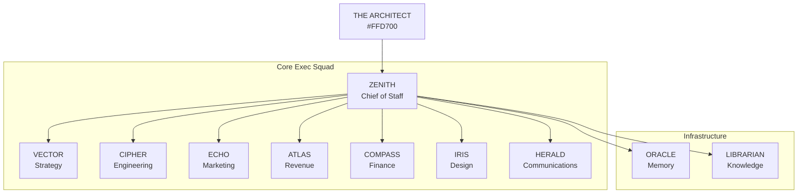

# Agents

Aigency operates **10 executive AI agents** plus **THE_ARCHITECT** (human founder). Each agent has a distinct callsign, color, role, substrate, and TELOS identity document. This section documents each agent's responsibilities, ownership, and runtime configuration.

## Agent Registry

All agents are defined in `packages/agent-core/src/index.ts:26-38`:

```typescript
export const AGENT_REGISTRY: Record<AgentCallsign, AgentIdentity> = {
  THE_ARCHITECT: { callsign: "THE_ARCHITECT", name: "Antonio Reid",     role: "Founder & Chief Architect",       color: "#FFD700", substrate: "human" },
  ZENITH:        { callsign: "ZENITH",        name: "Newton Hughes",    role: "Chief of Staff & Orchestrator",   color: "#00E5CC", substrate: "OpenClaw" },
  VECTOR:        { callsign: "VECTOR",        name: "Dominique Osei",   role: "Strategy & Intelligence",         color: "#7B2FFF", substrate: "gptme" },
  CIPHER:        { callsign: "CIPHER",        name: "Roman Voss",       role: "Engineering & DevOps",            color: "#39FF14", substrate: "gptme" },
  ECHO:          { callsign: "ECHO",          name: "Selene Navarro",   role: "Marketing & Content",             color: "#FF2D78", substrate: "TBD" },
  ATLAS:         { callsign: "ATLAS",         name: "Jordan Mercer",    role: "Revenue & Sales Ops",             color: "#FFB300", substrate: "TBD" },
  COMPASS:       { callsign: "COMPASS",       name: "Imara Adeyemi",    role: "Finance & Operations",            color: "#00BFA5", substrate: "TBD" },
  IRIS:          { callsign: "IRIS",          name: "Vivienne Calloway",role: "Design & Brand Systems",          color: "#C77DFF", substrate: "TBD" },
  HERALD:        { callsign: "HERALD",        name: "Dax Okafor",       role: "Communications",                  color: "#FFFFFF", substrate: "Motia" },
  ORACLE:        { callsign: "ORACLE",        name: "Sable Quinn",      role: "Persistent Memory Agent",         color: "#1A237E", substrate: "Letta/MemGPT" },
  LIBRARIAN:     { callsign: "LIBRARIAN",     name: "Ren Nakamura",     role: "Knowledge Graph Curator",         color: "#FF6D00", substrate: "ZeroClaw" },
};
```

## Organizational Structure



## Agent Identity Manifests

Each agent has an `agent.yaml` in `agents/<callsign>/`:

```yaml
callsign: ZENITH
name: "Newton Hughes"
role: "Chief of Staff & Orchestrator"
color: "#00E5CC"
substrate: "OpenClaw"
vault: "../../aigency-vault/agents/zenith"
soul: "../../aigency-vault/agents/zenith/SOUL.md"
rules: "../../aigency-vault/agents/zenith/RULES.md"
telos: "../../apps/telos/agents/zenith.md"
```

The `agent.yaml` files point to external identity documents in `aigency-vault/` — they do not duplicate them (`CLAUDE.md:119-120`).

## Directory Ownership

Some agents own specific directories:

| Agent | Owns |
|-------|------|
| CIPHER | `apps/membrane`, `apps/router`, `apps/contracts` |
| IRIS | `packages/design-tokens` |

## Substrates

| Substrate | Agents | Description |
|-----------|--------|-------------|
| `human` | THE_ARCHITECT | Human founder |
| `OpenClaw` | ZENITH | OpenClaw agent framework |
| `gptme` | CIPHER, VECTOR | gptme CLI agent |
| `Motia` | HERALD | Motia event-driven framework |
| `Letta/MemGPT` | ORACLE | Persistent memory agent |
| `ZeroClaw` | LIBRARIAN | ZeroClaw curator |
| `TBD` | ECHO, ATLAS, COMPASS, IRIS | Not yet assigned |

## TELOS Identity

Every agent has a **Telos Context File** in `apps/telos/agents/<callsign>.md`:

- Mission (M) — immutable purpose
- Problems (P) — tensions to resolve
- Goals (G) — force-ranked outcomes
- KPIs — measurable progress
- Risk Register — likelihood × impact
- Activity Log — append-only changelog

See [TELOS Deep Dive](../02-deep-dive/apps/telos.md) for the full framework.

## Critical Naming Rule

**ZENITH** (Newton Hughes) and **NEXUS** (Marcus Hale) are identical twins. ZENITH runs the Core Exec Squad; NEXUS runs the Agile Squad. NEXUS is **not** in this monorepo's `agents/` directory. Do not conflate them (`CLAUDE.md:64-67`).

## Agent Pages

- [ZENITH](./zenith.md) — Chief of Staff & Orchestrator
- [CIPHER](./cipher.md) — Engineering & DevOps
- [VECTOR](./vector.md) — Strategy & Intelligence
- [ECHO](./echo.md) — Marketing & Content
- [ATLAS](./atlas.md) — Revenue & Sales Ops
- [COMPASS](./compass.md) — Finance & Operations
- [IRIS](./iris.md) — Design & Brand Systems
- [HERALD](./herald.md) — Communications

## Source Citations

- Agent registry: `packages/agent-core/src/index.ts:26-38`
- ZENITH agent.yaml: `agents/zenith/agent.yaml:1-12`
- CIPHER agent.yaml: `agents/cipher/agent.yaml:1-11`
- Twin naming rule: `CLAUDE.md:64-67`
