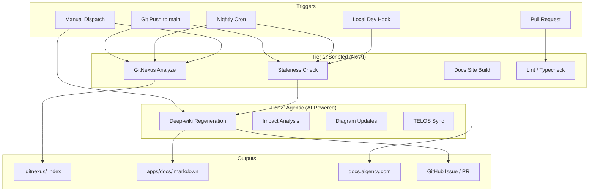

# Documentation & Knowledge Graph Automation

> *The map must redraw itself as the territory changes.*

---

## The Problem

Aigency has two living knowledge systems:

1. **GitNexus** — a code-aware knowledge graph (1,321 nodes, 1,567 edges)
2. **Deep-wiki** — human-readable documentation (35 markdown files)

Both become stale the moment code changes. Manual updates don't scale. We need automation.

---

## Automation Architecture



---

## Tier 1: Scripting (Runs Automatically)

These are deterministic, fast, and require no AI. They run on every push.

### GitNexus Auto-Sync

**What:** Parses all source files and rebuilds the knowledge graph.

**When:**
- Every push to `main`
- Every night at 3 AM UTC
- On manual workflow dispatch

**How:**
```bash
# Local
./scripts/automation/gitnexus-sync.sh

# CI
npx gitnexus analyze
```

**File:** `.github/workflows/automation.yml` → `gitnexus-sync` job

---

### Docs Staleness Detection

**What:** Measures the time gap between the last docs update and the last source code change.

**Threshold:** 7 days (configurable)

**How:**
```bash
# Local
./scripts/automation/docs-staleness-check.sh [--threshold-days 7]

# Returns exit code 1 if stale, 0 if fresh
```

**File:** `.github/workflows/automation.yml` → `docs-staleness-check` job

---

### Docs Site Build

**What:** Compiles markdown into a deployable static site.

**Status:** Placeholder (Phase 3 roadmap)

**How (future):**
```bash
pnpm --filter @aigency/docs build
```

**File:** `.github/workflows/automation.yml` → `build-docs` job

---

## Tier 2: Agentic (AI-Powered)

These require an LLM and human review. They don't run blindly — they create issues/PRs.

### Deep-Wiki Regeneration

**What:** Uses an AI agent to analyze code changes and update documentation.

**Trigger:**
- Staleness threshold exceeded (7+ days)
- Manual workflow dispatch with `regenerate_wiki: true`
- Scheduled nightly check

**Workflow:**
```
1. Staleness detected
2. GitHub Issue auto-created with context
3. AI agent (Claude/GPT) picks up the issue
4. Agent reads changed files, updates relevant wiki pages
5. Agent commits to branch `agentic/wiki-regen-YYYYMMDD-HHMMSS`
6. Agent opens PR
7. Human reviews and merges
```

**How:**
```bash
# Local setup for agent
./scripts/automation/agentic-wiki-regen.sh

# This creates:
#   - A work branch
#   - .agentic-wiki-context.md with instructions for the AI
```

**File:** `.github/workflows/automation.yml` → `agentic-wiki-trigger` job

---

### GitNexus Wiki Generation

**What:** Generates high-level documentation from the knowledge graph.

**Trigger:** Manual (requires LLM API key)

**How:**
```bash
npx gitnexus wiki --model minimax/minimax-m2.5
```

**Note:** This is separate from deep-wiki. GitNexus wiki is algorithmic; deep-wiki is narrative.

---

## Turborepo Integration

New tasks added to `turbo.json`:

```json
{
  "docs:build": {
    "dependsOn": ["^build"],
    "inputs": ["$TURBO_DEFAULT$", "apps/docs/**"],
    "outputs": ["apps/docs/dist/**"]
  },
  "docs:dev": {
    "cache": false,
    "persistent": true
  },
  "gitnexus:sync": {
    "cache": false,
    "inputs": ["apps/**", "packages/**", "agents/**"]
  },
  "docs:check": {
    "cache": false,
    "inputs": ["apps/docs/**", "apps/**", "packages/**", "agents/**"]
  }
}
```

**Usage:**
```bash
# Check if docs are stale
pnpm turbo run docs:check

# Sync GitNexus
pnpm turbo run gitnexus:sync

# Build docs site
pnpm turbo run docs:build
```

---

## Local Development Hooks

### Optional: Husky + lint-staged

For developers who want local automation:

```bash
# Install (if desired)
pnpm add -D husky lint-staged

# .husky/post-commit
./scripts/automation/gitnexus-sync.sh

# .husky/post-merge
./scripts/automation/gitnexus-sync.sh
./scripts/automation/docs-staleness-check.sh || true
```

> **Note:** Post-commit hooks are lightweight. GitNexus analyze takes ~3 seconds.

---

## CI/CD Pipeline

### GitHub Actions Workflow

**File:** `.github/workflows/automation.yml`

| Job | Trigger | Duration | AI Required |
|-----|---------|----------|-------------|
| `gitnexus-sync` | push, schedule, manual | ~5s | ❌ |
| `docs-staleness-check` | push, schedule | ~1s | ❌ |
| `build-docs` | push, PR | ~30s | ❌ |
| `agentic-wiki-trigger` | schedule (stale only), manual | ~5s | ❌ (creates issue) |

### Secrets Required

| Secret | Used By | Required? |
|--------|---------|-----------|
| `DISCORD_WEBHOOK_URL` | Agentic alert notifications | Optional |
| `OPENAI_API_KEY` | GitNexus wiki --embeddings | Optional |
| `GITHUB_TOKEN` | Auto-commit, issue creation | Built-in |

---

## Agentic Vision (Future)

### The DOCS Agent

A dedicated agent (callsign: SCRIBE?) that owns documentation freshness.

**Responsibilities:**
- Monitor staleness checks
- Regenerate deep-wiki when needed
- Update TELOS Activity Logs
- Maintain AGENTS.md accuracy
- Generate architecture diagrams (via Archie/Mermaid)

**Substrate:** gptme or Claude Code scheduled runs

**Runtime:**
```yaml
# .github/workflows/scribe.yml
on:
  schedule:
    - cron: '0 9 * * 1'  # Every Monday 9 AM
  workflow_dispatch:

jobs:
  scribe:
    runs-on: ubuntu-latest
    steps:
      - uses: actions/checkout@v4
      - uses: anthropics/claude-code-action@v1
        with:
          prompt: |
            Read apps/docs/AUTOMATION.md
            Run ./scripts/automation/docs-staleness-check.sh
            If stale, run ./scripts/automation/agentic-wiki-regen.sh
            Update relevant wiki pages based on recent commits
            Open a PR with changes
```

### Auto-Diagram Generation

When architecture changes:
1. GitNexus detects new clusters/processes
2. Agent generates Mermaid diagrams
3. Diagrams are embedded in wiki pages
4. Old diagrams are archived

**Tool:** Archie (from GitHubNext/agentics) or custom Mermaid generator

### Impact-Aware Updates

When a PR changes `apps/router/src/server.ts`:
1. GitNexus `detect_changes` identifies blast radius
2. Agent updates only affected wiki pages (not everything)
3. Agent adds citations to new code

---

## Files & Scripts Reference

| File | Purpose |
|------|---------|
| `.github/workflows/automation.yml` | Main CI/CD automation |
| `scripts/automation/gitnexus-sync.sh` | Local GitNexus refresh |
| `scripts/automation/docs-staleness-check.sh` | Local staleness detection |
| `scripts/automation/agentic-wiki-regen.sh` | Agent setup for wiki regen |
| `turbo.json` | Turborepo task definitions |
| `apps/docs/AUTOMATION.md` | This file — architecture spec |

---

## Decision Log

| Decision | Choice | Why |
|----------|--------|-----|
| **Scripted vs Agentic split** | Two tiers | Scripted is fast/reliable; agentic is powerful/expensive |
| **Threshold: 7 days** | Default staleness | Balances freshness vs. noise |
| **Issue creation vs auto-merge** | Issues + PRs | Agentic changes need human review |
| **No pre-commit hook by default** | CI only | Keeps local dev fast; opt-in via Husky |
| **GitNexus analyze on every push** | Yes | 3 seconds, keeps index fresh |

---

## Roadmap

### Phase 1: Scripting (Current)
- [x] GitHub Actions workflow
- [x] Local sync scripts
- [x] Staleness detection
- [x] Turborepo integration

### Phase 2: Agentic Triggering (Q3 2025)
- [ ] Auto-create GitHub Issues when docs go stale
- [ ] Discord/Slack notifications
- [ ] `.agentic-wiki-context.md` generation
- [ ] Work branch automation

### Phase 3: AI Agent Integration (Q4 2025)
- [ ] Claude Code GitHub Action for wiki regen
- [ ] Impact-aware partial updates (only changed pages)
- [ ] Auto-diagram generation from GitNexus clusters
- [ ] TELOS Activity Log auto-updates

### Phase 4: Autonomous Maintenance (Q1 2026)
- [ ] Dedicated DOCS/SCRIBE agent
- [ ] Self-healing docs (agent detects gaps, fills them)
- [ ] Predictive updates (agent anticipates changes from PRs)
- [ ] Multi-format output (wiki, llms.txt, AGENTS.md, VitePress)

---

## Running It Now

```bash
# 1. Check if docs are stale
./scripts/automation/docs-staleness-check.sh

# 2. Sync GitNexus
./scripts/automation/gitnexus-sync.sh

# 3. Prepare agentic regeneration (if stale)
./scripts/automation/agentic-wiki-regen.sh

# 4. Via Turborepo
pnpm turbo run gitnexus:sync docs:check
```

---

*Documentation is a living system. It should tend itself.*
