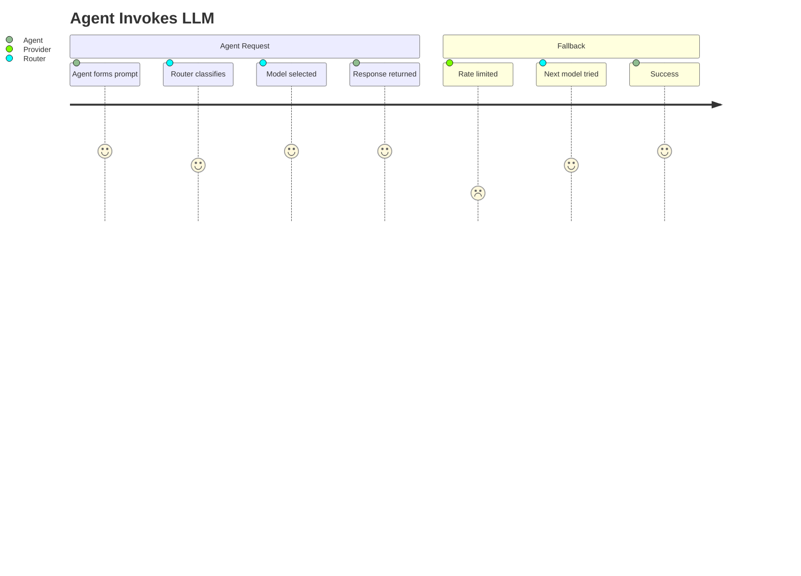
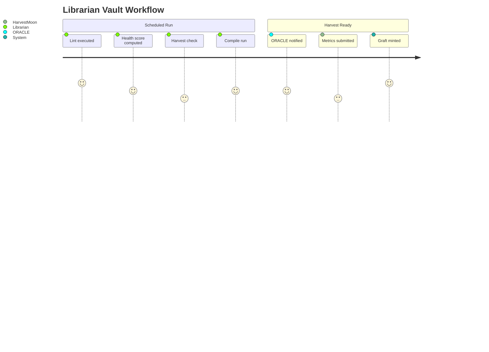

# Product Manager Onboarding

This guide is for product managers who need to understand Aigency's feature set, user journeys, and metrics without writing code.

## Product Overview

Aigency is an **operating system for AI agents**. It provides:

- **Identity** — Structured agent personas with TELOS documents
- **Memory** — Persistent graph + vector database (SurrealDB)
- **Routing** — Intelligent LLM provider selection (Router)
- **Interface** — 3D spatial knowledge graph (Membrane)
- **Quality Gates** — On-chain verification of knowledge health

## User Journeys

### Journey 1: Agent Invocation

### Journey 2: Knowledge Vault Maintenance

## Feature Inventory

### Router (Available)

| Feature | Status | Value |
|---------|--------|-------|
| OpenAI-compatible API | ✅ | Drop-in replacement |
| 14-dimension classification | ✅ | Optimal model selection |
| Rate limit tracking | ✅ | Resilience |
| Quota preservation | ✅ | Cost optimization |
| Fallback chain | ✅ | Reliability |
| Local SLM support | 🚧 | Planned |
| Portkey gateway | 🚧 | Planned |
| Anthropic provider | 🚧 | Planned |

### Membrane (In Development)

| Feature | Status | Value |
|---------|--------|-------|
| 3D canvas | ✅ | Spatial knowledge |
| Design tokens | ✅ | Consistent visual identity |
| SynapTree graph | 🚧 | Core visualization |
| QuerySurface | 🚧 | Agent search |
| DirectiveFeed | 🚧 | Work tracking |
| TimelineRail | 🚧 | History scrubber |

### TELOS (Content Phase)

| Feature | Status | Value |
|---------|--------|-------|
| Framework spec | ✅ | Identity standard |
| Interview protocol | ✅ | Structured capture |
| Agent skeletons | ✅ | 8 drafts |
| CLI tool | 🚧 | Q3 2025 |
| Web UI | 🚧 | Q4 2025 |
| Auto-deploy | 🚧 | Q4 2025 |

## Metrics & KPIs

### System Health

| Metric | Target | Measured By |
|--------|--------|-------------|
| Router uptime | 99.9% | Health endpoint |
| Avg classification time | < 10ms | Internal timer |
| Fallback rate | < 5% | Event logging |

### Vault Quality

| Metric | Threshold | Source |
|--------|-----------|--------|
| Health Score | >= 85 | `vault-tools/lint.ts` |
| Wiki Density | >= 0.70 | `vault-tools/lint.ts` |
| Compile success | > 95% | Librarian logs |

### Agent Activity

| Metric | Description |
|--------|-------------|
| Session starts | `session_start` timeline events |
| Directives created | `directive_created` events |
| Patterns detected | `pattern_detected` events |
| Grafts harvested | `graft_harvested` events |

## Release Cadence

- **Continuous** — Router improvements via config changes
- **Weekly** — Package updates, dependency bumps
- **Monthly** — Agent TELOS reviews
- **Quarterly** — Major feature releases (per TELOS roadmap)

## Feedback Channels

1. **Timeline events** — Automated system telemetry
2. **Lint reports** — Vault health dashboards (planned)
3. **Agent Activity Logs** — Self-reported in TELOS files

## Source Citations

- Router classification: `apps/router/src/router.ts:96-214`
- Librarian workflow: `apps/librarian/src/index.ts:1-47`
- TELOS roadmap: `apps/telos/README.md:88-249`
- HarvestMoon thresholds: `apps/contracts/src/HarvestMoon.sol:24-28`
- Timeline event types: `packages/surreal/src/types.ts:47-56`
