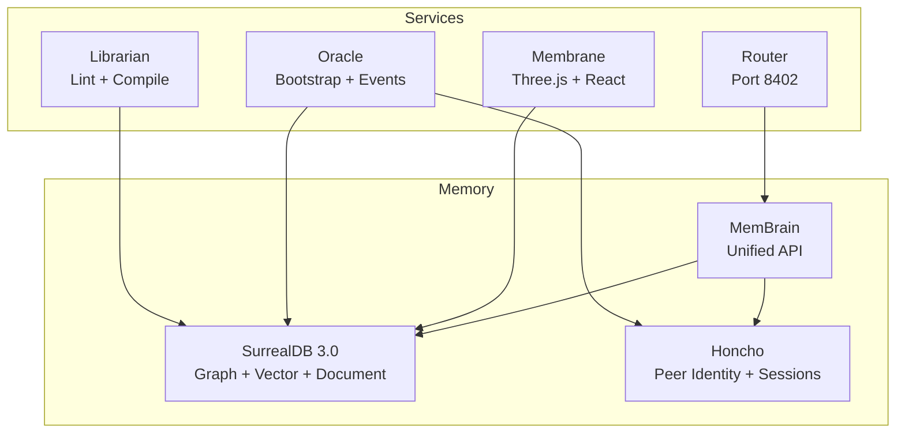

# Staff Engineer Onboarding

This guide is for engineers who need deep context on Aigency's architecture, design decisions, and extension points.

## Architecture at a Glance



## Critical Design Decisions

| Decision | Choice | Rationale | File |
|----------|--------|-----------|------|
| Database | SurrealDB 3.0 | Multi-model: graph + vector + document + LIVE | `CLAUDE.md:75` |
| Peer identity | Honcho ^0.2.0 | Cross-session reasoning, "dreaming" | `CLAUDE.md:76` |
| LLM inference | MLX + Llama.cpp | Local-first, no Ollama | `CLAUDE.md:77` |
| Chain | Base L2 (8453) | EVM, low gas, Coinbase | `CLAUDE.md:79` |
| Package manager | pnpm workspaces | Fast, disk-efficient, strict | `CLAUDE.md:82` |
| Build system | Turborepo | Task pipelines with caching | `CLAUDE.md:83` |

## Extension Points

### Adding a New Provider to Router

1. Add model definitions to `apps/router/config/providers.yaml`
2. Set `PROVIDER_<ID>_API_KEY` environment variable
3. Restart router — providers without keys are auto-filtered

(`apps/router/src/config/index.ts:88-99`)

### Adding a New SurrealDB Table

1. Define TypeScript interface in `packages/surreal/src/types.ts`
2. Add MemBrain methods in `packages/mem-brain/src/mem-brain.ts`
3. Add LIVE subscription helper in `packages/surreal/src/live.ts`

### Adding a New Agent

1. Extend `AgentCallsign` union in `packages/agent-core/src/index.ts:5-16`
2. Add entry to `AGENT_REGISTRY` (`packages/agent-core/src/index.ts:26-38`)
3. Create `agents/<callsign>/agent.yaml`
4. Create TELOS file at `apps/telos/agents/<callsign>.md`
5. Run `pnpm --filter @aigency/oracle seed`

## Testing Strategy

| Layer | Tool | Command |
|-------|------|---------|
| Unit | Jest | `pnpm --filter @aigency/router test` |
| Solidity | Foundry | `pnpm --filter @aigency/contracts test` |
| Type | tsc | `pnpm typecheck` |

## Monorepo Patterns

### Workspace Dependencies

Always use `workspace:*` for internal dependencies:

```json
{
  "dependencies": {
    "@aigency/agent-core": "workspace:*"
  }
}
```

### Package Exports

Packages use dual ESM/CJS exports:

```json
{
  "main": "./dist/index.js",
  "module": "./dist/index.mjs",
  "types": "./dist/index.d.ts"
}
```

### Build with tsup

```json
{
  "scripts": {
    "build": "tsup src/index.ts --format esm,cjs --dts"
  }
}
```

## Debugging

### Router

Set `logging.level: debug` in `apps/router/config/providers.yaml`:

```yaml
logging:
  level: debug
  format: pretty
```

### SurrealDB

Enable query logging via SurrealDB CLI flags or inspect the `timeline` table directly.

### Membrane

Use React DevTools + Three.js Inspector (via `@react-three/drei` helpers).

## Security Considerations

- API keys are **never** in config files; use environment variables
- `HarvestMoon.sol` requires 2-of-3 multisig for graft minting (planned)
- Honcho sessions include metadata but not raw secrets

## Source Citations

- Architecture decisions: `CLAUDE.md:71-84`
- Router config loading: `apps/router/src/config/index.ts:1-213`
- Agent registry: `packages/agent-core/src/index.ts:1-76`
- Turborepo pipeline: `turbo.json:1-30`
- Package config pattern: `packages/agent-core/package.json:1-29`
