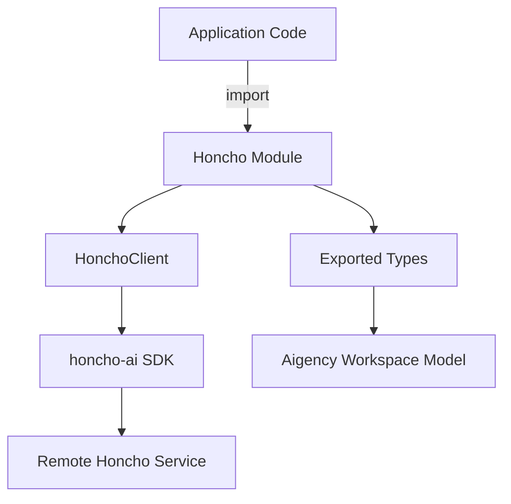

# Honcho

# Honcho Module Documentation

## Overview
The **Honcho** module provides the public entry point for the Aigency Honcho peer/identity layer. It wraps the `honcho-ai` SDK to fit the Aigency workspace model, exposing a simple client (`HonchoClient`) and the core type definitions (`AigencyPeer`, `AigencySession`). The module is deliberately thin: all business logic lives in the SDK; this package only adapts the SDK to Aigency’s workspace‑centric conventions.

### Core Concepts
- **Workspace** – A logical container for a set of peers.
- **Peer** – An identity that can own multiple sessions.
- **Session** – A communication channel belonging to a peer.
- **Message** – Payload exchanged within a session.

The hierarchy is reflected in the type definitions exported from `./types.js`.

## Public API

### `HonchoClient`
```ts
import { HonchoClient } from "@aigency/honcho";

const client = new HonchoClient(options);
```
`HonchoClient` is the primary class used by consumers to interact with the Honcho service. It abstracts the underlying `honcho-ai` SDK and presents methods that operate on Aigency workspaces, peers, sessions, and messages.

#### Constructor
```ts
new HonchoClient(config: HonchoClientConfig)
```
- **config** – Configuration object (e.g., API endpoint, authentication token, workspace identifier). The exact shape is defined in the SDK’s documentation.

#### Key Methods (delegated to the SDK)
| Method | Description | Return |
|--------|-------------|--------|
| `createWorkspace(name: string): Promise<Workspace>` | Creates a new workspace. | `Workspace` |
| `listWorkspaces(): Promise<Workspace[]>` | Retrieves all workspaces the client has access to. | `Workspace[]` |
| `addPeer(workspaceId: string, peer: AigencyPeer): Promise<AigencyPeer>` | Registers a new peer in a workspace. | `AigencyPeer` |
| `startSession(peerId: string, params?: SessionOptions): Promise<AigencySession>` | Starts a new session for a given peer. | `AigencySession` |
| `sendMessage(sessionId: string, payload: any): Promise<Message>` | Sends a message on an active session. | `Message` |
| `receiveMessages(sessionId: string, handler: (msg: Message) => void): void` | Subscribes to incoming messages for a session. | — |
| `closeSession(sessionId: string): Promise<void>` | Gracefully terminates a session. | — |

> **Note:** The method signatures above are illustrative; refer to the SDK’s type definitions for the exact parameter and return types.

### Types
```ts
export type { AigencyPeer, AigencySession } from "./types.js";
```
- **`AigencyPeer`** – Represents a peer identity. Typical fields: `id`, `displayName`, `publicKey`, `metadata`.
- **`AigencySession`** – Represents a session owned by a peer. Typical fields: `id`, `peerId`, `createdAt`, `status`, `metadata`.

These types are re‑exported so that downstream code can type‑check interactions without pulling in the full SDK.

## Architecture Diagram

*The diagram shows the thin wrapper (`HonchoClient`) delegating to the underlying SDK, which communicates with the remote Honcho service. Types flow from the module to the broader Aigency workspace model.*

## Integration Guide

### 1. Install
```bash
npm install @aigency/honcho
# Peer dependency: honcho-ai (installed automatically)
```

### 2. Configure
Create a configuration object that matches the SDK’s expectations. A minimal example:
```ts
import { HonchoClient } from "@aigency/honcho";

const client = new HonchoClient({
  endpoint: "https://api.honcho.ai",
  token: process.env.HONCHO_TOKEN,
  workspaceId: "my-workspace"
});
```

### 3. Basic Workflow
```ts
// 1️⃣ Create a peer
const peer = await client.addPeer("my-workspace", {
  displayName: "Alice",
  publicKey: "0xabc123...",
  metadata: { role: "operator" }
});

// 2️⃣ Start a session for that peer
const session = await client.startSession(peer.id);

// 3️⃣ Send a message
await client.sendMessage(session.id, { text: "Hello, Honcho!" });

// 4️⃣ Listen for responses
client.receiveMessages(session.id, (msg) => {
  console.log("Received:", msg);
});
```

### 4. Error Handling
All client methods return promises that reject with `HonchoError` (defined in the SDK). Typical error patterns:
- **NetworkError** – Connectivity issues.
- **AuthError** – Invalid or expired token.
- **ValidationError** – Payload does not conform to the expected schema.

Wrap calls in `try/catch` or use `.catch()` to handle these cases.

## Extending the Module

### Adding New Convenience Methods
If you need higher‑level abstractions (e.g., batch peer creation), extend `HonchoClient` in a subclass:
```ts
import { HonchoClient } from "@aigency/honcho";

export class ExtendedHonchoClient extends HonchoClient {
  async createPeers(workspaceId: string, peers: AigencyPeer[]) {
    return Promise.all(peers.map(p => this.addPeer(workspaceId, p)));
  }
}
```
Make sure to keep the subclass thin; any heavy lifting should still be delegated to the SDK.

### Contributing
1. **Fork** the repository.  
2. **Run tests** (the module currently has no unit tests; add tests for any new logic).  
3. **Submit a PR** with a clear description of the change.  
4. Follow the existing code style (ESM, TypeScript, strict `noImplicitAny`).

## Compatibility & Versioning
- **Node.js**: >= 14.0.0  
- **TypeScript**: >= 4.5  
- **Semantic Versioning**: The module follows semver; breaking changes will be indicated by a major version bump.

## Related Modules
- `@aigency/honcho-ai` – The raw SDK that this wrapper delegates to.  
- `@aigency/workspace` – Provides the higher‑level workspace management utilities that consume `HonchoClient`.  

--- 

*End of documentation.*