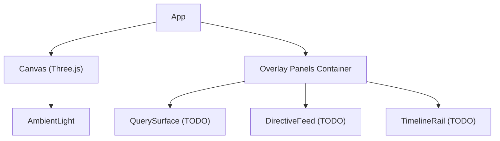

# Membrane

# Membrane Module Documentation

## Overview
The **Membrane** module provides the top‑level UI for the Membraned Interface. It renders a full‑screen Three.js canvas (via `@react-three/fiber`) that hosts the 3D knowledge graph, and a set of floating glass‑style panels that will host interactive UI elements such as the query bar, directive feed, and timeline scrubber.

The module is deliberately minimal: it only establishes the layout and basic lighting. All domain‑specific components (`SynapTree`, `QuerySurface`, `DirectiveFeed`, `TimelineRail`) are placeholders marked as TODOs and will be implemented elsewhere.

## File Structure
```
apps/
└─ membrane/
   └─ src/
      └─ App.tsx   ← Root component for the Membrane UI
```

## Exported API
### `App`
```tsx
export function App(): JSX.Element
```
- **Purpose**: Root React component that composes the full‑screen canvas and the overlay panels.
- **Returns**: A `<div>` that fills the viewport, containing:
  1. A `<Canvas>` from `@react-three/fiber` configured for the 3D scene.
  2. A `<div>` that will host floating UI panels (currently empty).

### Props
`App` does not accept any props. All configuration is internal (background color, camera settings, etc.).

## Implementation Details

### Layout
- The outermost `<div>` uses `width: 100vw` and `height: 100vh` to occupy the entire viewport.
- `position: relative` establishes a stacking context for the canvas and overlay panels.
- Background color is derived from the design token `tokens.atoms.color.base.canvas.$value`.

### Three.js Canvas
```tsx
<Canvas
  style={{ position: "absolute", inset: 0 }}
  camera={{ position: [0, 0, 50], fov: 60 }}
  gl={{ antialias: true }}
>
  {/* TODO: <SynapTree /> — CIPHER implementation */}
  <ambientLight intensity={0.1} />
</Canvas>
```
- **Positioning**: `absolute` with `inset: 0` stretches the canvas to fill the parent.
- **Camera**: Placed at `[0, 0, 50]` with a 60° field of view, providing a default view of the 3D scene.
- **GL Settings**: Antialiasing enabled for smoother rendering.
- **Lighting**: A low‑intensity ambient light is added to avoid completely black scenes before more sophisticated lighting is introduced.

### Overlay Panels
```tsx
<div style={{ position: "relative", zIndex: 10, pointerEvents: "none" }}>
  {/* TODO: <QuerySurface /> — Cmd+K ORACLE query bar */}
  {/* TODO: <DirectiveFeed /> — left-edge active directives */}
  {/* TODO: <TimelineRail /> — bottom timeline scrubber */}
</div>
```
- **Stacking**: `z-index: 10` ensures the panels render above the canvas.
- **Interaction**: `pointerEvents: "none"` disables mouse interaction for the container itself; individual panels will re‑enable pointer events as needed.
- **Future Components**: Placeholders for UI elements that will be added later.

## Integration Points
- **Design Tokens**: The module pulls the background color from `@aigency/design-tokens`. Any change to the token will automatically propagate to the UI.
- **Three.js Scene**: The canvas is the entry point for all 3D content. When `SynapTree` is implemented, it will be inserted as a child of `<Canvas>`.
- **UI Overlays**: The floating panels will be populated by components that live in the same `membrane` package or imported from shared UI libraries.

## Extensibility & TODOs
| TODO | Description | Expected Location |
|------|-------------|-------------------|
| `<SynapTree />` | 3D knowledge graph rendered with CIPHER | Inside `<Canvas>` |
| `<QuerySurface />` | Command‑plus‑K query bar (ORACLE) | Inside overlay `<div>` |
| `<DirectiveFeed />` | Left‑edge list of active directives | Inside overlay `<div>` |
| `<TimelineRail />` | Bottom‑aligned timeline scrubber | Inside overlay `<div>` |

When adding these components:
1. Ensure they respect the `pointerEvents` model (i.e., enable interaction only on the component itself).
2. Keep the overlay container's `z-index` higher than the canvas to maintain visual hierarchy.
3. Update the module's documentation to reflect new imports and any new props.

## Performance Considerations
- **Antialiasing**: Enabled by default; can be toggled via the `gl` prop if performance becomes a concern on low‑end devices.
- **Canvas Size**: The canvas always matches the viewport size. If a responsive layout is required, consider adding a resize observer and updating the canvas dimensions accordingly.
- **Lighting**: The ambient light is intentionally low‑intensity to reduce unnecessary shading calculations before more complex lighting is added.

## Testing Strategy
Since `App` contains no business logic, unit tests should focus on rendering and layout:
- Verify that the root `<div>` occupies the full viewport.
- Assert that the `<Canvas>` element is present and has the correct `camera` and `gl` props.
- Ensure the overlay container has the expected `z-index` and `pointerEvents` style.
- Snapshot tests can capture the initial DOM structure; future tests should be added when the TODO components are implemented.

## Architecture Diagram

*The diagram shows the high‑level composition of the `App` component: a canvas for 3D rendering and a container for future UI panels.*