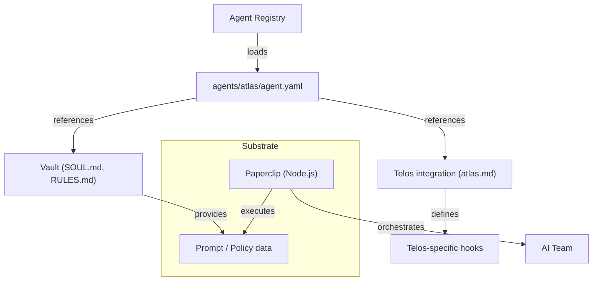

# Other — agents-atlas

# @aigency/agent-atlas

## Overview
`@aigency/agent-atlas` defines the **ATLAS** agent – a representation of *Jordan Mercer*, the Revenue & Sales Operations lead within the Paperclip ecosystem. The module is a declarative description (YAML) of the agent’s identity, role, visual branding, and links to its implementation artifacts. It does **not** contain executable code; instead, it serves as a data source for tooling that assembles AI‑driven organizational structures.

## Core Artifact: `agent.yaml`

| Field | Meaning | Example |
|-------|---------|---------|
| `callsign` | Short identifier used by the platform to reference the agent. | `ATLAS` |
| `name` | Human‑readable name of the person the agent emulates. | `Jordan Mercer` |
| `role` | Business function the agent fulfills. | `Revenue & Sales Ops` |
| `color` | UI accent color (hex) for visualizations such as org charts. | `#FFB300` |
| `substrate` | Underlying software platform that powers the agent’s behavior. | `Paperclip` |
| `substrate_lang` | Primary language of the substrate implementation. | `Node.js` |
| `substrate_why` | Rationale for choosing the substrate; describes the problem domain it solves. | `Orchestrates AI teams into a company with org charts, budgets, governance — revenue/sales ops native` |
| `substrate_repo` | Git repository containing the substrate source code. | `https://github.com/paperclipai/paperclip` |
| `vault` | Relative path to the agent’s vault folder, which stores its immutable assets (SOUL, RULES, etc.). | `../../aigency-vault/agents/atlas` |
| `soul` | Path to the *SOUL* markdown file – a narrative description of the agent’s purpose, personality, and constraints. | `../../aigency-vault/agents/atlas/SOUL.md` |
| `rules` | Path to the *RULES* markdown file – policy and operational rules governing the agent’s actions. | `../../aigency-vault/agents/atlas/RULES.md` |
| `telos` | Path to the Telos integration document, describing how the agent participates in the larger Telos application. | `../../apps/telos/agents/atlas.md` |

### Example `agent.yaml`
```yaml
callsign: ATLAS
name: "Jordan Mercer"
role: "Revenue & Sales Ops"
color: "#FFB300"
substrate: "Paperclip"
substrate_lang: "Node.js"
substrate_why: "Orchestrates AI teams into a company with org charts, budgets, governance — revenue/sales ops native"
substrate_repo: "https://github.com/paperclipai/paperclip"
vault: "../../aigency-vault/agents/atlas"
soul: "../../aigency-vault/agents/atlas/SOUL.md"
rules: "../../aigency-vault/agents/atlas/RULES.md"
telos: "../../apps/telos/agents/atlas.md"
```

## Package Manifest: `package.json`

| Property | Value | Description |
|----------|-------|-------------|
| `name` | `@aigency/agent-atlas` | NPM scoped package name. |
| `version` | `0.1.0` | Initial development version. |
| `private` | `true` | The package is not intended for publishing to a public registry. |
| `description` | `Jordan Mercer — Revenue & Sales Ops` | Human‑readable summary. |

The manifest exists solely to allow the module to be referenced as a dependency within monorepo tooling (e.g., Yarn workspaces, Lerna). No runtime scripts are defined.

## How It Is Consumed

1. **Discovery** – Build scripts or runtime loaders scan the `agents/atlas` directory for `agent.yaml`. The YAML is parsed into a plain JavaScript object.
2. **Registration** – The parsed object is registered with the central *Agent Registry* (often part of the `@aigency/core` package). The registry uses `callsign` as the unique key.
3. **Asset Loading** – Paths in `vault`, `soul`, `rules`, and `telos` are resolved relative to the module root. The referenced markdown files are loaded as static assets and attached to the agent record.
4. **Visualization** – UI components (org‑chart renderers, dashboards) read the `color` and `role` fields to style the agent node.
5. **Execution** – When the platform instantiates an AI agent for a given role, it pulls the `substrate_repo` and `substrate_lang` to spin up the appropriate runtime (Node.js) and injects the SOUL/Rules as prompts or policy constraints.

No direct function calls originate from this module; it is purely declarative.

## Integration Points



*The diagram illustrates the flow from the declarative YAML through the vault assets into the Paperclip substrate, culminating in the AI team orchestration.*

## Extending the Agent

When adding new capabilities or updating the agent’s description:

1. **Update `agent.yaml`** – Add or modify fields (e.g., `tags`, `capabilities`) following the existing key‑value style.
2. **Version bump** – Increment the `version` field in `package.json` according to semantic versioning (e.g., `0.1.1` for a non‑breaking addition).
3. **Add assets** – Place new markdown files under the `vault` directory and reference them via new keys (`profile`, `guidelines`, etc.).
4. **Run validation** – Use the repository’s linting script (`npm run lint:agents`) to ensure YAML syntax and path correctness.
5. **Commit** – Follow the monorepo’s conventional commits format (`feat(atlas): add performance KPI section to SOUL`).

## Repository Layout

```
agents/
└─ atlas/
   ├─ agent.yaml          # Core declarative definition
   ├─ package.json        # NPM manifest (private)
   └─ (no source code)    # All behavior lives in the Paperclip substrate
```

The vault and Telos documents reside outside this folder, referenced via relative paths.

## Development Workflow

| Step | Command | Description |
|------|---------|-------------|
| Install dependencies (workspace) | `yarn install` | Pulls shared tooling; no direct deps for this module. |
| Lint YAML | `yarn lint:agents` | Checks `agent.yaml` for schema compliance. |
| Preview agent data | `node scripts/print-agent.js ATLAS` | Prints the parsed agent object to console (helper script). |
| Update version | `npm version patch` | Bumps `package.json` version and creates a git tag. |

## Related Documentation

- **SOUL.md** – Narrative description of the agent’s purpose and personality.  
  Path: `../../aigency-vault/agents/atlas/SOUL.md`
- **RULES.md** – Operational policies that constrain the agent’s actions.  
  Path: `../../aigency-vault/agents/atlas/RULES.md`
- **Telos Integration** – How the agent plugs into the Telos application.  
  Path: `../../apps/telos/agents/atlas.md`
- **Paperclip Repository** – Source code for the substrate that powers the agent.  
  URL: `https://github.com/paperclipai/paperclip`

## FAQ

**Q: Why is the package marked `private`?**  
A: The agent definition is intended for internal use only; publishing it would expose proprietary role data.

**Q: Can I replace the substrate with a different implementation?**  
A: Yes. Update `substrate`, `substrate_lang`, and `substrate_repo` in `agent.yaml` and ensure the new runtime satisfies the same interface (prompt ingestion, policy enforcement).

**Q: Where do I find the runtime that actually runs the agent?**  
A: The runtime lives in the Paperclip repository referenced by `substrate_repo`. The platform’s loader clones that repo, installs its Node.js dependencies, and starts the agent process.

--- 

*End of documentation.*