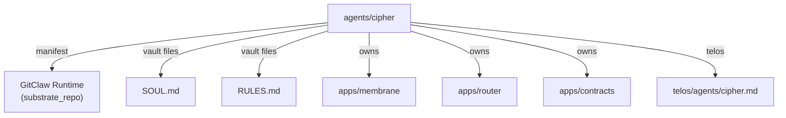

# Other — agents-cipher

# agents-cipher Module Documentation

## Overview
The **agents-cipher** module defines the *CIPHER* agent – a persona representing **Roman Voss**, responsible for Engineering & DevOps within the Aigency ecosystem. The module is primarily declarative; it supplies metadata that other tooling (e.g., agent orchestration, documentation generators, and CI pipelines) consumes to configure the agent’s environment, capabilities, and ownership.

## Core Files

| File | Purpose |
|------|---------|
| `agents/cipher/agent.yaml` | YAML manifest describing the agent’s identity, substrate, vault locations, and owned applications. |
| `agents/cipher/package.json` | Minimal NPM package descriptor used for versioning and publishing the agent as a private package. |

## `agent.yaml` Breakdown

```yaml
callsign: CIPHER
name: "Roman Voss"
role: "Engineering & DevOps"
color: "#39FF14"
substrate: "GitClaw"
substrate_lang: "TypeScript"
substrate_why: "Git-native runtime — agent IS a git repo; SOUL.md/RULES.md/skills/ are VCS files CIPHER already owns"
substrate_repo: "https://github.com/open-gitagent/gitagent"
vault: "../../aigency-vault/agents/cipher"
soul: "../../aigency-vault/agents/cipher/SOUL.md"
rules: "../../aigency-vault/agents/cipher/RULES.md"
owns: ["apps/membrane", "apps/router", "apps/contracts"]
telos: "../../apps/telos/agents/cipher.md"
```

### Key Fields

| Field | Description |
|-------|-------------|
| `callsign` | Short identifier used in logs, routing tables, and UI badges. |
| `name` | Human‑readable full name of the agent. |
| `role` | Functional domain; informs permission scopes and task assignment. |
| `color` | Hex color for UI theming (e.g., dashboards, avatars). |
| `substrate` | Runtime platform. `GitClaw` is a Git‑native execution environment that treats the agent itself as a Git repository. |
| `substrate_lang` | Primary language of the substrate implementation (`TypeScript`). |
| `substrate_why` | Rationale: the agent’s source files (`SOUL.md`, `RULES.md`, `skills/`) live in the same Git repo, enabling version‑controlled self‑description. |
| `substrate_repo` | Remote URL of the GitClaw runtime repository. |
| `vault` | Relative path to the vault directory containing the agent’s immutable assets (SOUL, RULES, etc.). |
| `soul` | Path to the *SOUL* document – a canonical description of the agent’s purpose, values, and capabilities. |
| `rules` | Path to the *RULES* document – policy definitions governing the agent’s behavior. |
| `owns` | List of application directories that the agent is responsible for maintaining. |
| `telos` | Path to a higher‑level design document (`telos`) that outlines the agent’s strategic objectives. |

## `package.json` Summary

```json
{
  "name": "@aigency/agent-cipher",
  "version": "0.1.0",
  "private": true,
  "description": "Roman Voss — Engineering & DevOps"
}
```

- **`name`**: Scoped NPM package name used for internal publishing.  
- **`version`**: Semantic version; bump when the manifest or associated vault assets change.  
- **`private`**: Prevents accidental publication to the public NPM registry.  
- **`description`**: Human‑readable summary for tooling that lists agents.

## Relationships & Integration Points



- **GitClaw Runtime**: The agent runs inside the GitClaw environment, which interprets the repository as executable code. No direct code imports exist in this module; the runtime discovers the agent via the `agent.yaml` manifest.
- **Vault Assets**: `SOUL.md` and `RULES.md` are version‑controlled artifacts that other services (e.g., policy engines, documentation generators) read to enforce or display the agent’s intent.
- **Owned Applications**: The `owns` array enumerates the top‑level directories the agent is expected to maintain. CI pipelines and deployment scripts reference this list to assign code‑ownership responsibilities.
- **Telos Document**: Provides a strategic roadmap; external planning tools may parse this file to align tasks with the agent’s long‑term goals.

## Development Workflow

1. **Clone the Repository**  
   ```bash
   git clone https://github.com/open-gitagent/gitagent.git
   cd gitagent
   ```

2. **Navigate to the Agent Directory**  
   ```bash
   cd agents/cipher
   ```

3. **Edit Manifest or Vault Files**  
   - Update `agent.yaml` to reflect new responsibilities or role changes.  
   - Modify `SOUL.md` / `RULES.md` to capture evolving policies.  

4. **Commit & Push**  
   ```bash
   git add agent.yaml SOUL.md RULES.md
   git commit -m "Update CIPHER role and policies"
   git push origin main
   ```

5. **Version Bump**  
   Increment the `version` field in `package.json` following semantic‑versioning conventions (e.g., `0.1.1` for a patch, `0.2.0` for a new capability).

6. **CI Validation**  
   The repository’s CI pipeline validates:
   - YAML schema compliance.  
   - Presence of required vault files.  
   - Consistency between `owns` entries and actual directories in the monorepo.

## Extending the Agent

- **Adding New Owned Apps**  
  Append the relative path to the `owns` array in `agent.yaml`. Ensure the target directory exists and contains a valid `package.json` or build script.

- **Supporting Additional Substrate Features**  
  If the agent needs to run non‑TypeScript code, update `substrate_lang` and adjust the GitClaw runtime configuration accordingly. Document the change in `RULES.md` to keep policy enforcement in sync.

- **Integrating with External Services**  
  External services (e.g., monitoring, alerting) can discover the agent via its `callsign` and `color`. Use the `telos` document to expose endpoint URLs or webhook configurations.

## Testing & Validation

The module does not contain executable code, but validation is performed through:

- **YAML Linting** – Ensures proper syntax and required fields.  
- **Schema Checks** – Custom JSON schema validates field types (e.g., `color` must be a valid hex string).  
- **Cross‑Reference Checks** – CI scripts verify that paths in `vault`, `soul`, `rules`, and `telos` resolve to existing files.

Running the validation locally:

```bash
npm install -g yaml-lint
yaml-lint agents/cipher/agent.yaml
```

## FAQ

**Q: Why is the package marked `private`?**  
A: The agent is an internal construct; publishing it publicly would expose internal role definitions and repository URLs.

**Q: How does the `substrate_why` field affect runtime behavior?**  
A: It is informational only. It explains the design decision that the agent’s source files are version‑controlled alongside its runtime, enabling reproducible builds and auditability.

**Q: Can I add custom scripts to this module?**  
A: Yes, but they should be placed under a subdirectory (e.g., `scripts/`) and referenced from `agent.yaml` via a new field (e.g., `scripts:`). Update the CI validation to include the new field.

--- 

*End of agents-cipher documentation.*