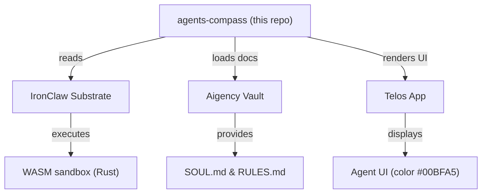

# Other — agents-compass

# agents-compass (Other — agents-compass)

## Overview
`agents-compass` defines the **Imara Adeyemi** agent – the Finance & Operations persona used throughout the Aigency ecosystem. The module is a pure data package; it contains no executable code, only declarative metadata that other components (e.g., the Telos app, the IronClaw substrate, and the vault) consume to instantiate the agent.

## Core Files

| File | Description |
|------|-------------|
| `agents/compass/agent.yaml` | YAML manifest describing the agent’s identity, role, visual branding, and integration points. |
| `agents/compass/package.json` | Minimal NPM package descriptor used for dependency management and publishing. |

## `agent.yaml` Breakdown

```yaml
callsign: COMPASS
name: "Imara Adeyemi"
role: "Finance & Operations"
color: "#00BFA5"
substrate: "IronClaw"
substrate_lang: "Rust"
substrate_why: "WASM sandbox + AES-256-GCM + zero-trust + no telemetry — finance/ops reliability at the substrate level"
substrate_repo: "https://github.com/nearai/ironclaw"
vault: "../../aigency-vault/agents/compass"
soul: "../../aigency-vault/agents/compass/SOUL.md"
rules: "../../aigency-vault/agents/compass/RULES.md"
telos: "../../apps/telos/agents/compass.md"
```

### Key Fields

| Field | Meaning |
|-------|---------|
| `callsign` | Short identifier used in logs and inter‑agent messaging. |
| `name` | Human‑readable name of the agent. |
| `role` | Functional domain; here, Finance & Operations. |
| `color` | UI accent color (hex) for dashboards that render the agent. |
| `substrate` | Underlying execution environment – **IronClaw**, a Rust‑based WASM sandbox. |
| `substrate_lang` | Language of the substrate implementation (Rust). |
| `substrate_why` | Rationale for choosing IronClaw: security (AES‑256‑GCM), zero‑trust, no telemetry, and deterministic execution suitable for finance/ops workloads. |
| `substrate_repo` | Source repository for the IronClaw runtime. |
| `vault` | Relative path to the agent’s vault directory containing immutable assets (SOUL, RULES, etc.). |
| `soul` | Path to the **SOUL.md** file – a narrative description of the agent’s purpose, motivations, and constraints. |
| `rules` | Path to **RULES.md** – policy definitions that govern the agent’s behavior. |
| `telos` | Path to the Telos app markdown that integrates this agent into the UI/UX layer. |

## `package.json` Summary

```json
{
  "name": "@aigency/agent-compass",
  "version": "0.1.0",
  "private": true,
  "description": "Imara Adeyemi — Finance & Operations"
}
```

- **`private: true`** – the package is not intended for publication to a public NPM registry; it is consumed internally.
- **`description`** – mirrors the agent’s role for quick identification in tooling.

## Integration Points

Although `agents-compass` contains no executable code, it is referenced by several other modules:

1. **IronClaw Substrate** – The runtime defined in `substrate_repo` loads the agent’s configuration to enforce the security guarantees listed in `substrate_why`.
2. **Aigency Vault** – The `vault` path points to a directory that stores immutable documentation (`SOUL.md`, `RULES.md`). These files are read‑only and version‑controlled, ensuring reproducible agent behavior.
3. **Telos Application** – The `telos` markdown file is consumed by the Telos UI to render the agent’s profile, expose its controls, and bind UI actions to the underlying substrate.

### Interaction Diagram



*The diagram shows the one‑way data flow from the `agents-compass` manifest into the runtime, vault, and UI layers.*

## Usage Guidelines

### Adding a New Agent Variant
1. **Copy the directory** `agents/compass` to a new folder (e.g., `agents/compass‑beta`).
2. **Update `agent.yaml`**:
   - Change `callsign`, `name`, and `role` as needed.
   - Adjust `color` to match the new branding.
   - If a different substrate is required, modify `substrate`, `substrate_lang`, and `substrate_why`.
3. **Create matching vault assets** (`SOUL.md`, `RULES.md`) under the new vault path.
4. **Update `package.json`** with a new `name` (e.g., `@aigency/agent-compass-beta`) and bump the version.

### Consuming the Agent
- **Runtime**: The IronClaw loader scans the repository for `agent.yaml` files. Ensure the new agent’s directory is included in the loader’s search path.
- **UI**: Add an entry in the Telos navigation configuration that points to the new `telos` markdown file.
- **Policy Enforcement**: Extend `RULES.md` to capture any additional constraints; the policy engine reads this file at startup.

## Development & Maintenance

| Task | Owner | Frequency |
|------|-------|-----------|
| Review `SOUL.md` for alignment with business objectives | Product Owner | Quarterly |
| Audit `RULES.md` for compliance with finance regulations | Compliance Team | Annually |
| Update IronClaw version (if security patches are released) | Platform Engineer | As needed |
| Verify `agent.yaml` syntax (YAML lint) | DevOps | CI pipeline |

### CI Considerations
- **YAML Lint**: Add a lint step (`yamllint agents/compass/agent.yaml`) to the CI pipeline.
- **Package Validation**: Even though the package is private, run `npm pack` to ensure `package.json` is well‑formed.

## Extending the Substrate
If future requirements demand custom logic (e.g., automated financial reconciliations), the workflow is:

1. **Add Rust source files** to the IronClaw repo.
2. **Expose a WASM entry point** that respects the `RULES.md` contract.
3. **Reference the new entry point** in `agent.yaml` via an additional field (e.g., `entrypoint: "reconcile.wasm"`).

The current module does not define such an entry point; it relies on the generic IronClaw sandbox to execute any agent‑specific WASM payloads placed in the vault.

## Summary
`agents-compass` is a declarative module that encapsulates the Finance & Operations persona for the Aigency platform. It provides:

- A concise, human‑readable manifest (`agent.yaml`) describing identity, visual branding, and integration hooks.
- Immutable documentation (`SOUL.md`, `RULES.md`) stored in the vault.
- A minimal NPM package descriptor for internal tooling.

All runtime behavior is delegated to the IronClaw substrate, while UI representation is handled by the Telos application. No code execution occurs within this module itself, making it safe to version‑control and distribute as a read‑only asset.