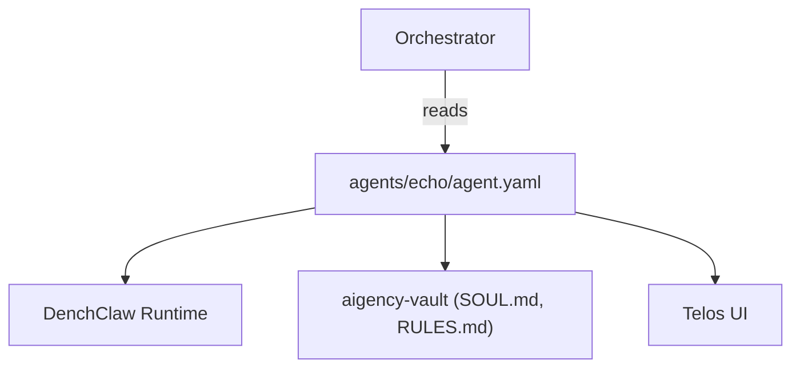

# Other — agents-echo

# agents-echo Module (Other — agents-echo)

## Overview
The **agents-echo** package defines the *Selene Navarro* marketing & content agent. It is a declarative description (YAML) that ties together metadata, repository links, and documentation assets for the agent. The module does not contain executable code; its purpose is to be consumed by tooling that assembles agents into the Aigency platform (e.g., the `telos` app).

## Core Files

| File | Purpose |
|------|---------|
| `agents/echo/agent.yaml` | Central manifest describing the agent’s identity, role, visual branding, substrate (runtime), and links to source code, vault, and policy documents. |
| `agents/echo/package.json` | NPM package metadata (name, version, description). The package is marked `private` because it is not published to a public registry. |

## `agent.yaml` Breakdown

```yaml
callsign: ECHO                     # Short identifier used in logs and routing
name: "Selene Navarro"             # Human‑readable name
role: "Marketing & Content"        # Business function
color: "#FF2D78"                   # UI accent colour
substrate: "DenchClaw"             # Runtime platform (DenchClaw)
substrate_lang: "TypeScript"       # Language of the substrate implementation
substrate_why: >                  # Rationale for choosing this substrate
  CRM automation + outreach agents + knowledge work — maps directly to marketing/content ops
substrate_repo: "https://github.com/DenchHQ/DenchClaw"
vault: "../../aigency-vault/agents/echo"   # Path to the agent’s knowledge vault
soul: "../../aigency-vault/agents/echo/SOUL.md"   # Core philosophy / design doc
rules: "../../aigency-vault/agents/echo/RULES.md" # Operational constraints
telos: "../../apps/telos/agents/echo.md"   # Integration point for the Telos UI
```

### Key Fields

- **callsign** – Unique short tag used by the orchestration layer to address the agent.
- **substrate** – Indicates the execution environment; here it is `DenchClaw`, a TypeScript‑based CRM automation framework.
- **vault / soul / rules** – Relative paths to markdown assets that live in the shared `aigency-vault`. These files contain the agent’s knowledge base, guiding principles, and policy constraints.
- **telos** – Path to a markdown file that the Telos front‑end consumes to render the agent’s UI representation.

## `package.json` Summary

```json
{
  "name": "@aigency/agent-echo",
  "version": "0.1.0",
  "private": true,
  "description": "Selene Navarro — Marketing & Content"
}
```

- The package name follows the `@aigency` scope convention.
- `private: true` prevents accidental publishing; the module is intended for internal monorepo use.
- Versioning is kept at `0.1.0` pending further development.

## Integration Points

| Component | Connection |
|-----------|------------|
| **DenchClaw substrate** | The agent’s runtime is the DenchClaw TypeScript codebase (referenced via `substrate_repo`). The substrate reads the YAML manifest to instantiate the agent with its role‑specific behaviours. |
| **Aigency Vault** | The vault holds the agent’s knowledge assets (`SOUL.md`, `RULES.md`). These are loaded at runtime to inform decision‑making and compliance. |
| **Telos UI** | The `telos` field points to a markdown file that Telos renders, providing a UI view of the agent’s profile and controls. |
| **Orchestration layer** | The callsign `ECHO` is used by the central orchestrator to route messages to this agent. No direct code imports exist; the orchestrator parses the YAML to build routing tables. |

### Minimal Architecture Diagram



## Adding or Modifying the Agent

1. **Update Metadata**  
   Edit `agent.yaml` to change any of the fields (e.g., role, colour, or substrate). Keep the relative paths correct; they are resolved from the module root.

2. **Version Bump**  
   Increment the `version` field in `package.json` following semantic‑versioning conventions when making breaking changes.

3. **Vault Content**  
   - `SOUL.md` – Document the agent’s core purpose and high‑level strategy.  
   - `RULES.md` – List operational constraints (e.g., GDPR compliance, rate limits).  
   Any change here may require a restart of the DenchClaw process to reload the knowledge base.

4. **Telos Integration**  
   Modify `../../apps/telos/agents/echo.md` to adjust how the agent appears in the UI (e.g., add new controls or status displays).

5. **Testing**  
   Since the module contains no executable code, testing focuses on validation of the YAML schema. Use a JSON/YAML schema validator to ensure required fields are present and correctly typed.

## Deployment Considerations

- **Monorepo Build**: The module is part of a larger monorepo. The build pipeline copies `agents/echo` into the orchestrator’s configuration bundle. Ensure the `agents/echo` directory is included in the `files` list of the orchestrator’s packaging step.
- **Private Package**: Because `private: true`, the package is not published to npm. It is referenced via relative paths in the monorepo’s `tsconfig.json` or Yarn workspaces.
- **Runtime Reload**: When `agent.yaml` or any vault markdown changes, the DenchClaw runtime must be reloaded to pick up the new configuration. Automate this with a file‑watcher in development environments.

## Frequently Asked Questions

| Question | Answer |
|----------|--------|
| *Where is the actual TypeScript code for the agent?* | The agent’s behaviour lives in the DenchClaw repository (`substrate_repo`). The YAML manifest only describes which substrate to use and provides metadata. |
| *Can I add custom functions to this module?* | Not directly. To extend functionality, add TypeScript files to the DenchClaw codebase and reference them via the `substrate` field. |
| *Is there a CI check for the YAML file?* | Yes, the repository includes a lint step that validates all `agent.yaml` files against the internal schema. |
| *How do I expose the agent to external APIs?* | The orchestrator uses the callsign (`ECHO`) to expose a REST/WebSocket endpoint. No changes are needed in this module; configure the orchestrator’s routing table. |

## Summary
The **agents-echo** module is a metadata‑only package that defines the *Selene Navarro* marketing & content agent. It links the agent to the DenchClaw TypeScript substrate, the shared knowledge vault, and the Telos UI. Contributions focus on updating the YAML manifest, versioning, and maintaining the associated markdown assets. No executable code resides in this module, so integration is handled by the surrounding orchestration and runtime layers.