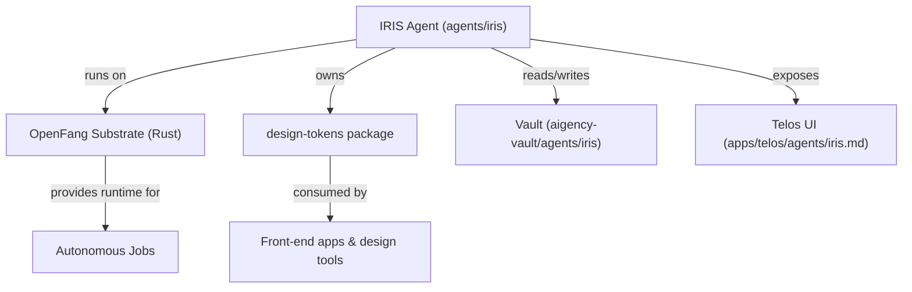

# Other — agents-iris

# agents-iris Module Documentation

## Overview
The **agents-iris** module defines the *IRIS* agent – Vivienne Calloway – responsible for **Design & Brand Systems** within the Aigency ecosystem. It is a declarative configuration (YAML) paired with a minimal `package.json` that registers the agent as an npm package under the `@aigency` scope.

The agent runs on the **OpenFang** substrate (a Rust‑based autonomous OS) and owns the `design-tokens` package, providing a centralized source of truth for brand colors, typography, spacing, and other design primitives.

---

## Agent Metadata (`agents/iris/agent.yaml`)

| Field | Description |
|-------|-------------|
| `callsign` | **IRIS** – short identifier used in logs and inter‑agent messaging. |
| `name` | **Vivienne Calloway** – human‑readable name of the agent. |
| `role` | **Design & Brand Systems** – primary domain of responsibility. |
| `color` | `#C77DFF` – visual accent used in UI representations of the agent. |
| `substrate` | **OpenFang** – the runtime environment that hosts the agent. |
| `substrate_lang` | **Rust** – language of the substrate implementation. |
| `substrate_why` | Explains why Rust was chosen: *“Rust Agent OS, autonomous 24/7 scheduling — brand monitoring, asset generation, design system maintenance without prompting.”* |
| `substrate_repo` | <https://github.com/RightNow-AI/openfang> – source repository for the OpenFang runtime. |
| `vault` | Relative path to the agent’s vault (`../../aigency-vault/agents/iris`). Contains persistent data, assets, and documentation. |
| `soul` | Path to the agent’s core philosophy (`SOUL.md`). |
| `rules` | Path to operational rules (`RULES.md`). |
| `owns` | List of owned packages – currently `["packages/design-tokens"]`. |
| `telos` | Link to the Telos app view of the agent (`../../apps/telos/agents/iris.md`). |

---

## Package Definition (`agents/iris/package.json`)

```json
{
  "name": "@aigency/agent-iris",
  "version": "0.1.0",
  "private": true,
  "description": "Vivienne CallowayDesign & Brand Systems — #C77DFF"
}
```

* **Name** – Scoped npm identifier for internal tooling (e.g., CI pipelines, dependency graphs).  
* **Version** – Semantic versioning; bump when the agent’s configuration or owned assets change.  
* **Private** – Prevents accidental publishing to the public npm registry.  
* **Description** – Human‑readable summary that mirrors the YAML `role` and `color`.

---

## Core Responsibilities

1. **Design Token Management**  
   - Owns the `packages/design-tokens` repository, which exports a JSON/TS file containing the canonical brand palette, spacing scale, typography, and component tokens.  
   - Provides a single source of truth for all front‑end applications and design tools.

2. **Brand Monitoring & Asset Generation**  
   - Runs autonomous jobs on the OpenFang substrate to detect brand drift (e.g., color misuse) and generate updated assets (logos, UI kits) without manual prompting.

3. **Design System Maintenance**  
   - Periodically validates that UI components across the codebase conform to the token definitions.  
   - Emits diagnostics to the Telos dashboard for developers to act upon.

---

## Integration Points



* **OpenFang Substrate** – Executes the agent’s scheduled tasks; written in Rust for performance and safety.  
* **Vault** – Persistent storage for generated assets, logs, and versioned token snapshots.  
* **Telos UI** – Visual dashboard where developers can view the agent’s status, upcoming jobs, and any rule violations.  
* **Design‑Tokens Package** – Imported by any UI repository (`@aigency/design-tokens`) to ensure visual consistency.

---

## Development Workflow

1. **Clone the Vault**  
   ```bash
   git clone https://github.com/RightNow-AI/aigency-vault.git
   cd aigency-vault/agents/iris
   ```

2. **Edit Agent Configuration**  
   - Update `agent.yaml` to reflect new responsibilities, color changes, or additional owned packages.  
   - Keep `SOUL.md` and `RULES.md` in sync with any policy changes.

3. **Update Design Tokens**  
   - Modify files under `packages/design-tokens` (e.g., `tokens.json`).  
   - Run the local validation script (provided by the `design-tokens` package) to ensure JSON schema compliance.

4. **Run Tests (if any)**  
   - The agent itself does not contain executable code, but downstream packages may have unit tests that consume the tokens. Execute them via the monorepo test runner:
     ```bash
     npm run test --workspace @aigency/design-tokens
     ```

5. **Commit & PR**  
   - Follow the standard Aigency PR template. Include a brief description of the design change and any impact on downstream apps.

---

## Extending the Agent

### Adding New Owned Packages
To give IRIS ownership of additional packages (e.g., a brand‑guidelines repo):

1. Add the package path to the `owns` array in `agent.yaml`.
2. Create a corresponding entry in the monorepo `package.json` workspace list.
3. Update the Telos UI markdown to reference the new package.

### Custom Autonomous Jobs
If you need a new scheduled task (e.g., weekly brand audit):

1. Implement the job in Rust within the OpenFang codebase.  
2. Register the job in the OpenFang scheduler configuration, referencing the IRIS agent’s `callsign`.  
3. Document the job’s purpose and schedule in `RULES.md`.

---

## Related Documentation

- **SOUL.md** – Philosophical foundation and long‑term vision for the IRIS agent.  
- **RULES.md** – Operational policies, including token naming conventions and audit frequencies.  
- **Telos Dashboard** – Real‑time view of IRIS activity (`apps/telos/agents/iris.md`).  
- **OpenFang Repository** – Runtime implementation details (`https://github.com/RightNow-AI/openfang`).  

---

## FAQ

**Q: Why is the package marked `private`?**  
A: The agent and its owned assets are internal to the Aigency ecosystem. Publishing them publicly could expose brand secrets and break internal versioning semantics.

**Q: How does IRIS interact with other agents?**  
A: Currently there are no direct inter‑agent calls. Coordination occurs via shared resources (e.g., the design‑tokens package) and the Telos dashboard, which aggregates status across agents.

**Q: Where are generated brand assets stored?**  
A: In the agent’s vault (`../../aigency-vault/agents/iris`). The vault is version‑controlled and synced with CI pipelines to distribute assets to downstream services.

---