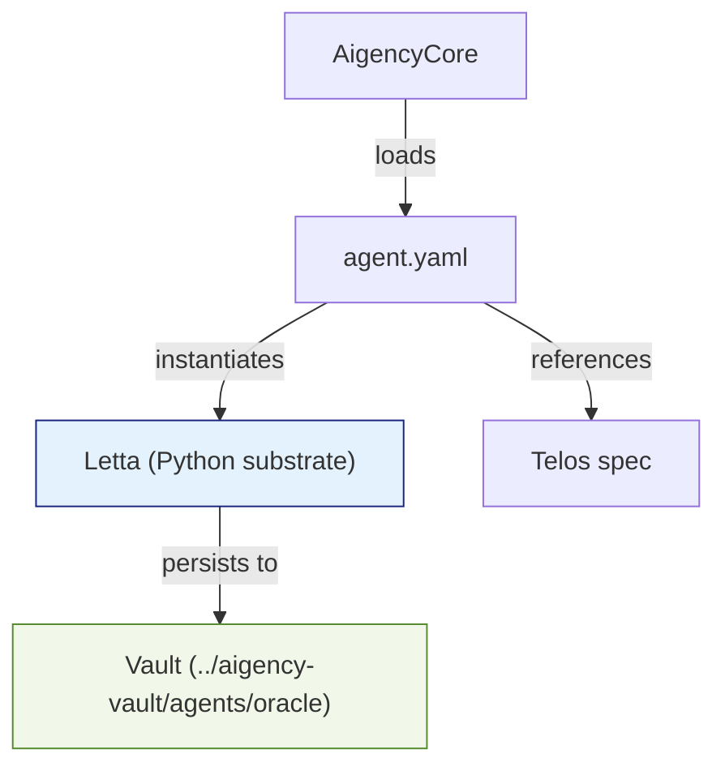

# Other — agents-oracle

# @aigency/agent-oracle – “Sable Quinn” Persistent Memory Agent

## Overview
`@aigency/agent-oracle` implements **Sable Quinn**, a *Persistent Memory Agent* that provides stateful, cross‑session memory for the Aigency platform. The agent is built on **Letta**, a purpose‑designed Python substrate that offers durable memory semantics unavailable elsewhere in the Claw ecosystem.

The module is a thin wrapper around Letta’s runtime; all operational logic lives in the Letta repository. This package supplies the static metadata (callsign, role, visual styling) and wiring information required for the Aigency orchestration layer to discover and initialise the agent.

## Repository Layout
```
agents/
└─ oracle/
   ├─ agent.yaml          # Declarative descriptor consumed by the Aigency runtime
   └─ package.json        # NPM package metadata (private, versioned)
```

### `agent.yaml` fields (full list)

| Field | Description |
|-------|-------------|
| `callsign` | Short identifier used by the runtime (`ORACLE`). |
| `name` | Human‑readable name of the agent (`"Sable Quinn"`). |
| `role` | Functional role (`"Persistent Memory Agent"`). |
| `color` | UI accent colour (`#1A237E`). |
| `substrate` | Underlying engine (`"Letta"`). |
| `substrate_lang` | Language of the substrate (`"Python"`). |
| `substrate_why` | Rationale for choosing Letta – provides stateful cross‑session memory not present in the rest of the ecosystem. |
| `substrate_repo` | Git URL of the Letta source (`https://github.com/letta-ai/letta`). |
| `vault` | Relative path to the agent’s vault directory (`../../aigency-vault/agents/oracle`). |
| `soul` | Path to the agent’s “SOUL” documentation (`../../aigency-vault/agents/oracle/SOUL.md`). |
| `rules` | Path to the agent’s rule set (`../../aigency-vault/agents/oracle/RULES.md`). |
| `telos` | Path to the Telos integration spec (`../../apps/telos/agents/oracle.md`). |

These entries are parsed by the Aigency core at startup to:

1. Register the agent under the `ORACLE` callsign.
2. Load UI theming (color) and role metadata.
3. Resolve the Letta substrate and ensure the Python runtime is available.
4. Mount the vault, soul, and rule files for runtime consumption.

## `package.json`

```json
{
  "name": "@aigency/agent-oracle",
  "version": "0.1.0",
  "private": true,
  "description": "Sable Quinn — Persistent Memory Agent"
}
```

* The package is **private** – it is not published to a public NPM registry.
* Versioning follows semantic versioning; bump the patch number for non‑breaking changes, minor for new features, and major for breaking API changes (though the module currently exposes no public API).

## Integration Points

### 1. Letta Substrate
The agent delegates all memory operations to Letta. The runtime expects a Python environment with Letta installed (`pip install letta`). The `substrate_repo` field points developers to the upstream source for debugging or extending the substrate.

### 2. Vault
The vault directory contains persistent data (e.g., serialized memory graphs, embeddings). It is mounted relative to the repository root, allowing the agent to read/write state across process restarts.

### 3. Telos
`telos` references a markdown spec that describes how the agent participates in the Telos application workflow. This file is consulted by developers when wiring the agent into higher‑level orchestration pipelines.

### 4. Aigency Core
During the Aigency boot sequence, the core scans `agents/**/agent.yaml` files, builds a registry, and instantiates agents based on their `substrate` declarations. No additional code changes are required to expose Sable Quinn to the rest of the system.

## Deployment Checklist

| Step | Action |
|------|--------|
| 1 | Ensure Python 3.9+ is available on the host. |
| 2 | `pip install letta` (or use the repository at `substrate_repo`). |
| 3 | Verify the vault path resolves correctly (`../../aigency-vault/agents/oracle`). |
| 4 | Run the Aigency orchestrator; it will automatically load `@aigency/agent-oracle`. |
| 5 | Confirm the agent appears in the UI with the configured color (`#1A237U`). |
| 6 | Review `SOUL.md` and `RULES.md` for domain‑specific behaviour. |

## Architecture Diagram



*The diagram shows the static wiring: the Aigency core reads `agent.yaml`, creates a Letta instance, and connects it to the persistent vault. The Telos spec is a documentation link, not a runtime dependency.*

## Extending the Module

1. **Add new memory capabilities** – Fork the Letta repository, implement the feature, and update `substrate_repo` to point to the fork.
2. **Expose a JavaScript API** – Create a thin Node.js wrapper that imports the Python process via `child_process` or `pyodide`. Update `package.json` with a `main` entry and publish internally.
3. **Customize UI** – Modify the `color` field or add additional UI metadata (e.g., `icon`) to `agent.yaml`. The Aigency UI will pick up changes on the next reload.

## Known Limitations

* The module contains **no executable JavaScript/TypeScript code**; all logic resides in the Letta Python substrate.
* No internal or external call graph is defined – the agent is a leaf node in the current architecture.
* Because the package is private, CI pipelines must include a step to copy the source into the deployment image; it cannot be fetched from a public registry.

## Contact & Maintenance

- **Owner**: Aigency platform team (see `aigency-vault/agents/oracle/README.md` for contact details).
- **Issue Tracker**: Use the monorepo’s GitHub Issues; tag with `component:agent-oracle`.
- **Version Bump Policy**: Follow the repository’s `CHANGELOG.md` conventions; update `package.json` version accordingly.