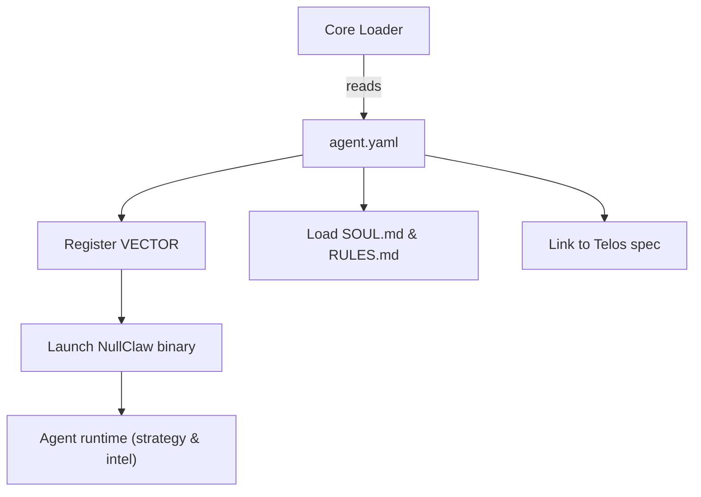

# Other — agents-vector

# @aigency/agent-vector – Dominique Osei (Strategy & Intelligence)

## Overview
`@aigency/agent-vector` is a **metadata‑only** package that defines the *Vector* agent (callsign `VECTOR`). The module supplies a YAML descriptor that the Aigency platform consumes to register the agent, expose its capabilities, and link to its supporting assets (source code, documentation, and runtime substrate).

The package does **not** contain executable JavaScript/TypeScript code; all operational logic lives in the external *NullClaw* substrate (a Zig binary) and the associated vault files.

## Package Contents

| File | Purpose |
|------|---------|
| `agents/vector/agent.yaml` | Canonical definition of the Vector agent (callsign, name, role, visual styling, substrate details, and links to documentation). |
| `agents/vector/package.json` | NPM package metadata (name, version, description). Used by the monorepo tooling to locate the agent definition. |

### `agent.yaml` fields (key ones)

| Field | Description |
|-------|-------------|
| `callsign` | Unique identifier used by the platform (`VECTOR`). |
| `name` | Human‑readable name (`Dominique Osei`). |
| `role` | Functional domain (`Strategy & Intelligence`). |
| `color` | UI accent color (`#7B2FFF`). |
| `substrate` | Runtime implementation (`NullClaw`). |
| `substrate_lang` | Language of the substrate (`Zig`). |
| `substrate_why` | Rationale for the substrate choice (compact binary, sub‑2 ms boot, zero overhead for intel gathering). |
| `substrate_repo` | Source repository for the substrate (`https://github.com/nullclaw/nullclaw`). |
| `vault` | Relative path to the agent’s vault directory (contains source, docs, rules). |
| `soul` | Path to the agent’s core design document (`SOUL.md`). |
| `rules` | Path to the operational policy document (`RULES.md`). |
| `telos` | Path to the higher‑level application spec (`../../apps/telos/agents/vector.md`). |

## Repository Layout

```
agents/
└─ vector/
   ├─ agent.yaml          ← Agent descriptor (this file)
   └─ package.json        ← NPM package metadata
```

The `vault` directory referenced in `agent.yaml` lives outside the `agents` tree:

```
../../aigency-vault/
└─ agents/
   └─ vector/
      ├─ SOUL.md          ← Design philosophy & architecture
      ├─ RULES.md         ← Operational constraints & security policies
      └─ ... (source files, configs, etc.)
```

## Integration Points

| Integration | How the module participates |
|-------------|------------------------------|
| **Aigency Core** | The core loader scans `package.json` entries, reads `agent.yaml`, and registers the agent under the `VECTOR` callsign. |
| **Substrate Runtime** | The `substrate` field points to the NullClaw Zig binary. The core launches this binary when the agent is instantiated. |
| **Vault Assets** | Documentation (`SOUL.md`, `RULES.md`) and any auxiliary scripts are accessed via the relative `vault` path. |
| **Telos Application** | The `telos` link connects the agent to the higher‑level Telos app specification, enabling cross‑agent orchestration. |

### Minimal Interaction Flow



*The diagram illustrates the one‑way flow from the core loader to the agent’s runtime; there are no internal or external code calls defined within this package.*

## Usage for Developers

1. **Adding a New Agent Variant**  
   - Duplicate the `agents/vector` directory.  
   - Update `callsign`, `name`, `role`, and any visual attributes.  
   - Adjust `substrate` fields if a different binary is required.  
   - Point `vault`, `soul`, `rules`, and `telos` to the new locations.

2. **Modifying Existing Metadata**  
   - Edit `agent.yaml` directly.  
   - Ensure any path changes remain relative to the package root.  
   - Run the repository’s lint/validation script (if present) to verify YAML syntax.

3. **Building/Deploying**  
   - The package is marked `private`; it is not published to npm.  
   - It is consumed by the monorepo’s internal tooling (e.g., `yarn workspace @aigency/agent-vector`).  
   - No build step is required for the YAML; the only artifact is the `package.json` for discovery.

## Extending the Agent

- **Substrate Enhancements**: To change the underlying intelligence engine, fork the NullClaw repository, implement the new Zig logic, and update `substrate_repo` and any binary distribution steps.  
- **Policy Updates**: Edit `RULES.md` to reflect new operational constraints; the core platform reads this file at agent startup for compliance checks.  
- **Documentation**: Enrich `SOUL.md` with architecture diagrams, threat models, or performance benchmarks to aid future contributors.

## Testing & Validation

Since the module contains no executable code, testing focuses on:

- **YAML Schema Validation** – Ensure required fields exist and conform to expected types (string, URL, path).  
- **Path Resolution** – Verify that `vault`, `soul`, `rules`, and `telos` resolve correctly from the package root.  
- **Integration Smoke Test** – Run the Aigency core loader in a dev environment and confirm that the `VECTOR` agent appears in the registry without errors.

## Versioning & Release Process

- **Version**: Managed manually in `package.json`. Increment the patch number (`0.1.0 → 0.1.1`) for any metadata change.  
- **Changelog**: Maintain a `CHANGELOG.md` at the repository root (outside this module) to record updates to the agent definition.  
- **Commit Conventions**: Follow the monorepo’s conventional commits (e.g., `feat(vector): add new intelligence rule`).  

---

*End of documentation for `@aigency/agent-vector`.*