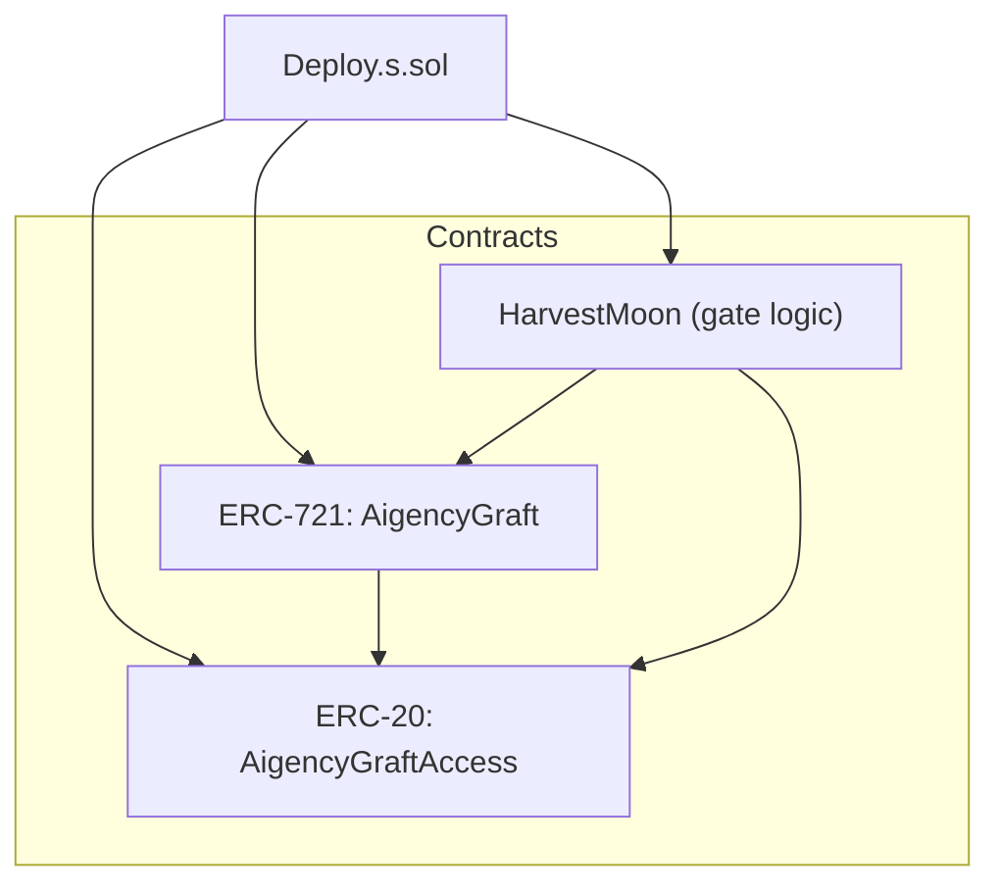

# Other — apps-contracts

# apps‑contracts Module

## Overview
The **apps‑contracts** package contains the Solidity smart‑contract suite for the Aigency platform. It targets Base L2 (chain ID 8453) and is built with Foundry 0.8.24. The primary contracts are:

| Contract | Type | Purpose |
|----------|------|---------|
| `HarvestMoon.sol` | Custom logic | Implements the “graft quality gate” used by the HarvestMoon protocol. |
| `AigencyGraft.sol` | ERC‑721 | Standard non‑fungible token representing grafts (unique assets). |
| `AigencyGraftAccess.sol` | ERC‑20 | Fungible token used for access control and fee payment within the ecosystem. |

The module is **private** (not published to npm) and is intended to be consumed by the rest of the monorepo via direct import of the compiled artifacts.

## Project Layout
```
apps/contracts
├─ src/                # Solidity source files
│   ├─ HarvestMoon.sol
│   ├─ AigencyGraft.sol
│   └─ AigencyGraftAccess.sol
├─ out/                # Forge build output (ABIs, bytecode, etc.)
├─ lib/                # External libraries (e.g., OpenZeppelin)
├─ test/               # Foundry test suite
├─ script/             # Deployment scripts
│   └─ Deploy.s.sol
├─ foundry.toml        # Forge configuration
└─ package.json        # npm metadata & scripts
```

### `foundry.toml`
Key settings:

| Setting | Value | Meaning |
|---------|-------|---------|
| `src` | `"src"` | Source directory for Solidity files. |
| `out` | `"out"` | Build artifacts location. |
| `libs` | `["lib"]` | Library search path (e.g., OpenZeppelin). |
| `test` | `"test"` | Test directory. |
| `script` | `"script"` | Deployment script location. |
| `solc` | `"0.8.24"` | Compiler version. |
| `rpc_endpoints` | `{ base-mainnet, base-sepolia }` | RPC URLs injected via environment variables. |
| `etherscan` | `{ base-mainnet, base-sepolia }` | Etherscan API configuration for contract verification. |

### `package.json`
Provides npm‑style scripts that wrap Foundry commands:

| Script | Command | Description |
|--------|---------|-------------|
| `build` | `forge build` | Compiles all contracts; falls back to a warning if Forge is missing. |
| `clean` | `forge clean` | Removes the `out/` directory. |
| `deploy:mainnet` | `forge script script/Deploy.s.sol --rpc-url base-mainnet --broadcast` | Deploys to Base Mainnet. |
| `deploy:testnet` | `forge script script/Deploy.s.sol --rpc-url base-sepolia --broadcast` | Deploys to Base Sepolia testnet. |
| `test` | `forge test -vvv` | Runs the full test suite with verbose output. |

## Build & Test Workflow

1. **Install Foundry** (if not already present):
   ```bash
   curl -L https://foundry.paradigm.xyz | bash
   foundryup
   ```

2. **Compile**:
   ```bash
   npm run build
   ```
   - Generates ABI (`.json`) and bytecode (`.bin`) files under `out/`.
   - Artifacts are versioned by the Solidity compiler (`0.8.24`).

3. **Run Tests**:
   ```bash
   npm test
   ```
   - Executes all tests in `test/` with three levels of verbosity (`-vvv`).
   - Tests are written in Solidity using Foundry’s `forge test` framework.

4. **Clean**:
   ```bash
   npm run clean
   ```

## Deployment

The `script/Deploy.s.sol` script orchestrates contract deployment. It expects the following environment variables:

| Variable | Use |
|----------|-----|
| `BASE_RPC_URL` | RPC endpoint for Base Mainnet. |
| `BASE_SEPOLIA_RPC_URL` | RPC endpoint for Base Sepolia. |
| `BASESCAN_API_KEY` | API key for BaseScan verification. |

Typical deployment steps:

```bash
# Mainnet
BASE_RPC_URL=https://base-mainnet.rpc npm run deploy:mainnet

# Sepolia testnet
BASE_SEPOLIA_RPC_URL=https://base-sepolia.rpc npm run deploy:testnet
```

The script performs:

1. **Deployment** of `AigencyGraftAccess` (ERC‑20) first, to establish the access token.
2. **Deployment** of `AigencyGraft` (ERC‑721) with the address of the ERC‑20 token passed as a constructor argument.
3. **Deployment** of `HarvestMoon` with references to both token contracts, enabling the quality‑gate logic.
4. **Verification** on BaseScan using the configured API key.

## Integration Points

| Component | Interaction |
|-----------|--------------|
| **Frontend (apps/web)** | Imports compiled ABIs from `apps/contracts/out/` to instantiate contract instances via ethers.js or wagmi. |
| **Backend (apps/api)** | Uses the same ABIs to query contract state (e.g., token balances, ownership) and to submit signed transactions. |
| **CI/CD (GitHub Actions)** | Executes `npm run test` and `npm run build` on each PR; deployment jobs invoke the `deploy:*` scripts when a release tag is created. |

## Development Guidelines

1. **Solidity Style**  
   - Follow the [OpenZeppelin Contracts style guide](https://docs.openzeppelin.com/contracts/4.x/style-guide).  
   - Use `pragma solidity ^0.8.24;` at the top of each file.  
   - Keep contracts modular; shared logic should be extracted into libraries under `src/lib/`.

2. **Testing**  
   - Write unit tests in `test/` covering each public function.  
   - Use Foundry’s cheat codes (`vm.prank`, `vm.deal`, etc.) to simulate edge cases.  
   - Aim for > 90 % line coverage (`forge coverage`).

3. **Versioning**  
   - The package version is managed manually in `package.json`. Increment the patch version for any contract change that does not affect the public interface; bump minor for ABI‑breaking changes.

4. **Verification**  
   - After any deployment, run `forge verify-contract` (or rely on the `--broadcast` flag which triggers automatic verification via the `etherscan` config).  
   - Ensure the `BASESCAN_API_KEY` environment variable is set in CI.

5. **Contribution Workflow**  
   - Fork the repository, create a feature branch, and open a PR.  
   - The CI pipeline will automatically run `npm run test` and `npm run build`.  
   - Reviewers will verify that the new contracts compile with the current Solidity version and that all tests pass.

## Architecture Diagram



*The diagram shows the deployment order and the dependency direction between contracts.*

## Frequently Asked Questions

**Q: Why is the module marked `private` in `package.json`?**  
A: The contracts are intended for internal use only. Publishing them to a public npm registry would expose the source and compiled bytecode unnecessarily.

**Q: How do I add a new contract?**  
A: Place the `.sol` file under `src/`, import any required libraries from `lib/`, and add corresponding tests in `test/`. The existing `forge build` pipeline will automatically pick it up.

**Q: Can I use a different Solidity compiler version?**  
A: The project is locked to `0.8.24` via `foundry.toml`. Changing the version requires updating the `solc` field and ensuring all contracts compile without warnings.

**Q: Where are the compiled artifacts stored?**  
A: After a successful `npm run build`, artifacts are in `out/`. The directory contains a sub‑folder for each contract with its ABI (`.json`) and bytecode (`.bin`). These files are consumed by the frontend and backend packages.