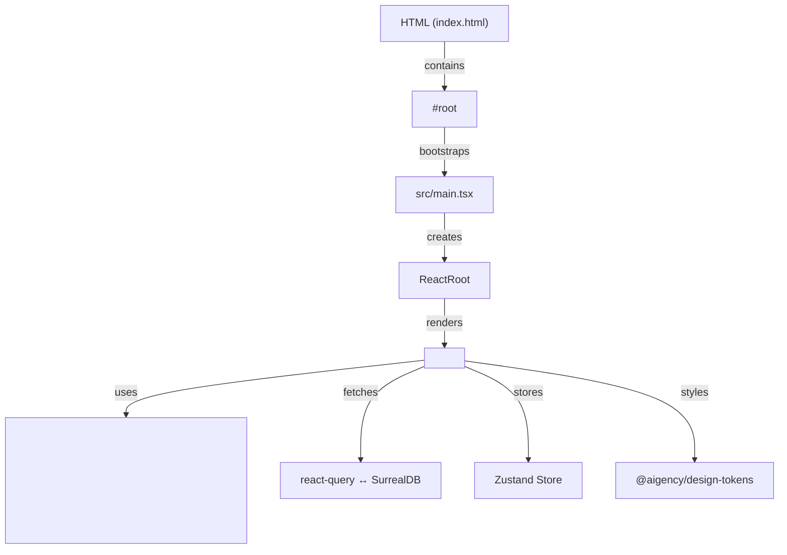

# Other — apps-membrane

# @aigency/membrane – Membraned Interface

## Overview
`@aigency/membrane` is a **React + Three.js** front‑end that renders “frosted‑glass” panels over a live 3‑D knowledge graph stored in **SurrealDB**.  
The UI is built with:

* **React 18** – component model and state handling.  
* **@react-three/fiber** – React renderer for Three.js.  
* **@react-three/drei** & **@react-three/postprocessing** – helpers and visual effects (e.g., bloom, depth of field).  
* **d3-force-3d** – physics‑based layout of graph nodes.  
* **Zustand** – lightweight global store for interaction state.  
* **@tanstack/react-query** – data fetching/caching from the SurrealDB backend.

The module is a **stand‑alone Vite application** that can be run in development mode, built for production, or type‑checked with the shared TypeScript configuration.

---

## Project Structure

```
apps/
└─ membrane/
   ├─ src/
   │  ├─ main.tsx          ← entry point (creates React root)
   │  └─ App.tsx           ← top‑level UI component (not shown)
   ├─ package.json         ← npm scripts, dependencies
   ├─ tsconfig.json        ← TypeScript compiler options
   └─ vite.config.ts?      ← Vite configuration (inherited from workspace)
```

Only `src/main.tsx` is required to bootstrap the app; all UI logic lives under `src/App.*` and its children.

---

## Entry Point – `src/main.tsx`

```tsx
import { StrictMode } from "react";
import { createRoot } from "react-dom/client";
import { App } from "./App.js";

const root = document.getElementById("root");
if (!root) {
  throw new Error("No #root element found");
}

createRoot(root).render(
  <StrictMode>
    <App />
  </StrictMode>
);
```

* **Root element** – The HTML page must contain `<div id="root"></div>`.  
* **StrictMode** – Enables React development warnings.  
* **`<App />`** – The top‑level component that composes the 3‑D scene, UI panels, and data layers.

---

## Build & Development

| Script | Description |
|--------|-------------|
| `npm run dev` | Starts Vite in watch mode (`http://localhost:5173`). Hot‑module replacement updates the UI instantly. |
| `npm run build` | Produces an optimized static bundle in `dist/`. |
| `npm run preview` | Serves the production bundle locally for quick verification. |
| `npm run clean` | Removes the `dist/` directory. |
| `npm run typecheck` | Runs `tsc --noEmit` using the shared `@aigency/tsconfig`. |

**Typical workflow**

```bash
# install workspace dependencies (run from repo root)
pnpm install

# start development server
cd apps/membrane
npm run dev
```

The Vite dev server automatically injects the `#root` element into the generated `index.html`.

---

## TypeScript Configuration – `tsconfig.json`

```json
{
  "extends": "@aigency/tsconfig/react.json",
  "include": ["src"],
  "exclude": ["node_modules", "dist"],
  "compilerOptions": {
    "rootDir": "src",
    "outDir": "dist"
  }
}
```

* **Extends** the shared React TS config (`@aigency/tsconfig/react.json`).  
* **`rootDir` / `outDir`** keep source and compiled files separate, matching Vite’s expectations.  
* **`include`** restricts type‑checking to the `src` folder.

---

## Runtime Dependencies

| Dependency | Reason for Inclusion |
|------------|----------------------|
| `react`, `react-dom` | Core UI library. |
| `three` | 3‑D rendering engine. |
| `@react-three/fiber` | React renderer for Three.js. |
| `@react-three/drei` | Common helpers (orbit controls, loaders, etc.). |
| `@react-three/postprocessing` | Visual effects (bloom, SSAO, etc.). |
| `d3-force-3d` | Force‑directed layout for graph nodes. |
| `zustand` | Global state store for interaction flags, selected node, etc. |
| `@tanstack/react-query` | Declarative data fetching from SurrealDB. |
| `@aigency/surreal` | Thin client wrapper around SurrealDB. |
| `@aigency/agent-core` | Shared utilities (e.g., logging, auth). |
| `@aigency/design-tokens` | Consistent spacing, colors, and typography across the UI. |
| `framer-motion` | Declarative animations for UI panels. |

All dependencies are **peer‑scoped to the workspace**, ensuring version alignment across the monorepo.

---

## Integration Points

* **SurrealDB** – The graph data is fetched via `@aigency/surreal`. The `<App>` component creates a `react-query` client that subscribes to live updates, feeding the 3‑D scene in real time.  
* **Design Tokens** – UI colors, spacing, and typography are sourced from `@aigency/design-tokens`, guaranteeing visual consistency with other Aigency products.  
* **Agent Core** – Shared services (e.g., authentication, telemetry) are imported from `@aigency/agent-core`.  

No internal module calls are defined in this package; all heavy lifting occurs inside the `App` component hierarchy.

---

## Extending the Module

1. **Add a new visual effect**  
   * Install the effect (e.g., `npm i @react-three/postprocessing`).  
   * Import the effect component in `src/App.tsx` and wrap the `<Canvas>` element.  

2. **Expose a new data endpoint**  
   * Extend the SurrealDB client in `@aigency/surreal`.  
   * Add a `react-query` hook in `src/hooks/useMyData.ts` and consume it inside a panel component.  

3. **Introduce a global UI state**  
   * Add a slice to the Zustand store (`src/store.ts`).  
   * Use the store via `useStore(state => state.myFlag)` in any component.  

All new code should be placed under `src/` and referenced from `App.tsx` to keep the entry point minimal.

---

## Testing & Quality

* **Type safety** – Enforced by `npm run typecheck`.  
* **Linting** – Inherited from the workspace’s ESLint config (not shown).  
* **No unit tests** – The current repository does not include test files; consider adding Jest + React Testing Library for component-level tests.

---

## Architecture Diagram



The diagram shows the high‑level flow from the static HTML page to the React root, then into the `<App>` component, which orchestrates the 3‑D canvas, data fetching, and global UI state.

---

## Getting Help

* **Workspace README** – General contribution guidelines for the Aigency monorepo.  
* **Issue Tracker** – Open a ticket under the `apps/membrane` component for bugs or feature requests.  
* **Design Tokens Docs** – Refer to `@aigency/design-tokens` repository for color and spacing specifications.  

---