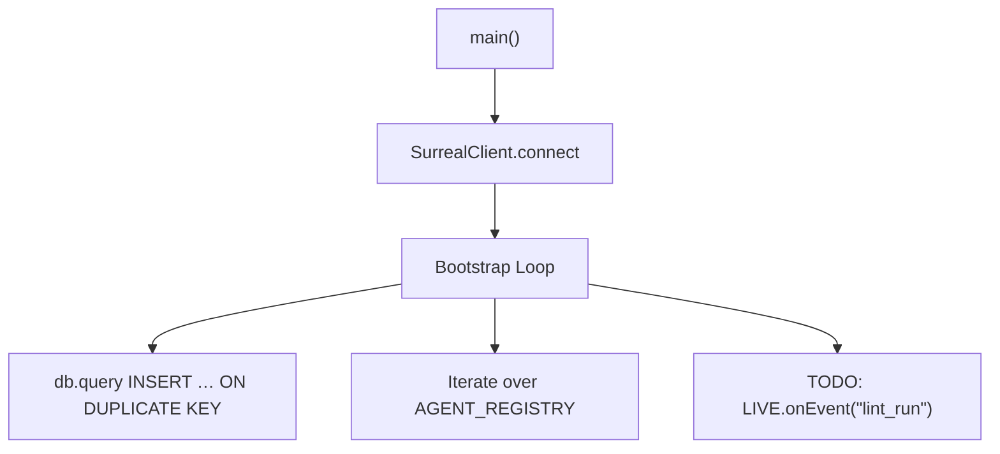

# Other — apps-oracle

# @aigency/oracle – Persistent Memory Agent

## Overview

`@aigency/oracle` (code name **Sable Quinn**) is the entry point for the persistent‑memory side of the Aigency platform. Its responsibilities are:

1. **SurrealDB bootstrap** – ensure the `agent` table contains a record for each registered agent (11 in total) using idempotent `INSERT … ON DUPLICATE KEY` statements.  
2. **Seeding** – a separate `seed.ts` script (not shown) can be used to populate additional test data.  
3. **Event subscription (TODO)** – listen to `lint_run` timeline events and forward metric data to the `HarvestMoon.sol` contract.  
4. **Honcho workspace exposure** – the module runs alongside the Honcho workspace so other services can discover peer identities.

The module is deliberately minimal: it only connects to SurrealDB, performs the bootstrap, and exits (or stays alive if future event handling is added).

---

## Directory Layout

```
apps/oracle/
├─ package.json          # npm metadata, scripts, dependencies
├─ tsconfig.json         # TypeScript configuration (extends @aigency/tsconfig)
└─ src/
   └─ index.ts           # Main entry point (bootstrap logic)
```

---

## Build & Run

| Script | Description |
|--------|-------------|
| `npm run build` | Compile `src/index.ts` to ESM in `dist/` and generate declaration files. |
| `npm run dev`   | Run `src/index.ts` with hot‑reloading (via `tsx watch`). |
| `npm run start` | Execute the compiled bundle (`node dist/index.js`). |
| `npm run seed`  | Run the optional seeding script (`src/seed.ts`). |
| `npm run clean` | Remove the `dist/` directory. |
| `npm run typecheck` | Run `tsc --noEmit` to verify type safety. |

**Environment variables** (all optional, defaults shown):

| Variable | Default | Meaning |
|----------|---------|---------|
| `SURREAL_URL` | `ws://localhost:8000/rpc` | WebSocket endpoint for SurrealDB. |
| `SURREAL_NS`  | `aigency` | SurrealDB namespace. |
| `SURREAL_DB`  | `mem_brain` | Database name. |
| `SURREAL_USER`| `root` | Username for SurrealDB authentication. |
| `SURREAL_PASS`| `root` | Password for SurrealDB authentication. |

Example:

```bash
SURREAL_URL=wss://db.example.com/rpc \
SURREAL_NS=prod \
SURREAL_DB=mem_brain \
SURREAL_USER=oracle \
SURREAL_PASS=supersecret \
npm run start
```

---

## Core Logic (`src/index.ts`)

### 1. Connect to SurrealDB

```ts
await SurrealClient.connect({
  url: process.env.SURREAL_URL ?? "ws://localhost:8000/rpc",
  namespace: process.env.SURREAL_NS ?? "aigency",
  database: process.env.SURREAL_DB ?? "mem_brain",
  username: process.env.SURREAL_USER ?? "root",
  password: process.env.SURREAL_PASS ?? "root",
});
```

* `SurrealClient` is re‑exported from `@aigency/surreal`.  
* The connection is **awaited** before any DB operation, guaranteeing that `SurrealClient.db` is ready.

### 2. Bootstrap Agent Records

```ts
const db = SurrealClient.db;
for (const [callsign, identity] of Object.entries(AGENT_REGISTRY)) {
  await db.query(
    `INSERT INTO agent (id, callsign, name, role, color, substrate, status, soul_hash, created_at, updated_at)
     VALUES ($id, $callsign, $name, $role, $color, $substrate, 'standby', 'pending', time::now(), time::now())
     ON DUPLICATE KEY UPDATE updated_at = time::now()`,
    {
      id: `agent:${callsign.toLowerCase()}`,
      callsign,
      name: identity.name,
      role: identity.role,
      color: identity.color,
      substrate: identity.substrate,
    }
  );
}
```

* **Source of truth** – `AGENT_REGISTRY` from `@aigency/agent-core` contains the canonical list of agents (callsign → identity).  
* **Idempotency** – the `ON DUPLICATE KEY UPDATE` clause makes the operation safe to run repeatedly; only the `updated_at` timestamp changes on subsequent runs.  
* **Fields** – `status` is initialized to `'standby'` and `soul_hash` to `'pending'`. These values are later updated by other services (e.g., the Honcho workspace).

### 3. Event Subscription (Future Work)

```ts
// TODO: subscribe to lint_run events → submitMetrics to HarvestMoon.sol
// LIVE.onEvent("lint_run", async (action, event) => { ... })
```

* The placeholder indicates an upcoming integration with the **Honcho** event bus (`LIVE`) and the **HarvestMoon.sol** smart contract.  
* When implemented, the handler will extract metric data from the `lint_run` event and invoke a contract method (likely via a web3 provider).

### 4. Program Entry Point

```ts
main().catch(console.error);
```

* Errors from `main` are logged to `stderr`. The process exits with a non‑zero code if an unhandled rejection occurs.

---

## Integration Points

| Component | Interaction |
|-----------|--------------|
| `@aigency/agent-core` | Provides `AGENT_REGISTRY` (static list of agents). |
| `@aigency/surreal` | Supplies `SurrealClient` (connection & query API). |
| `@aigency/honcho` | Planned event source (`LIVE.onEvent`). |
| `@aigency/mem-brain` | Logical domain for the `agent` table; other services read/write to the same DB. |
| `@aigency/vault-tools` | Not used directly in this module but available for future secret handling (e.g., signing metrics). |

---

## Architecture Diagram



*The diagram shows the linear flow from program start to DB bootstrap. The optional event subscription is indicated as a future branch.*

---

## Extending the Module

### Adding New Agents

1. Update `AGENT_REGISTRY` in `@aigency/agent-core` (add the new callsign and identity).  
2. Run `npm run start` (or `npm run dev`). The bootstrap loop will automatically insert the new record.

### Implementing the `lint_run` Handler

1. Import the Honcho event bus (`import { LIVE } from "@aigency/honcho"`).  
2. Replace the TODO block with a concrete handler:

```ts
LIVE.onEvent("lint_run", async (action, event) => {
  const metrics = extractMetrics(event);
  await submitMetricsToHarvestMoon(metrics);
});
```

3. Add any required dependencies (e.g., a web3 provider) to `package.json`.  
4. Write unit tests for the handler (see the repository’s testing conventions).

### Testing

*No unit tests are currently shipped with this module.*  
When adding tests, follow the monorepo pattern:

```ts
import { SurrealClient } from "@aigency/surreal";
import { AGENT_REGISTRY } from "@aigency/agent-core";

describe("Oracle bootstrap", () => {
  beforeAll(async () => {
    await SurrealClient.connect(/* test DB config */);
  });

  it("creates all agents idempotently", async () => {
    // invoke the bootstrap function (extracted to a helper for testability)
    await bootstrapAgents();
    // assert that each agent exists exactly once
    const result = await SurrealClient.db.query("SELECT * FROM agent");
    expect(result.length).toBe(Object.keys(AGENT_REGISTRY).length);
  });
});
```

---

## Common Pitfalls

| Symptom | Likely Cause | Remedy |
|---------|--------------|--------|
| `SurrealClient.connect` fails with authentication error | Wrong `SURREAL_USER`/`SURREAL_PASS` or DB not reachable | Verify env vars and that SurrealDB is running. |
| Duplicate agents appear after multiple runs | Using an older SurrealDB version that does not support `ON DUPLICATE KEY` | Upgrade SurrealDB to ≥ 1.0.0 or replace the query with a `SELECT`‑then‑`INSERT` guard. |
| Process exits silently | Unhandled promise rejection inside the loop (e.g., network glitch) | Ensure `main().catch` logs the error; consider adding retry logic. |

---

## Release Checklist

- [ ] Verify `package.json` version bump.  
- [ ] Run `npm run typecheck` and fix any TypeScript errors.  
- [ ] Build with `npm run build` and confirm `dist/index.js` runs without errors.  
- [ ] (Optional) Add integration tests for the future `lint_run` handler.  
- [ ] Update the monorepo changelog with a brief description of the bootstrap behavior.  

---