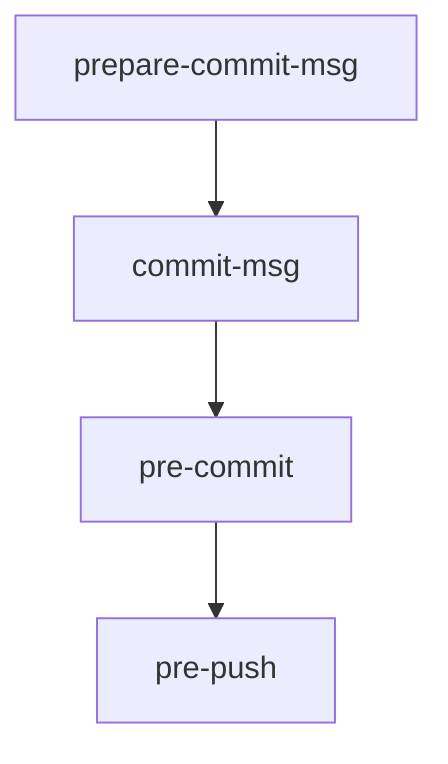

# Other — lefthook.yml

# `lefthook.yml` – Git Hook Configuration for the Aigency Monorepo

## Overview

`lefthook.yml` defines the Git hooks used across the Aigency monorepo. It replaces Husky with **Lefthook**, providing fast, parallel‑safe execution without polluting `node_modules`. The file is the single source of truth for:

* **Commit message generation** (`prepare-commit-msg`)
* **Commit message linting** (`commit-msg`)
* **Pre‑commit checks** (`pre-commit`)
* **Pre‑push validation** (`pre-push`)

All hooks are executed by the `lefthook` binary (installed via the repo’s `pnpm` scripts). See the official docs for details: <https://evilmartians.github.io/lefthook/>.

---

## Hook Lifecycle



* **`prepare-commit-msg`** – Runs *before* the commit message editor opens.  
* **`commit-msg`** – Runs *after* the message is saved, before the commit is created.  
* **`pre-commit`** – Runs on staged files just before the commit is recorded.  
* **`pre‑push`** – Runs after a successful commit, right before the push is sent to the remote.

---

## Hook Definitions

### 1. `prepare-commit-msg`

```yaml
prepare-commit-msg:
  commands:
    ai-commit-msg:
      interactive: true
      run: |
        # Only run if no message provided (message file contains commented template)
        if grep -q '^#' {1} 2>/dev/null && ! grep -v '^#' {1} | grep -q '[a-zA-Z]'; then
          if [ -n "$(git diff --cached --name-only)" ]; then
            echo "🤖 Generating commit message..."
            node packages/commit-agent/dist/cli.mjs --mode auto --prepare-commit-msg-file {1} 2>/dev/null || true
          fi
        fi
```

* **Purpose** – Auto‑generates a commit message using the local *commit‑agent* when the user opens the editor with an empty template.
* **Key points**
  * `{1}` is the path to the temporary commit‑message file supplied by Git.
  * The script only runs if the file contains only commented lines (i.e., the user hasn’t typed a message yet) **and** there are staged changes.
  * Errors are silenced (`|| true`) to avoid blocking the commit flow.

### 2. `commit-msg`

```yaml
commit-msg:
  commands:
    commitlint:
      run: pnpm exec commitlint --edit {1}
```

* **Purpose** – Enforces conventional commit formatting.
* **Key points**
  * `{1}` is the same commit‑message file.
  * The command uses `pnpm exec` to run the locally‑installed `commitlint` binary.
  * A failing lint will abort the commit.

### 3. `pre-commit`

```yaml
pre-commit:
  parallel: true
  commands:
    autofix:
      run: ./scripts/automation/autofix.sh fix
    biome-check:
      glob: "*.{js,ts,jsx,tsx,json,cjs,mjs}"
      run: pnpm exec biome check --no-errors-on-unmatched --files-ignore-unknown=true --colors=off {staged_files}
    biome-format-md-json:
      glob: "*.{md,json}"
      run: pnpm exec biome format --write --no-errors-on-unmatched --files-ignore-unknown=true --colors=off {staged_files}
    typecheck-affected:
      run: pnpm exec turbo run typecheck --affected
```

* **Parallel execution** – All commands run concurrently (`parallel: true`), reducing overall hook latency.
* **Commands**
  * **`autofix`** – Runs the repository‑wide autofix script (`scripts/automation/autofix.sh fix`). It applies any automatic fixes (e.g., lint‑auto‑fixes) before the commit.
  * **`biome-check`** – Lints JavaScript/TypeScript/JSON files using **Biome**. The `glob` limits the check to relevant extensions; `{staged_files}` expands to the list of files staged for commit.
  * **`biome-format-md-json`** – Formats Markdown and JSON files in‑place.
  * **`typecheck-affected`** – Executes Turborepo’s incremental type‑checking (`turbo run typecheck --affected`) on the subset of packages impacted by the staged changes.

### 4. `pre-push`

```yaml
pre-push:
  parallel: true
  commands:
    lint:
      run: pnpm exec turbo run lint
    typecheck:
      run: pnpm exec turbo run typecheck
    test:
      run: pnpm exec turbo run test
    coverage-check:
      run: |
        if [ -f apps/router/coverage/coverage-final.json ] || \
           [ -f packages/agent-core/coverage/coverage-final.json ] || \
           [ -f packages/surreal/coverage/coverage-final.json ] || \
           [ -f packages/vault-tools/coverage/coverage-final.json ] || \
           [ -f packages/honcho/coverage/coverage-final.json ] || \
           [ -f packages/mem-brain/coverage/coverage-final.json ]; then
          ./scripts/automation/coverage-check.sh --ci
        else
          echo "⚠️  No coverage reports found. Run 'pnpm test:coverage' first to enforce thresholds."
        fi
    coderabbit-review:
      run: |
        if command -v coderabbit &>/dev/null || command -v cr &>/dev/null; then
          echo "🐰 Running CodeRabbit pre-push review..."
          ./scripts/automation/coderabbit-review.sh committed --plain || true
        else
          echo "⏭️  CodeRabbit CLI not installed. Skipping pre-push review."
          echo "   Install: curl -fsSL https://cli.coderabbit.ai/install.sh | sh"
        fi
```

* **Parallel execution** – All four commands run concurrently.
* **Commands**
  * **`lint`**, **`typecheck`**, **`test`** – Run the full Turborepo pipelines for linting, type‑checking, and testing across all packages.
  * **`coverage-check`** – If any package has a `coverage-final.json` file, the script `scripts/automation/coverage-check.sh --ci` validates coverage thresholds. Otherwise, a reminder is printed.
  * **`coderabbit-review`** – Executes a CodeRabbit AI review of the commits being pushed, if the CLI is installed. The script is tolerant to missing CLI (`|| true`).

---

## Integration Points

| Component | How it’s Used | Where It Lives |
|----------|---------------|----------------|
| **Commit Agent** | Generates AI‑assisted commit messages | `packages/commit-agent/dist/cli.mjs` |
| **Biome** | Linting & formatting for source files | Executed via `pnpm exec biome` |
| **Turbo** | Monorepo task runner for lint, typecheck, test, etc. | `pnpm exec turbo run …` |
| **Autofix Script** | Applies automatic fixes before commit | `scripts/automation/autofix.sh` |
| **Coverage Check Script** | Enforces coverage thresholds on push | `scripts/automation/coverage-check.sh` |
| **CodeRabbit Review Script** | AI code review on push | `scripts/automation/coderabbit-review.sh` |

These scripts are part of the monorepo and are version‑controlled alongside the code they protect. Changing a hook typically means updating one of these scripts or adjusting the command definitions in this YAML file.

---

## Adding or Modifying Hooks

1. **Identify the hook stage** (`prepare-commit-msg`, `commit-msg`, `pre-commit`, `pre-push`).
2. **Add a new command** under the appropriate stage:
   ```yaml
   <stage>:
     commands:
       <new-name>:
         run: <shell‑command>
         # optional: glob, interactive, parallel (only at stage level)
   ```
3. **Use placeholders correctly**:
   * `{1}` – Path to the commit‑message file (only for `prepare-commit-msg` and `commit-msg`).
   * `{staged_files}` – Space‑separated list of files staged for commit (only for `pre-commit`).
4. **Test locally**:
   ```bash
   # Run a specific hook without committing
   lefthook run <stage>
   # Example: lefthook run pre-commit
   ```
5. **Commit the change** – The new hook will be automatically active for all contributors who have `lefthook install` run (handled by the repo’s `postinstall` script).

---

## Common Pitfalls & Troubleshooting

| Symptom | Likely Cause | Fix |
|---------|--------------|-----|
| Commit aborts with “commitlint failed” | Message does not follow Conventional Commits | Run `pnpm exec commitlint --edit <msg-file>` locally to see errors, then adjust the message. |
| `prepare-commit-msg` never generates a message | The commit‑message file contains non‑comment text or no staged changes | Ensure you start the commit with an empty message (`git commit`) and have staged files (`git add …`). |
| `pre-commit` hangs indefinitely | One of the parallel commands is waiting for input (e.g., a missing `--yes` flag) | Verify each command runs non‑interactively; add `--yes` or redirect stdin if needed. |
| `coverage-check` prints “No coverage reports found” | Coverage was never generated in the current branch | Run `pnpm test:coverage` first, then push again. |
| `coderabbit-review` prints “CLI not installed” | The CodeRabbit CLI is not on the PATH | Install it globally (`curl -fsSL https://cli.coderabbit.ai/install.sh | sh`) or add it to the project’s dev dependencies. |

---

## Performance Notes

* **Parallel execution** (`parallel: true`) dramatically reduces hook latency, but be aware of resource contention on low‑spec machines. If you encounter out‑of‑memory errors, consider disabling parallelism for the offending command.
* **Biom​e glob patterns** limit the files each command processes, preventing unnecessary work on unrelated file types.
* **Turbo’s `--affected` flag** ensures only packages impacted by the current change set are type‑checked, keeping `pre‑commit` fast.

---

## Versioning & Maintenance

* The file is version‑controlled in the repository root. Any change should be reviewed in a PR because it affects every contributor’s Git workflow.
* The monorepo’s CI pipeline runs `lefthook run pre-push` as part of the verification step, guaranteeing that the configuration remains functional on the CI environment.
* When upgrading Lefthook (e.g., to a newer major version), verify that all placeholders (`{1}`, `{staged_files}`) are still supported and that the `parallel` flag behaves as expected.

---

## References

* **Lefthook Documentation** – <https://evilmartians.github.io/lefthook/>
* **Commitlint** – <https://commitlint.js.org/>
* **Biome** – <https://biomejs.dev/>
* **Turbo (Turborepo)** – <https://turbo.build/repo/docs>
* **CodeRabbit** – <https://coderabbit.ai/> (CLI install script referenced in the hook)