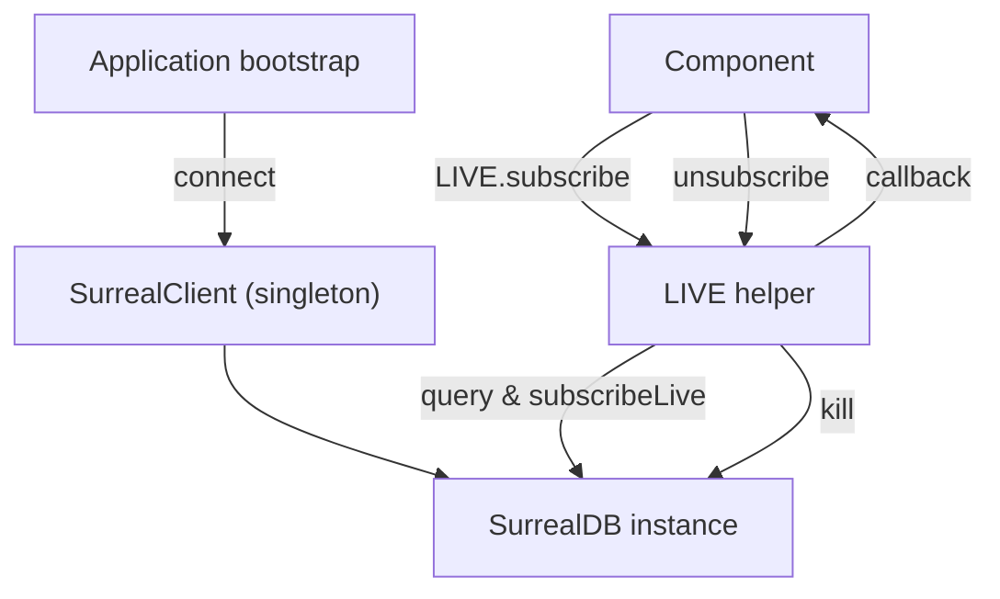

# Other — packages-surreal

# @aigency/surreal – SurrealDB 3.0 client, schema utilities, and LIVE query helpers

## Overview

`@aigency/surreal` provides a thin wrapper around the official **surrealdb** JavaScript SDK, adding Aigency‑specific connection handling, a set of TypeScript record definitions that mirror the database schema, and a small helper (`LIVE`) for subscribing to SurrealDB **LIVE SELECT** streams.

The package is published as a private workspace package and is consumed by other Aigency services (e.g., Membrane, Oracle, Wiki). It exports:

| Export | Path | Description |
|--------|------|-------------|
| `SurrealClient` | `./client.js` | Singleton client that holds a connected `SurrealDB` instance (`SurrealClient.db`). |
| `LIVE` | `./live.js` | Helper object exposing `subscribe`, `onEvent`, and `onAgentStatus` for real‑time queries. |
| Types | `./types.js` | TypeScript interfaces for every record stored in SurrealDB (agents, directives, timeline, wiki, graph edges, etc.). |

The module is built with **tsup** (ESM + CJS) and ships type declarations (`.d.ts`) for full IDE support.

---

## Installation & Build

```bash
# From the monorepo root
pnpm install          # installs workspace dependencies
pnpm -C packages/surreal run build   # produces ./dist
```

The `package.json` `exports` field points consumers to the appropriate entry point (`dist/index.mjs` for ESM, `dist/index.js` for CJS).

---

## Core API

### `SurrealClient`

*Location*: `src/client.ts` (implementation not shown here)  
*Purpose*: Manages a single SurrealDB connection that is reused across the codebase.

Typical usage pattern:

```ts
import { SurrealClient } from "@aigency/surreal";

await SurrealClient.connect({
  host: "http://localhost:8000",
  namespace: "aigency",
  database: "brain",
  auth: { user: "root", pass: "root" },
});

// The underlying DB instance is available as:
const db = SurrealClient.db;
```

> **Note** – `SurrealClient` is a singleton; calling `connect` more than once will reuse the existing connection.

### `LIVE` – Real‑time subscription helper

*Location*: `src/live.ts`

`LIVE` abstracts the low‑level `LIVE SELECT` command provided by SurrealDB. It automatically:

1. Issues a `LIVE SELECT` query and extracts the generated subscription UUID.
2. Registers a callback that receives the action (`CREATE | UPDATE | DELETE`) and the typed record.
3. Returns an *unsubscribe* function that kills the live query when invoked.

#### `LIVE.subscribe<T>(table, callback, where?)`

```ts
/**
 * Subscribe to LIVE changes on a SurrealDB table.
 *
 * @param table   The table name (e.g., "timeline").
 * @param callback  (action, data) => void – receives the CRUD action and the record.
 * @param where   Optional WHERE clause (raw SurrealQL string).
 * @returns A function that, when called, terminates the subscription.
 */
```

**Example**

```ts
import { LIVE } from "@aigency/surreal";
import type { TimelineRecord } from "@aigency/surreal";

const unsub = await LIVE.subscribe<TimelineRecord>("timeline", (action, rec) => {
  console.log(`[${action}]`, rec);
});

// later, when you no longer need updates
await unsub();
```

#### Convenience helpers

| Helper | Signature | Description |
|--------|-----------|-------------|
| `LIVE.onEvent<T>(eventType, callback)` | `(eventType: string, callback: LiveCallback<T>) => Promise<() => void>` | Subscribes to the `timeline` table filtered by `event_type = '<eventType>'`. |
| `LIVE.onAgentStatus(callback)` | `(callback: LiveCallback<{ callsign: string; status: string }>) => Promise<() => void>` | Subscribes to the `agent` table for any status change. |

These helpers simply forward to `LIVE.subscribe` with a pre‑filled `where` clause.

---

## Type Definitions (`src/types.ts`)

All record interfaces are exported from the package root. They are used throughout the codebase to enforce type safety when reading or writing SurrealDB data.

### Record categories

| Category | Interfaces |
|----------|------------|
| **Agents** | `AgentRecord`, `AgentMemoryRecord`, `AgentMemoryRelationRecord`, `AgentMemoryRecallTraceRecord` |
| **Directives & Patterns** | `DirectiveRecord`, `PatternRecord` |
| **Timeline** | `TimelineRecord` |
| **Wiki** | `WikiPageRecord`, `WikiChunkRecord`, `WikiLinkRecord`, `WikiTimelineEntryRecord`, `WikiIngestLogRecord` |
| **Peers** | `PeerRecord` |
| **Graph edges** | `DecidedByEdge`, `InformedByEdge`, `InvolvesEdge`, `ReferencesEdge`, `SupersedesEdge`, `GeneratedEdge` |
| **Jobs** | `JobRecord` |

Each interface mirrors the schema described in `agents/oracle/wiki/surreal-schema.md`. Fields are annotated with format expectations (e.g., ULID‑based IDs, ISO timestamps, embedding vectors).

**Example – TimelineRecord**

```ts
export interface TimelineRecord {
  id: string; // "timeline:<ulid>"
  event_type:
    | "session_start"
    | "session_end"
    | "directive_created"
    | "directive_completed"
    | "pattern_detected"
    | "lint_run"
    | "compile_run"
    | "graft_harvested"
    | "agent_status_change"
    | "memory_created"
    | "memory_recall";
  agent: AgentCallsign;
  summary: string;
  metadata: Record<string, unknown>;
  created_at: string;
}
```

These types are re‑exported from `src/index.ts` so consumers can import them directly:

```ts
import type { TimelineRecord, AgentRecord } from "@aigency/surreal";
```

---

## Integration Points

### Call graph

```
mem-brain
 ├─ subscribeToTimeline → LIVE.subscribe
 ├─ subscribeToDirectives → LIVE.subscribe
 └─ subscribeToAgentStatus → LIVE.subscribe
```

`LIVE.subscribe` is the only entry point for real‑time data in this package. No other module calls into `SurrealClient` directly; all database interactions go through the singleton client (`SurrealClient.db`).

### Typical usage flow

1. **Application start** – `SurrealClient.connect` is called once (e.g., in a service bootstrap).
2. **Component wants live updates** – it calls one of the `LIVE` helpers.
3. **LIVE helper** builds the query, registers the subscription, and returns an unsubscribe function.
4. **When the component is disposed** – it invokes the returned function to clean up the live query.

---

## Development & Contribution Guidelines

| Area | Guidance |
|------|----------|
| **Testing** | Only a placeholder test (`client.test.ts`) exists. Add unit tests for `LIVE.subscribe` using a mocked `SurrealClient.db` that implements `query`, `subscribeLive`, and `kill`. |
| **Linting** | Run `pnpm -C packages/surreal run lint`. The project uses **Biome**; avoid `any` unless explicitly ignored (as done in `live.ts`). |
| **Type safety** | All public APIs are typed. When extending the schema, add the new interface to `src/types.ts` and re‑export it from `src/index.ts`. |
| **Build** | `pnpm -C packages/surreal run build` generates both ESM and CJS bundles plus declaration files. Ensure the generated `dist` folder is committed (or generated in CI). |
| **Versioning** | The package is private; bump the `version` field manually when making breaking changes (e.g., altering the shape of a record). |
| **Documentation** | Keep the JSDoc comments in `live.ts` up‑to‑date; they are the source of the generated API docs. |

---

## Architecture Diagram



*The diagram shows the relationship between the application, the singleton client, the LIVE helper, and the underlying SurrealDB connection.*

---

## Frequently Asked Questions

**Q: Do I need to close the SurrealDB connection manually?**  
A: No. `SurrealClient` maintains a long‑lived connection for the lifetime of the process. Only live subscriptions need explicit cleanup via the returned unsubscribe function.

**Q: Can I use `LIVE.subscribe` with a custom record type?**  
A: Yes. Provide a generic type argument that matches the expected table schema, e.g., `LIVE.subscribe<AgentRecord>("agent", ...)`. The runtime does not enforce the type; it is purely a compile‑time aid.

**Q: How do I add a new table to the schema?**  
A: 1) Define a new interface in `src/types.ts`.  
2) Export it from `src/index.ts`.  
3) Update any `LIVE` convenience helpers if you need a shortcut for the new table.

---