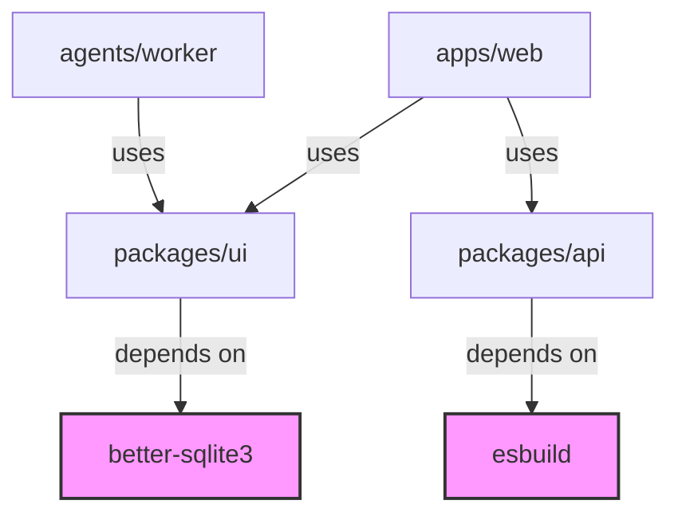

# Other — pnpm-workspace.yaml

# Other — `pnpm-workspace.yaml`

## Overview
`pnpm-workspace.yaml` defines the workspace configuration for the monorepo when using **pnpm** as the package manager. It tells pnpm which directories contain packages that belong to the workspace and which external dependencies should be treated as *built* (i.e., pre‑compiled) and therefore excluded from the workspace's hoisting and linking process.

## Structure

```yaml
packages:
  - "apps/*"
  - "packages/*"
  - "agents/*"
onlyBuiltDependencies:
  - "@biomejs/biome"
  - "better-sqlite3"
  - "esbuild"
  - "lefthook"
  - "protobufjs"
```

### `packages`
A glob pattern list that identifies all workspace packages. The patterns are resolved relative to the repository root:

| Pattern      | Resolved locations                     |
|--------------|----------------------------------------|
| `apps/*`     | `./apps/<package-name>/`                |
| `packages/*`| `./packages/<package-name>/`            |
| `agents/*`   | `./agents/<package-name>/`              |

Each matched folder must contain a `package.json` that declares the package name, version, and its own dependencies. pnpm will link these packages together, allowing intra‑workspace imports without publishing to a registry.

### `onlyBuiltDependencies`
A whitelist of dependencies that are **already built** (e.g., native binaries, pre‑compiled bundles) and therefore should **not** be hoisted into the workspace's `node_modules/.pnpm` store. This improves install speed and avoids unnecessary rebuilds.

| Dependency          | Typical use case |
|---------------------|------------------|
| `@biomejs/biome`    | Linting/formatting tool |
| `better-sqlite3`   | Native SQLite bindings |
| `esbuild`           | Fast JavaScript bundler |
| `lefthook`          | Git hook manager |
| `protobufjs`        | Protocol Buffers runtime |

## How pnpm Uses This File

1. **Workspace discovery** – pnpm reads `packages` globs, resolves each matching directory, and registers the contained `package.json` as a workspace package.
2. **Dependency graph construction** – For each workspace package, pnpm builds a dependency graph, linking internal packages via symlinks and installing external dependencies from the registry.
3. **Built‑dependency handling** – When a package lists any of the `onlyBuiltDependencies` in its `dependencies` or `devDependencies`, pnpm treats those modules as pre‑built. They are installed directly from the registry without being added to the hoisted store, preventing unnecessary compilation steps.

## Interaction with the Rest of the Codebase

- **`apps/*`** – Contains the main applications (e.g., web front‑ends, Electron apps). These apps import shared libraries from `packages/*` and may also depend on agents.
- **`packages/*`** – Holds reusable libraries, utilities, and UI components that are consumed by both `apps` and `agents`.
- **`agents/*`** – Contains background services or CLI tools that also share code from `packages/*`.

All three groups are part of the same pnpm workspace, so any change to a library in `packages/*` is instantly reflected in dependent apps or agents without a separate publish step.

## Extending the Workspace

To add a new package:

1. Create the folder under one of the defined globs (`apps/`, `packages/`, or `agents/`).
2. Add a valid `package.json` with a unique name.
3. Run `pnpm install` at the repository root – pnpm will automatically pick up the new package.

If the new package depends on a binary or pre‑compiled tool not already listed in `onlyBuiltDependencies`, add it to the list to avoid unnecessary rebuilds.

## Common Pitfalls

- **Missing `package.json`** – A folder matching a glob but lacking a `package.json` will be ignored, leading to confusing “module not found” errors.
- **Incorrect glob pattern** – Overly broad patterns (e.g., `*`) may unintentionally include non‑package directories, slowing down install time.
- **Omitting a built dependency** – If a native module like `better-sqlite3` is not listed under `onlyBuiltDependencies`, pnpm may attempt to rebuild it on every install, causing failures on CI machines lacking the required build toolchain.

## Example Dependency Flow



*The diagram shows how workspace packages (`ui`, `api`) are shared across apps and agents, and how built dependencies are consumed without being hoisted.*

## Maintenance Checklist

- [ ] Verify that all workspace packages are listed under the appropriate glob.
- [ ] Keep `onlyBuiltDependencies` up‑to‑date with any new native or pre‑compiled modules.
- [ ] Run `pnpm install` after modifying the file to ensure pnpm picks up changes.
- [ ] Periodically audit the workspace for stray directories that match the globs but are not actual packages.