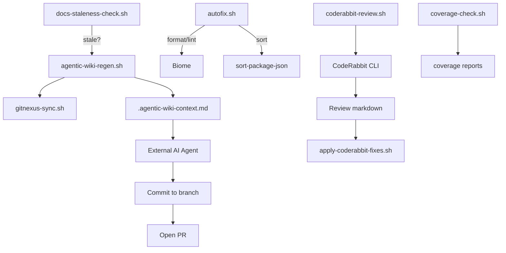

# Other — scripts-automation

# Other – scripts‑automation

## Overview

The `scripts/automation` directory contains a collection of Bash utilities that automate routine development tasks for the **aigency‑monorepo**. They are used by CI pipelines, pre‑commit hooks, and developers locally to:

* Detect stale documentation and trigger AI‑assisted wiki regeneration.
* Run a suite of auto‑fixers (formatting, linting, import ordering, JSON sorting, etc.).
* Generate CodeRabbit reviews for human or AI consumption.
* Verify test‑coverage thresholds.
* Keep the GitNexus knowledge‑graph index in sync with the repository.

All scripts are **self‑contained** Bash programs that assume they are executed from the repository root (or change to it internally). They rely on standard tools (`git`, `node`, `npx`, `pnpm`) and on the monorepo’s own utilities (`biome`, `gitnexus`, `coderabbit`).

---

## Directory Layout

```
scripts/
└─ automation/
   ├─ agentic-wiki-regen.sh      # Prepare AI‑agent context for wiki regeneration
   ├─ autofix.sh                 # Run Biome format/lint, import organization, etc.
   ├─ coderabbit-review.sh       # Wrapper around CodeRabbit CLI for reviews
   ├─ coverage-check.sh          # Enforce per‑package coverage thresholds
   ├─ docs-staleness-check.sh    # Detect when docs lag behind source changes
   └─ gitnexus-sync.sh           # Refresh GitNexus index
```

---

## 1. `docs-staleness-check.sh`

### Purpose
Detects whether the deep‑wiki (`apps/docs/`) is out‑of‑date relative to source code changes in `apps/`, `packages/`, and `agents/`.

### Usage

```bash
./scripts/automation/docs-staleness-check.sh [--threshold-days N]
```

* `--threshold-days N` – Override the default 7‑day staleness threshold.

### Exit Codes

| Code | Meaning                              |
|------|--------------------------------------|
| `0`  | Docs are fresh (within threshold)    |
| `1`  | Docs are stale or no docs history    |

### How it works
1. **Locate repository root** (`REPO_ROOT`).
2. **Compute timestamps** (Unix epoch) of the latest commit that touched:
   * `apps/docs/` → `DOCS_LAST_MOD`
   * Any source directory (`apps/`, `packages/`, `agents/`) → `SOURCE_LAST_MOD`
3. **Compare ages**. If the source‑age exceeds the docs‑age by more than the threshold, the script exits with `1`.

### Integration
* Called by `agentic-wiki-regen.sh` as the first step.
* Can be used in CI to gate merges: `if docs-staleness-check.sh --ci; then …`.

---

## 2. `agentic-wiki-regen.sh`

### Purpose
Automates the preparation of a Git work branch and a context file that an external AI agent (Claude, GPT, etc.) consumes to regenerate the deep‑wiki.

### Usage

```bash
./scripts/automation/agentic-wiki-regen.sh [--dry-run]
```

* `--dry-run` – Perform all checks and generate the context file, but **do not** create a branch, commit, or invoke external services.

### Workflow

| Step | Action |
|------|--------|
| **1** | Run `docs-staleness-check.sh`. If docs are fresh, the script exits early. |
| **2** | Create a timestamped branch `agentic/wiki-regen-YYYYMMDD-HHMMSS`. |
| **3** | Write `.agentic-wiki-context.md` containing: <br>• Task description <br>• Branch name <br>• Current commit & changed files <br>• Detailed instructions for the AI agent |
| **4** | Refresh the GitNexus index (`gitnexus-sync.sh`). |
| **5** | Stage and commit the context file (`git add` + `git commit`). |
| **6** | Print next‑step instructions for the AI agent and human reviewers. |

### Key Variables

| Variable | Description |
|----------|-------------|
| `REPO_ROOT` | Absolute path to the repository root (computed at runtime). |
| `DRY_RUN`   | Boolean flag controlling side‑effects. |
| `TIMESTAMP` | `date +%Y%m%d-%H%M%S` used for branch naming. |
| `BRANCH_NAME` | `agentic/wiki-regen-${TIMESTAMP}`. |
| `CONTEXT_FILE` | `.agentic-wiki-context.md`. |

### Exit Codes

* `0` – Successful setup (or early exit when docs are fresh).
* Non‑zero – Any failure (e.g., unknown option, git error).

### Integration Points

* **CI** – Can be invoked after a successful `docs-staleness-check.sh` to prepare a PR automatically.
* **Human workflow** – After the script finishes, the developer runs the AI agent (outside this repo) with the generated context file, then pushes the resulting commits.

---

## 3. `gitnexus-sync.sh`

### Purpose
Synchronizes the **GitNexus** knowledge‑graph index with the current repository state.

### Usage

```bash
./scripts/automation/gitnexus-sync.sh [--force]
```

* `--force` – Force a full re‑analysis even if the index appears up‑to‑date.

### Workflow

1. Verify `npx` is available (Node.js prerequisite).
2. Run `npx gitnexus status` if an existing `.gitnexus` directory is present.
3. Execute `npx gitnexus analyze` (or `--force`).
4. Report any uncommitted changes in `.gitnexus/`.

### Integration

* Called by `agentic-wiki-regen.sh` (Step 4) to ensure the AI agent works against an up‑to‑date code graph.
* Can be used in pre‑commit or post‑merge hooks to keep the index fresh.

---

## 4. `autofix.sh`

### Purpose
Runs the full suite of auto‑fixers across the monorepo, optionally in **check** mode (CI‑friendly) or **fix** mode (apply changes).

### Usage

```bash
./scripts/automation/autofix.sh [--check] [--fix]
```

* `--check` – Run in verification mode; exit with non‑zero if any fix is required.
* `--fix` – Default; apply all fixes.

### Steps Performed

| # | Fixer | Description |
|---|-------|-------------|
| 1 | **Biome Format** | `pnpm exec biome format` (writes files unless `--check`). |
| 2 | **Biome Lint** | `pnpm exec biome check` with safe then unsafe fixes. |
| 3 | **Organize Imports** | `biome check --organize-imports-enabled=true`. |
| 4 | **JSON / `package.json` Sort** | Uses `npx sort-package-json` when available. |
| 5 | **Git Conflict Markers** | Greps for `<<<<<<< HEAD` in source files; fails if found. |
| 6 | **Trailing Whitespace / EOF Newline** | Strips trailing spaces from tracked source files. |

### Exit Codes

* `0` – All checks passed (or fixes applied successfully).
* `1` – One or more checks failed (used by CI pipelines).

### Integration

* **CI** – Run with `--check` to enforce code quality before merging.
* **Local development** – Run without arguments to automatically clean the repo.

---

## 5. `coderabbit-review.sh`

### Purpose
Convenient wrapper around the **CodeRabbit** CLI that generates AI‑readable reviews of repository changes. Supports multiple modes and optional auto‑fix application.

### Usage

```bash
./scripts/automation/coderabbit-review.sh <mode> [options] [--autofix]
```

#### Modes

| Mode        | What is reviewed                               |
|-------------|-----------------------------------------------|
| `quick`     | Uncommitted changes (default).                |
| `staged`    | Staged changes only.                          |
| `committed`| Commits since the base branch (`main` or `develop`). |
| `pr`        | Full PR diff (CI mode).                       |
| `agent`     | Structured output for AI agents (`--agent`). |
| `interactive`| Launches the interactive TUI.                |

#### Common Options

* `--autofix` – After the review, automatically apply fixable suggestions via `apply-coderabbit-fixes.sh`.
* `--base <branch>` – Override the automatically detected base branch.

### Output

* Review markdown is saved to `.coderabbit/reviews/review-<timestamp>.md`.
* Metadata JSON is saved alongside as `review-<timestamp>.json`.

### Integration

* **CI** – `pr` mode is used in GitHub Actions to produce a review artifact.
* **Local** – Developers can run `quick` or `staged` to get immediate feedback.
* **AI agents** – `agent` mode produces a machine‑readable format that downstream bots can consume.

---

## 6. `coverage-check.sh`

### Purpose
Enforces per‑package line‑coverage thresholds based on Istanbul `coverage-final.json` reports.

### Usage

```bash
./scripts/automation/coverage-check.sh [--ci]
```

* `--ci` – Fail the script (non‑zero exit) when any package falls below its threshold; intended for CI pipelines.

### Configuration

Thresholds are defined in an associative Bash array:

```bash
declare -A THRESHOLDS=(
  ["apps/router"]=55
  ["packages/agent-core"]=80
  ["packages/surreal"]=10
  ["packages/vault-tools"]=1
  ["packages/honcho"]=10
  ["packages/mem-brain"]=20
)
```

### How it works

1. For each package directory, locate `coverage/coverage-final.json`.
2. Run a Node snippet that aggregates statement coverage and computes a percentage.
3. Compare the percentage against the configured threshold.
4. Report pass/fail and exit with `0` (all good) or `1` (any failure when `--ci` is set).

### Integration

* **CI** – Run as a step after `pnpm test:coverage` to gate merges.
* **Local** – Run without `--ci` to get a quick report.

---

## Interaction Diagram



*The diagram shows the primary data flow between scripts and external tools.*

---

## Common Dependencies

| Tool | Required By | Install Command |
|------|-------------|-----------------|
| `git` | All scripts | System package |
| `node` / `npm` | `gitnexus-sync.sh`, `coverage-check.sh`, `coderabbit-review.sh` | `brew install node` / `apt-get install nodejs` |
| `pnpm` | `autofix.sh` | `npm i -g pnpm` |
| `biome` | `autofix.sh` | `pnpm add -D @biomejs/biome` (already in repo) |
| `npx` | `gitnexus-sync.sh`, `autofix.sh` (sort‑package-json) | Comes with npm |
| `coderabbit` (or `cr`) | `coderabbit-review.sh` | `brew install coderabbit` or `curl -fsSL https://cli.coderabbit.ai/install.sh \| sh` |
| `gitnexus` | `gitnexus-sync.sh` | `npm i -g gitnexus` (or via `npx gitnexus`) |

---

## Running the Automation Locally

```bash
# 1. Verify docs freshness
./scripts/automation/docs-staleness-check.sh

# 2. If stale, prepare AI context
./scripts/automation/agentic-wiki-regen.sh

# 3. Run auto‑fixers (apply changes)
./scripts/automation/autofix.sh

# 4. Review changes with CodeRabbit
./scripts/automation/coderabbit-review.sh quick --autofix

# 5. Ensure coverage thresholds
./scripts/automation/coverage-check.sh --ci
```

---

## Contributing Guidelines

1. **Keep scripts POSIX‑compatible** – they run on macOS, Linux, and CI containers.
2. **Add unit tests** only where a script contains complex logic (e.g., `coverage-check.sh` parsing). Tests live under `scripts/automation/__tests__/`.
3. **Document new flags** in the script’s header comment block and update this README accordingly.
4. **Maintain exit‑code contracts** – `0` for success, non‑zero for failure. CI relies on these codes.
5. **Avoid hard‑coded paths** – always compute `REPO_ROOT` relative to `${BASH_SOURCE[0]}` as done throughout the module.
6. **Update the Mermaid diagram** when adding new scripts or changing the flow.

---

## Frequently Asked Questions

| Question | Answer |
|----------|--------|
| *Why does `agentic-wiki-regen.sh` not invoke the AI directly?* | The repository only prepares context; the actual AI execution may require credentials, rate‑limits, or external webhook handling that are outside the repo’s security scope. |
| *Can I run `autofix.sh` in a pre‑commit hook?* | Yes. Add `./scripts/automation/autofix.sh --check` to `.git/hooks/pre-commit`. |
| *What if `gitnexus-sync.sh` reports index changes?* | Stage the `.gitnexus/` directory (`git add .gitnexus/`) and commit it, or let the CI pipeline handle it automatically. |
| *How do I adjust coverage thresholds?* | Edit the `THRESHOLDS` associative array in `coverage-check.sh`. Consider raising values gradually as test coverage improves. |
| *Is there a way to run CodeRabbit in CI without installing it globally?* | The script automatically installs it via `brew` (macOS) or `curl` fallback, so CI runners only need `curl` and `bash`. |

---