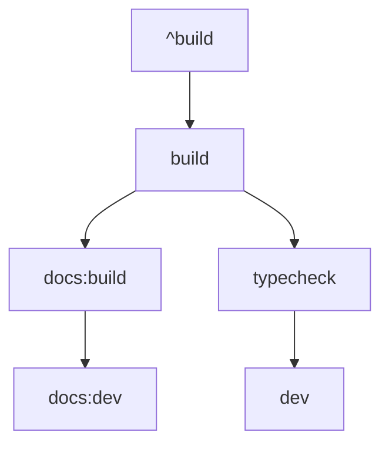

# Other — turbo.json

# Other — `turbo.json`

## Overview
`turbo.json` is the root‑level Turborepo configuration file for this monorepo. It defines the global schema, UI mode, and the set of tasks that Turborepo will orchestrate across all packages and apps. Each task entry describes its caching behavior, input/output globs, and any cross‑package dependencies.

## Schema Declaration
```json
{
  "$schema": "https://turbo.build/schema.json",
  "ui": "tui",
  ...
}
```
- **`$schema`** – Points to the official Turborepo JSON schema for validation and IDE assistance.
- **`ui`** – Sets the UI mode to the terminal UI (`tui`). This enables the interactive task runner when invoking `turbo run`.

## Task Definitions
All tasks are defined under the top‑level `tasks` object. The keys are the task names that can be invoked via `turbo run <task>`. Each task may contain the following properties:

| Property | Description | Typical Values |
|----------|-------------|----------------|
| `dependsOn` | Array of task names that must complete before this task runs. Prefix `^` indicates the same task in dependent packages. | `["^build"]` |
| `inputs` | Glob patterns that Turborepo watches to compute the task’s cache key. `$TURBO_DEFAULT$` expands to the default set of source files (e.g., `src/**`, `package.json`, etc.). | `["$TURBO_DEFAULT$", ".env*"]` |
| `outputs` | Glob patterns that are written by the task and stored in the cache. | `["dist/**"]` |
| `cache` | Boolean flag to enable/disable caching for the task. | `true` (default) / `false` |
| `persistent` | When `true`, the task runs in watch mode and stays alive (useful for dev servers). | `true` / omitted |
| `cache` | When `false`, Turborepo will always re‑execute the task. | `false` |

### Core Build Pipeline

- **`build`** – Compiles the current package (`dist/**`). Depends on the upstream `^build` task, ensuring that all dependent packages are built first.
- **`typecheck`** – Runs TypeScript type checking after the upstream `^build`. Uses only `$TURBO_DEFAULT$` as inputs.
- **`docs:build`** – Builds the documentation site; depends on `^build` and consumes both the default inputs and the `apps/docs/**` source tree.
- **`dev` / `docs:dev`** – Long‑running development servers. Both are marked `persistent: true` and `cache: false` to avoid stale caches while watching files.

### Testing & Coverage
- **`test`** – Executes unit tests. Inputs include the default source set plus any `.env.test*` files.
- **`test:coverage`** – Same inputs as `test` but also declares `coverage/**` as an output, allowing Turborepo to cache coverage artifacts.

### Linting & Formatting
- **`lint`** – Lints the codebase; fully cacheable.
- **`lint:fix`** – Lint with auto‑fix; caching disabled because the task mutates source files.
- **`format`** – Runs Prettier (or equivalent) formatting; also non‑cacheable.

### Clean & Docs Checks
- **`clean`** – Removes generated artifacts. Explicitly non‑cacheable to guarantee a fresh state.
- **`docs:check`** – Validates documentation files across the repo. No caching to ensure up‑to‑date validation.

### Custom Agent Tasks
- **`gitnexus:sync`** – Synchronises repository state with an external GitNexus service. Inputs cover all source directories (`apps/**`, `packages/**`, `agents/**`). Caching disabled because the external service state may change independently of source files.

## Interaction with the Codebase
- **Cross‑Package Dependencies** – The `^` prefix in `dependsOn` tells Turborepo to run the same task in any package that the current package depends on (as defined in its `package.json`). This creates a topological order that respects the monorepo’s dependency graph.
- **Cache Keys** – Turborepo builds a hash from the listed `inputs`. Changing any file that matches an input pattern invalidates the cache for that task and downstream dependents.
- **Outputs** – When a task declares `outputs`, Turborepo stores those files in the remote cache (if configured). Subsequent runs can restore the outputs without re‑executing the task, dramatically speeding up CI pipelines.

## Extending / Overriding Tasks
- **Local Overrides** – Individual packages can provide a `turbo.json` (or `turbo.config.js`) that extends or overrides the root configuration. The merge strategy follows Turborepo’s “deep merge” rules: task objects are shallow‑merged, while arrays (e.g., `inputs`) are concatenated.
- **Adding New Tasks** – To introduce a new task, add a key under `tasks` with the desired properties. Ensure that any new task that should participate in the build graph declares appropriate `dependsOn` relationships.

## Best Practices
1. **Keep `inputs` Minimal** – Only list files that truly affect the task’s output. Over‑broad globs increase cache misses.
2. **Declare `outputs` When Possible** – Enables remote caching and artifact restoration.
3. **Avoid `cache: false` Unless Necessary** – Disabling caching removes one of Turborepo’s primary performance benefits.
4. **Use `persistent: true` for Long‑Running Servers** – Prevents Turborepo from terminating the process after the first run.
5. **Leverage `$TURBO_DEFAULT$`** – This placeholder automatically includes the most common source files, reducing duplication across tasks.

## Related Files
- **`package.json`** – Defines the dependency graph that Turborepo uses to resolve `^` task dependencies.
- **`apps/**` & `packages/**`** – Source directories referenced by task inputs/outputs.
- **`.env*` & `.env.test*`** – Environment files that influence build and test behavior; explicitly listed to ensure cache invalidation when they change.