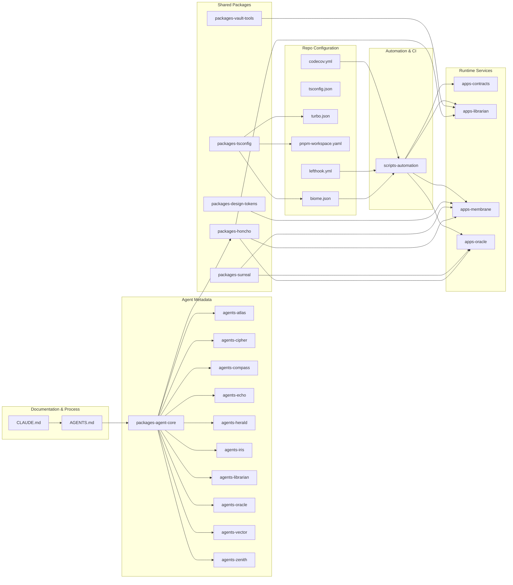

# Other

# Other – Module Overview

The **Other** collection is the non‑executable backbone of the Aigency monorepo. It houses:

* **Operational handbooks** that define how developers interact with the GitNexus code‑intelligence platform.  
* **Declarative agent descriptors** that describe every persona (ATLAS, CIPHER, COMPASS, etc.) used by the platform.  
* **Application packages** that implement runtime services (contracts, librarian, membrane, oracle, …).  
* **Repository‑wide configuration files** (Biome, TypeScript, Turborepo, pnpm, Git hooks, CI tools).  
* **Automation scripts** that glue the above pieces together in CI/CD pipelines.

Together these sub‑modules provide a single source of truth for **process, metadata, tooling, and orchestration**. Developers read the handbooks, the platform consumes the agent metadata, and the build system enforces consistency across all code.

---

## How the Sub‑modules Fit Together

| Category | Sub‑modules | Role in the ecosystem |
|----------|-------------|-----------------------|
| **Process & Guidance** | `[AGENTS.md](AGENTS.md)` – operational handbook for GitNexus impact analysis. `[CLAUDE.md](CLAUDE.md)` – repository‑wide working memory (architecture, naming, commands). | Define the developer workflow and the contracts that every change must satisfy before it is merged. |
| **Agent Metadata** | `[agents-atlas](agents-atlas.md)`, `[agents-cipher](agents-cipher.md)`, `[agents-compass](agents-compass.md)`, `[agents-echo](agents-echo.md)`, `[agents-herald](agents-herald.md)`, `[agents-iris](agents-iris.md)`, `[agents-librarian](agents-librarian.md)`, `[agents-oracle](agents-oracle.md)`, `[agents-vector](agents-vector.md)`, `[agents‑zenith](agents‑zenith.md)` | Pure‑data packages (YAML + minimal `package.json`) that describe each persona’s callsign, role, visual branding, and substrate. Consumed by the runtime orchestration layer (`@aigency/honcho`) and by UI apps that render agent information. |
| **Core Agent Registry** | `[packages-agent-core](packages-agent-core.md)` | Centralises TypeScript interfaces and the `AGENT_REGISTRY` map. All services import this to obtain a consistent view of the agents defined above. |
| **Application Services** | `[apps-contracts](apps-contracts.md)` – Solidity contracts. `[apps-librarian](apps-librarian.md)` – vault‑lint‑to‑DB service. `[apps-membrane](apps-membrane.md)` – React/Three.js UI for the knowledge graph. `[apps-oracle](apps-oracle.md)` – persistent‑memory bootstrap & event forwarding. | Implement runtime behaviour. They rely on shared packages (e.g., `@aigency/surreal`, `@aigency/honcho`) and on the agent metadata to know which agents they serve. |
| **Shared Packages** | `[packages-design-tokens](packages-design-tokens.md)` – UI token set. `[packages-honcho](packages-honcho.md)` – Honcho client for peer/identity handling. `[packages-surreal](packages-surreal.md)` – SurrealDB client & LIVE helpers. `[packages-tsconfig](packages-tsconfig.md)` – unified TypeScript config. `[packages-vault-tools](packages-vault-tools.md)` – CLI utilities for the vault (compile, lint, flush). | Provide reusable building blocks for the apps and for CI scripts. |
| **Repository Configuration** | `[biome.json](biome.json)` – formatter/linter config. `[codecov.yml](codecov.yml)` – coverage thresholds. `[lefthook.yml](lefthook.yml)` – Git hook orchestration. `[pnpm-workspace.yaml](pnpm-workspace.yaml)` – workspace package discovery. `[tsconfig.json](tsconfig.json)` – global TypeScript compiler options. `[turbo.json](turbo.json)` – Turborepo task graph. | Enforce code quality, dependency linking, and build caching across the whole monorepo. |
| **Automation & CI** | `[scripts-automation](scripts-automation.md)` – Bash utilities for linting, formatting, wiki regeneration, coverage checks, etc. | Invoked by Git hooks (`lefthook`), CI pipelines, and local development to keep the repository in a healthy state. |
| **Root Manifest** | `[package.json](package.json)` – top‑level npm manifest (scripts, dev dependencies, workspace entry points). | Drives the npm‑based tooling (Turbo, Biome, Commitizen, etc.) that powers the development lifecycle. |

---

## Key Cross‑Package Workflows

1. **Change‑Impact Workflow**  
   - Developer reads `[CLAUDE.md]` → runs `gitnexus_impact` as prescribed in `[AGENTS.md]`.  
   - Pre‑commit hook (`lefthook.yml`) runs Biome formatting and the `lint` command from `[packages-vault-tools]`.  
   - If impact analysis passes, the commit proceeds; otherwise the developer revisits the change.

2. **Agent Registration & Discovery**  
   - Each `agents‑*/agent.yaml` is published as a private npm package.  
   - `[packages-agent-core]` aggregates them into `AGENT_REGISTRY`.  
   - Runtime services (`apps-membrane`, `apps-oracle`, `apps-librarian`) import `AGENT_REGISTRY` and the Honcho client (`[packages-honcho]`) to locate peers, establish sessions, and route messages.

3. **Knowledge‑Graph Update Cycle**  
   - `apps-librarian` runs on a schedule (or via GitHub Actions) → uses `[packages-vault-tools]` to lint the vault → writes a timeline event to SurrealDB via `[packages-surreal]`.  
   - `apps-membrane` subscribes to the LIVE query (`LIVE` helper) to render the updated graph in real time.  
   - `apps-oracle` seeds the `agent` table and later forwards metric events to the Solidity contracts in `apps-contracts`.

4. **CI / Coverage Enforcement**  
   - Pull‑request pipelines execute `lefthook` → Biome → `npm test` → `codecov.yml` uploads coverage.  
   - `turbo.json` caches build artifacts, ensuring that only changed packages are rebuilt, while `pnpm-workspace.yaml` guarantees correct workspace linking.

5. **Design Token Propagation**  
   - UI components in `apps-membrane` import `@aigency/design-tokens` to keep visual styling in sync with the brand system defined in `agents-iris` (the design‑system owner).

---

## Diagram – High‑Level Relationships

The diagram shows the flow from **documentation** → **agent core** → **runtime services**, with shared packages and configuration files underpinning the entire stack.

---

### Quick Start for a New Contributor

1. **Read** `[CLAUDE.md]` to understand the repository architecture.  
2. **Follow** the impact‑analysis steps in `[AGENTS.md]` before editing any code.  
3. **Run** `pnpm install && pnpm run build` – Turborepo will orchestrate builds using the shared TypeScript config (`tsconfig.json`) and the Biome formatter (`biome.json`).  
4. **Commit** using the prepared hooks (`lefthook.yml`); the hooks will invoke Biome, the vault lint tool, and the pre‑commit scripts from `scripts-automation`.  
5. **Push** and let CI enforce coverage (`codecov.yml`) and run the full test suite.

All detailed behaviours are documented in the linked sub‑module pages.