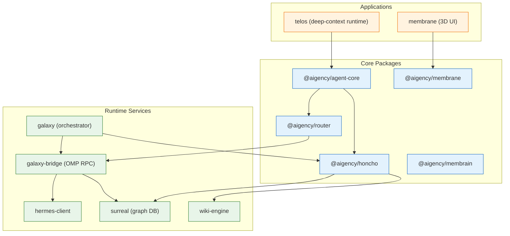

# aigency-monorepo — Wiki

# aigency – Multi‑Agent AI Operating System

Welcome to the **Aigency** monorepo! This repository contains the core platform that powers autonomous agents with persistent memory, knowledge‑graph reasoning, and a flexible routing layer for large language models. Everything you need to build, run, and extend a fleet of AI agents lives here – from low‑level primitives to full‑stack applications.

---

## Quick Start

```bash
# Clone the repo
git clone https://github.com/AReid987/aigency-monorepo.git
cd aigency-monorepo

# Install dependencies (pnpm workspaces)
pnpm install

# Build all packages
pnpm run build

# Run the development server for the demo UI
pnpm run dev
```

> The repository uses **pnpm** workspaces, **Turbo** for incremental builds, and **Biome** for linting/formatting. All scripts listed in `package.json` (e.g. `autofix`, `typecheck`, `test`, `wiki:update`) are available via `pnpm run <script>`.

---

## High‑Level Architecture



*The diagram shows the most important modules and how they interact. Core packages provide type‑safe contracts and routing logic; runtime services implement persistence, RPC, and knowledge‑base features; applications consume the core to expose UI or specialized runtimes.*

---

## What the System Does

1. **Agent Identity & Routing** – The `@aigency/agent-core` package defines a canonical set of agent callsigns (ATLAS, CIPHER, COMPASS, etc.) and the routing primitives used by the **Router** (`@aigency/router`). When a chat request arrives, the router classifies its difficulty tier, selects an appropriate LLM provider, and builds a fallback chain.

2. **Persistent Memory** – `@aigency/honcho` wraps the Honcho SDK to manage peer sessions. Under the hood it talks to **SurrealDB** (graph store) and the **WikiEngine** (vector search, page crystallisation). The unified interface is exposed through the **MemBrain** layer (`packages/membrain`).

3. **Orchestration** – The `galaxy` package contains the orchestrator (`handleHermesMessage`, `executeTask`). It receives high‑level commands from external clients (e.g. Hermes), delegates work to the **OMP RPC** bridge, and ultimately writes results back to memory.

4. **User‑Facing UI** – The `membrane` app renders a 3‑D knowledge graph with Three.js and React‑Three‑Fiber. It pulls data from the memory layer and lets users query, visualize, and edit agent directives.

5. **Deep‑Context Runtime** – The `telos` app demonstrates how a full context file (`TelosContextFile`) can be parsed and versioned. It is a scaffold for future “context‑as‑code” features.

---

## Key End‑to‑End Flows

### 1. Handling a Hermes Message → Memory Write
```
handleHermesMessage (galaxy) → executeTask (galaxy)
   → delegate (galaxy‑bridge) → setModel / sendCommand (OMP RPC)
   → write (OMP RPC) → MemBrain → SurrealDB
```
*The orchestrator receives a Hermes payload, selects a model, sends the command over the OMP bridge, and persists the result in the graph database.*

### 2. Chat Request → LLM Routing → Response
```
server (router) → handleChatCompletion
   → routeRequest (router) → getEnabledProviders (config)
   → select Tier → pick Model → build fallback chain
   → invoke LLM → stream response back to client
```
*If the configuration is missing, the flow aborts with `ConfigNotInitializedError` – a useful guard that appears early in the call stack.*

### 3. Wiki Page Load → Data Fetch → Render
```
Page (pages/wiki/[slug].tsx) → WikiView
   → load (WikiView) → loadRepoWikiPage (gitnexus)
   → wikiBase / titleFromSlug (gitnexus) → render
```
*The UI layer pulls markdown from the repository, resolves the base URL, and displays a nicely formatted page.*

---

## Where to Look Next

- **Core Types & Routing** – `[Agent Core](packages/agent-core/README.md)` and `[Router](apps/router/README.md)`  
- **Memory & Identity** – `[Honcho](packages/honcho/README.md)` and `[SurrealDB Wrapper](packages/surreal/README.md)`  
- **Orchestrator** – `[Galaxy](apps/galaxy/README.md)` (contains `handleHermesMessage` and task delegation)  
- **UI** – `[Membrane App](apps/membrane/README.md)` for the 3‑D knowledge graph  
- **Deep‑Context** – `[Telos](apps/telos/README.md)` for the context file format  

Each module’s README provides a focused guide, API reference, and example usage.

---

## Development Tips

| Task | Command |
|------|---------|
| Lint & auto‑fix | `pnpm run lint:fix` |
| Run unit tests with coverage | `pnpm run test:coverage` |
| Update the wiki from source files | `pnpm run wiki:update` |
| Generate type definitions | `pnpm run typecheck` |
| Clean all build artefacts | `pnpm run clean` |

The CI pipeline runs **Codecov**, **MegaLinter**, and **CodeRabbit AI Review** on every push, so keep the pipeline green by running the above scripts locally before committing.

---

## Contributing

1. Fork the repo and create a feature branch.  
2. Run `pnpm install && pnpm run build` to ensure everything compiles.  
3. Add or update tests; run `pnpm run test` to verify.  
4. Run `pnpm run autofix` to apply project‑wide formatting.  
5. Open a PR – the CI bots will automatically lint, type‑check, and run AI‑assisted review.

Happy hacking! 🎉