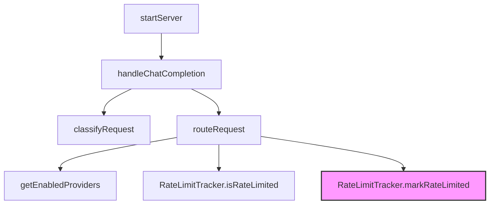

# Router

# Router Module Documentation

## Overview
The **Router** module decides which LLM provider/model should handle a given chat request. It classifies the request into a *tier* (SIMPLE → REASONING), selects the most appropriate model while preserving quota, and builds a fallback chain for automatic retry on failure or rate‑limit. The module also tracks rate‑limited models, estimates token usage, and formats routing decisions for logging.

## Public Types

| Type | Description |
|------|-------------|
| `Tier` | `"SIMPLE" | "MEDIUM" | "COMPLEX" | "REASONING"` – logical difficulty level of a request. |
| `RoutingDecision` | Result of `routeRequest`. Contains `tier`, `model` (full ID `provider/model`), `confidence`, `reasoning`, `fallbackChain`, and `quotaSize`. |
| `RequestClassification` | Output of `classifyRequest`. Holds the original `messages`, a sanitized prompt, the derived `tier`, a numeric `score`, and an array of `reasoning` strings. |
| `RouterConfig` | Configuration options that influence routing behavior (quota preference, fallback enablement, rate‑limit cooldown, confidence threshold). |
| `DEFAULT_ROUTER_CONFIG` | Default values for `RouterConfig`. |

## Configuration (`RouterConfig`)

| Property | Default | Meaning |
|----------|---------|---------|
| `preferLargeQuota` | `true` | Prefer models with larger quota buckets when multiple candidates are viable. |
| `enableFallback` | `true` | When `true`, the router returns a fallback chain (next‑best models). |
| `rateLimitCooldown` | `60` (seconds) | How long a model stays in the rate‑limited set after a `markRateLimited` call. |
| `minConfidenceThreshold` | `0.3` | Minimum confidence required to accept a model for the requested tier. (Currently used only for documentation; confidence is derived from tier compatibility.) |

## RateLimitTracker

```ts
class RateLimitTracker {
  constructor(cooldownSeconds?: number);
  markRateLimited(modelId: string): void;
  isRateLimited(modelId: string): boolean;
  getRateLimitedModels(): string[];
  clear(): void;
}
```

* **Purpose** – Prevents the router from selecting models that have recently returned a rate‑limit error.  
* **Internal state** – `Map<string, number>` where the value is the epoch‑ms when the cooldown expires.  
* **Key methods**  
  * `markRateLimited` – Called by `handleChatCompletion` when a provider returns a rate‑limit response. Logs a warning via `logger`.  
  * `isRateLimited` – Queried by `routeRequest` and `getNextFallback` to filter out unavailable models.  
  * `clear` – Empties the tracker; invoked by various cleanup paths (`dispose`, CLI status handling, quota‑tracker reset).  

## Request Classification (`classifyRequest`)

```ts
function classifyRequest(messages: Array<{ role: string; content: string }>): RequestClassification
```

* **Input** – Full chat history (`messages`).  
* **Process** – Examines the last message and the conversation length, scoring eight heuristics (token estimate, code presence, reasoning keywords, math, multi‑turn, question complexity, technical domain, creative task).  
* **Output** – A `RequestClassification` object containing:  
  * `tier` – Determined from the accumulated score (`SIMPLE` … `REASONING`).  
  * `score` – Numeric sum of heuristic points (0‑14).  
  * `reasoning` – Human‑readable list of why each heuristic contributed.  
  * `sanitizedPrompt` – First 100 characters of the last message with newlines escaped (useful for logging).  

## Model Routing (`routeRequest`)

```ts
function routeRequest(
  classification: RequestClassification,
  rateLimitTracker: RateLimitTracker,
  _config?: RouterConfig
): RoutingDecision
```

### Steps

1. **Load providers** – Calls `getEnabledProviders()` (from `./config/index.js`). Each provider supplies a list of models with metadata (`tier`, `quota.quotaSize`, etc.).  
2. **Flatten models** – Produces an array of `{ provider, model, fullId }`.  
3. **Filter rate‑limited** – Removes any model where `rateLimitTracker.isRateLimited(fullId)` returns `true`. Throws if none remain.  
4. **Tier compatibility** – Keeps models whose declared tier is **≥** the request tier (e.g., a `complex` model can serve a `simple` request).  
5. **Candidate selection** – If tier‑compatible models exist, they become the candidate set; otherwise the full non‑rate‑limited set is used.  
6. **Quota‑preservation sort** – Candidates are sorted by:
   * **Primary** – Larger quota size (`huge` → `tiny`).  
   * **Secondary** – Exact tier match (prefers a model whose tier equals the request tier).  
7. **Decision** – The first entry after sorting is the selected model.  
8. **Fallback chain** – The next three models (if any) become `fallbackChain`.  
9. **Confidence** – `0.9` when tier‑compatible models exist, otherwise `0.5`.  
10. **Return** – A `RoutingDecision` with all fields populated.

### Important Constants

* `tierOrder = { simple: 0, medium: 1, complex: 2, reasoning: 3 }` – Used for tier compatibility comparison.  
* `quotaSizeOrder = { huge: 5, large: 4, medium: 3, small: 2, tiny: 1 }` – Drives the primary sort order.

## Fallback Retrieval (`getNextFallback`)

```ts
function getNextFallback(
  currentModel: string,
  fallbackChain: string[],
  rateLimitTracker: RateLimitTracker
): string | null
```

Iterates over `fallbackChain` and returns the first model that is **not** rate‑limited and differs from `currentModel`. Returns `null` when no viable fallback exists.

## Quota Estimation (`estimateQuotaUsage`)

```ts
function estimateQuotaUsage(messages: Array<{ role: string; content: string }>): {
  requestCount: number;
  tokenEstimate: number;
}
```

* Computes a rough token count (`totalLength / 4`).  
* Returns a fixed `requestCount: 1` (the router currently handles a single request per call).  
* Used by external monitoring or billing components to predict quota consumption before the request is sent to a provider.

## Logging Helper (`formatRoutingDecision`)

```ts
function formatRoutingDecision(decision: RoutingDecision): string
```

Produces a multi‑line, emoji‑prefixed string suitable for structured logs. Includes tier, model ID, quota size, confidence percentage, reasoning text, and optional fallback chain.

## Integration Points

| Caller | Interaction |
|--------|--------------|
| `router/src/server.ts` → `handleChatCompletion` | Calls `classifyRequest`, `routeRequest`, and `markRateLimited` on failure. |
| `galaxy-bridge/src/omp-rpc-client.ts` → `dispose` | Triggers `RateLimitTracker.clear()` during client shutdown. |
| `galaxy/src/cli.ts` → `main` / `handleStatus` | Indirectly clears the tracker via `dispose`. |
| `router/src/quota-tracker.ts` → `reset` | Calls `RateLimitTracker.clear()` to reset state after a quota reset. |
| `src/config/index.ts` | Provides `getEnabledProviders` and underlying configuration; the router assumes providers are already validated. |

## Execution Flow (simplified)



* The diagram shows the primary path from server start to model selection, highlighting the two internal calls to `RateLimitTracker`.  

## Error Handling

* **No available models** – `routeRequest` throws `Error("No models available (all rate-limited). Wait before retrying.")`. Callers should catch this and surface a user‑friendly message or retry after the configured cooldown.
* **Invalid tier** – The classification logic guarantees a valid `Tier`; however, if a provider returns a model with an unknown tier, the router will treat it as non‑compatible and fall back to the next candidate.

## Extending the Router

1. **Add new heuristics** – Extend `classifyRequest` by inserting additional scoring blocks before the tier assignment. Keep the `reasoning` array updated for transparency.  
2. **Custom quota policies** – Modify the sort comparator in `routeRequest` to incorporate additional model attributes (e.g., latency, cost).  
3. **Dynamic fallback length** – Change the slice size (`candidateModels.slice(1, 4)`) to adjust how many fallbacks are returned.  
4. **Alternative rate‑limit strategies** – Replace `RateLimitTracker` with a more sophisticated token‑bucket implementation; ensure the public API (`markRateLimited`, `isRateLimited`, `clear`) remains compatible.  

## Usage Example

```ts
import { RateLimitTracker, classifyRequest, routeRequest } from "./router.js";

const tracker = new RateLimitTracker(); // uses default 60 s cooldown
const messages = [
  { role: "user", content: "Can you explain the difference between TCP and UDP?" },
];

const classification = classifyRequest(messages);
const decision = routeRequest(classification, tracker);

console.log(formatRoutingDecision(decision));
// → 🎯 Routing Decision:
//    Tier: MEDIUM
//    Model: openai/gpt-4
//    Quota: large
//    Confidence: 90%
//    Reasoning: Selected GPT‑4 (quota: large) for MEDIUM tier task
//    Fallbacks: openai/gpt-3.5 → anthropic/claude-2
```

## Testing & Debugging Tips

* **Rate‑limit visibility** – Call `tracker.getRateLimitedModels()` to inspect which models are currently blocked.  
* **Decision inspection** – Use `formatRoutingDecision` or directly log the `RoutingDecision` object to verify quota and tier matching.  
* **Edge cases** – Simulate a scenario where all models are rate‑limited to confirm the error path is exercised.  

--- 

*End of Router module documentation.*