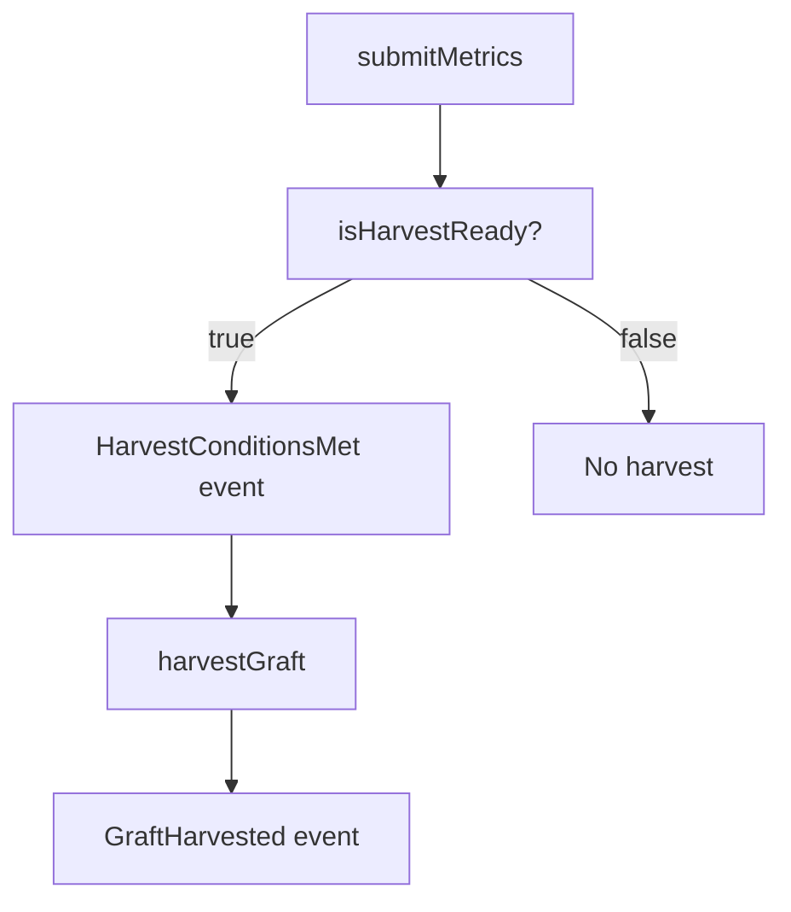

# Smart Contracts

# HarvestMoon.sol – Quality‑Gate Smart Contract

## Overview
`HarvestMoon` is a gatekeeper contract that authorises the minting of **Crystal Graft** NFTs based on off‑chain quality metrics submitted by trusted oracle addresses.  
The contract lives on Base L2 (chain‑id 8453) and is intended to be used together with the `AigencyGraft` NFT contract (minting call is commented out for later wiring).

Key properties:

| Property | Meaning |
|----------|---------|
| **Lint health score** | Integer 0‑100 (stored directly). |
| **Wiki density** | Fixed‑point 0.00‑1.00, stored as `uint256` scaled by 10⁴ (e.g. 0.74 → 7400). |
| **Vault age** | Days since vault genesis. |
| **Harvest readiness** | All three metrics must exceed predefined thresholds **and** the submit‑timelock and harvest‑cooldown must have elapsed. |

Only the architect (set at deployment) and any address flagged as a *trusted submitter* may call the privileged functions.

---

## Deployment

```solidity
// Deploy on Base L2 (chain id 8453) or Base Sepolia (84532)
address architect = 0x...; // architect wallet address
HarvestMoon moon = new HarvestMoon(architect);
```

- The constructor records `architect` as an immutable address and automatically marks it as a trusted submitter.
- No proxy pattern is used; the contract is non‑upgradeable. If upgradeability is required, wrap it in a proxy and expose the same external interface.

---

## State Variables

| Variable | Visibility | Description |
|----------|------------|-------------|
| `architect` | `public immutable` | Fixed architect address, set once at construction. |
| `trustedSubmitters` | `public` (mapping) | `address => bool` flag indicating which accounts may submit metrics or trigger harvests. |
| `lintHealthScore` | `public` | Latest lint health score (0‑100). |
| `wikiDensity` | `public` | Latest wiki density (scaled ×10⁴). |
| `vaultAgeDays` | `public` | Latest vault age in days. |
| `lastUpdated` | `public` | Timestamp of the most recent `submitMetrics` call. |
| `lastHarvestAt` | `public` | Timestamp of the last successful `harvestGraft`. |
| `graftCount` | `public` | Monotonically increasing counter used as the graft identifier. |
| **Constants** | `public constant` | Thresholds and timelocks used by `isHarvestReady`. |
| `LINT_THRESHOLD` | `85` | Minimum lint score (≥ 85). |
| `DENSITY_THRESHOLD` | `7000` | Minimum wiki density (≥ 0.70). |
| `AGE_THRESHOLD_DAYS` | `90` | Minimum vault age (≥ 90 days). |
| `HARVEST_COOLDOWN` | `30 days` | Minimum interval between successive harvests. |
| `SUBMIT_TIMELOCK` | `24 hours` | Minimum delay after a metric submission before a harvest may be attempted. |

---

## Constructor

```solidity
constructor(address _architect)
```

- Sets `architect` to `_architect`.
- Grants the architect the trusted‑submitter role (`trustedSubmitters[_architect] = true`).

---

## Access Control

| Function | Required Role | Reason |
|----------|---------------|--------|
| `setTrustedSubmitter` | `architect` | Only the architect can add or remove trusted submitters. |
| `submitMetrics` | `trustedSubmitters[msg.sender]` | Prevents arbitrary accounts from feeding metrics. |
| `harvestGraft` | `trustedSubmitters[msg.sender]` | In production this will be replaced by a 2‑of‑3 multisig check; for now any trusted submitter may trigger a harvest. |

The contract does **not** implement a full multisig scheme; the comment in `harvestGraft` indicates where a multisig guard should be inserted.

---

## Oracle Feed – `submitMetrics`

```solidity
function submitMetrics(
    uint256 _lintScore,
    uint256 _wikiDensity,
    uint256 _ageDays
) external
```

1. **Authorization** – Caller must be a trusted submitter.  
2. **Input validation** –  
   - `_lintScore` ≤ 100.  
   - `_wikiDensity` ≤ 10 000 (represents 1.00).  
3. **State update** – Stores the three metrics and updates `lastUpdated`.  
4. **Events** – Emits `MetricsSubmitted`.  
5. **Readiness check** – Calls `isHarvestReady()`; if true, emits `HarvestConditionsMet`.

> **Note:** The function does **not** automatically mint a graft; it only signals that the conditions are satisfied. Harvesting must be performed in a separate transaction.

---

## Harvest Gate – `isHarvestReady`

```solidity
function isHarvestReady() public view returns (bool)
```

The function returns `true` only when **all** of the following hold:

1. Metrics have been submitted at least once (`lastUpdated != 0`).  
2. The submit‑timelock has passed: `block.timestamp >= lastUpdated + SUBMIT_TIMELOCK`.  
3. The harvest cooldown has passed: `block.timestamp >= lastHarvestAt + HARVEST_COOLDOWN`.  
4. Metric thresholds are met:
   - `lintHealthScore >= LINT_THRESHOLD`
   - `wikiDensity >= DENSITY_THRESHOLD`
   - `vaultAgeDays >= AGE_THRESHOLD_DAYS`

All checks are pure view operations; no state is modified.

---

## Harvesting – `harvestGraft`

```solidity
function harvestGraft(address recipient) external returns (uint256 graftId)
```

1. **Authorization** – Caller must be a trusted submitter (architect or oracle).  
2. **Readiness** – Calls `isHarvestReady()`; reverts if conditions are not satisfied.  
3. **State changes** –  
   - Increments `graftCount` and returns the new ID.  
   - Updates `lastHarvestAt` to the current block timestamp.  
4. **Event** – Emits `GraftHarvested(graftId, recipient, block.timestamp)`.  
5. **Minting** – The actual NFT mint call (`AigencyGraft.mint`) is commented out; it should be wired after the NFT contract is deployed.

---

## View Functions

### `getMetrics`

```solidity
function getMetrics() external view returns (
    uint256 _lintScore,
    uint256 _wikiDensity,
    uint256 _ageDays,
    uint256 _lastUpdated
)
```

Returns the latest metric values and the timestamp of the last submission. Useful for front‑end dashboards and off‑chain monitoring.

---

## Events

| Event | Parameters | Emitted By |
|-------|------------|------------|
| `MetricsSubmitted` | `lintScore`, `density`, `ageDays`, `timestamp` | `submitMetrics` |
| `HarvestConditionsMet` | `timestamp` | `submitMetrics` (when `isHarvestReady` is true) |
| `GraftHarvested` | `graftId`, `recipient`, `timestamp` | `harvestGraft` |

All events are indexed where appropriate (`graftId`, `recipient`) to facilitate efficient log queries.

---

## Security Considerations

| Issue | Mitigation |
|-------|------------|
| **Unauthorized metric injection** | Only addresses flagged in `trustedSubmitters` may call `submitMetrics`. The architect controls this list via `setTrustedSubmitter`. |
| **Replay / front‑running** | The `SUBMIT_TIMELOCK` forces a 24 h delay after a metric update before a harvest can be attempted, reducing the window for a malicious actor to submit a favorable metric and immediately harvest. |
| **Harvest frequency** | `HARVEST_COOLDOWN` (30 days) caps how often a graft can be minted, preventing rapid token inflation. |
| **Missing multisig** | The current `harvestGraft` authorisation is a placeholder. Production deployments should replace the simple `trustedSubmitters` check with a 2‑of‑3 multisig (Architect + Oracle + Librarian). |
| **Overflow** | Solidity 0.8+ includes built‑in overflow checks; the contract relies on them. |
| **Denial‑of‑service** | No external calls are made, so a malicious submitter cannot block the contract, but they could withhold metric updates. Governance should monitor the `trustedSubmitters` list. |

---

## Integration Points

- **AigencyGraft (NFT contract)** – The commented line in `harvestGraft` shows where the mint call will be inserted: `AigencyGraft.mint(recipient, graftId)`. The NFT contract must expose a `mint(address to, uint256 tokenId)` function callable by `HarvestMoon`.  
- **Off‑chain Oracle** – The oracle process must sign transactions from a trusted address to call `submitMetrics`. The oracle should also monitor `HarvestConditionsMet` events to know when a harvest is possible.  
- **Governance UI** – Front‑ends can read `getMetrics` and `isHarvestReady` to display status, and can invoke `harvestGraft` once conditions are met.

---

## Testing Recommendations

1. **Metric Validation** – Test that out‑of‑range values for lint score (> 100) and wiki density (> 10 000) revert.  
2. **Timelock Logic** – Verify that `isHarvestReady` returns false before `SUBMIT_TIMELOCK` and `HARVEST_COOLDOWN` have elapsed.  
3. **Thresholds** – Use boundary values (e.g., lint = 85, density = 7000, age = 90) to confirm readiness.  
4. **Access Control** – Ensure only the architect can call `setTrustedSubmitter`, and only trusted submitters can call `submitMetrics` and `harvestGraft`.  
5. **Event Emission** – Assert that `MetricsSubmitted`, `HarvestConditionsMet`, and `GraftHarvested` fire with correct arguments.  
6. **State Progression** – After a successful harvest, check that `graftCount` increments, `lastHarvestAt` updates, and subsequent harvest attempts respect the cooldown.

---

## Gas Optimisation Notes

- All state variables are `uint256`; packing is already optimal given Solidity’s 32‑byte slots.  
- The contract does not use loops or external calls, keeping gas usage predictable.  
- The `isHarvestReady` view function is cheap; callers can safely invoke it off‑chain to avoid unnecessary transactions.

---

## Mermaid Diagram (Harvest Flow)



The diagram illustrates the typical lifecycle: an oracle submits metrics, the contract evaluates readiness, emits a readiness event, and an authorised address triggers the graft harvest.