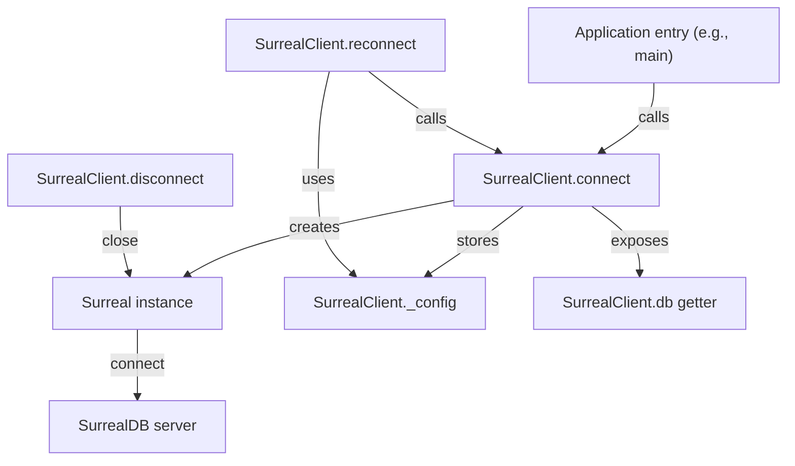

# Surreal

# Surreal Module

## Overview
The **Surreal** module provides a singleton wrapper around the `surrealdb` client, handling connection lifecycle, authentication, and namespace/database selection for SurrealDB 3.0. It abstracts the low‑level WebSocket/HTTP details and guarantees a single active connection throughout the application.

## Exported Types

### `SurrealClientConfig`
```ts
interface SurrealClientConfig {
  url: string;        // e.g. "ws://localhost:8000/rpc"
  namespace: string; // e.g. "aigency"
  database: string;  // e.g. "mem_brain"
  username: string;
  password: string;
}
```
Configuration required for establishing a connection. All fields are mandatory.

## Exported Object: `SurrealClient`

`SurrealClient` is a plain object exposing four async methods and a getter:

| Member | Type | Description |
|--------|------|-------------|
| `connect(config)` | `Promise<Surreal>` | Creates a new `Surreal` instance if none exists, connects to the server, signs in, and selects the namespace/database. Subsequent calls return the already‑connected instance. |
| `db` | `Surreal` (getter) | Returns the active `Surreal` instance. Throws if `connect` has not been called. |
| `disconnect()` | `Promise<void>` | Gracefully closes the underlying connection and clears internal state. |
| `reconnect()` | `Promise<Surreal>` | Re‑establishes a connection using the last successful configuration. Useful after a network interruption. |

### Internal State
- `_instance: Surreal | null` – Holds the active client or `null` when disconnected.
- `_config: SurrealClientConfig | null` – Stores the configuration used for the most recent successful `connect`. Required for `reconnect`.

## API Details

### `connect(config: SurrealClientConfig): Promise<Surreal>`
1. **Singleton guard** – If `_instance` already exists, the method returns it immediately, preventing duplicate connections.
2. **Store config** – The supplied `config` is saved to `_config` for later reuse.
3. **Instantiate client** – `new Surreal()` creates a fresh client.
4. **Connect** – Calls `await _instance.connect(config.url)`.
5. **Authenticate** – Calls `await _instance.signin({ username, password })`.
6. **Select namespace/database** – Calls `await _instance.use({ namespace, database })`.
7. **Return** – The fully‑initialized `Surreal` instance.

**Error handling** – Any failure in steps 4‑6 propagates as a rejected promise; the singleton remains unset, allowing a retry.

### `db` (getter)
```ts
get db(): Surreal
```
- Returns the current `_instance`.
- Throws `Error("[surreal] Not connected. Call SurrealClient.connect() first.")` if no connection exists.

### `disconnect(): Promise<void>`
1. If `_instance` is present, calls `await _instance.close()`.
2. Clears both `_instance` and `_config` to `null`.

After `disconnect`, any subsequent call to `db` will throw until `connect` is invoked again.

### `reconnect(): Promise<Surreal>`
1. Validates that `_config` is available; otherwise throws `Error("[surreal] No config to reconnect with.")`.
2. Resets `_instance` to `null`.
3. Delegates to `connect(_config)` to re‑establish the connection.

## Usage Example

```ts
import { SurrealClient, SurrealClientConfig } from "./client";

const config: SurrealClientConfig = {
  url: "ws://localhost:8000/rpc",
  namespace: "aigency",
  database: "mem_brain",
  username: "admin",
  password: "secret",
};

async function initSurreal() {
  // Establish the connection (singleton)
  const db = await SurrealClient.connect(config);

  // Use the db directly
  const result = await db.select("some_table");
  console.log(result);
}

// Later, e.g., on a network drop
async function recover() {
  await SurrealClient.reconnect();
}
```

## Integration Points

- **Incoming callers**: The module is imported by entry points such as `librarian/src/index.ts` and `oracle/src/index.ts`. Those callers invoke `SurrealClient.connect()` during application startup.
- **Outgoing calls**: The module does not call any other internal code; it only interacts with the external `surrealdb` library.

## Architecture Diagram



*The diagram shows the singleton lifecycle: `connect` creates the client, `db` provides access, `disconnect` tears it down, and `reconnect` rebuilds using the stored config.*

## Best Practices

1. **Call `connect` once** – Prefer a single early call (e.g., during app initialization) to avoid race conditions.
2. **Handle errors** – Wrap `connect`/`reconnect` in try/catch; on failure the singleton remains unset, allowing a retry.
3. **Do not manually instantiate `Surreal`** – All interactions should go through `SurrealClient` to keep the singleton invariant.
4. **Graceful shutdown** – Invoke `SurrealClient.disconnect()` during process termination to close the WebSocket cleanly.

## Extending the Module

If additional lifecycle hooks (e.g., health checks, automatic reconnection on error events) are required:

1. Add an event listener on the underlying `Surreal` instance (e.g., `instance.on('error', ...)`).
2. Call `SurrealClient.reconnect()` from the handler.
3. Ensure any new state is stored in the existing `_config` structure to keep `reconnect` functional.

All new functionality should respect the singleton contract: only one active `Surreal` instance at any time.