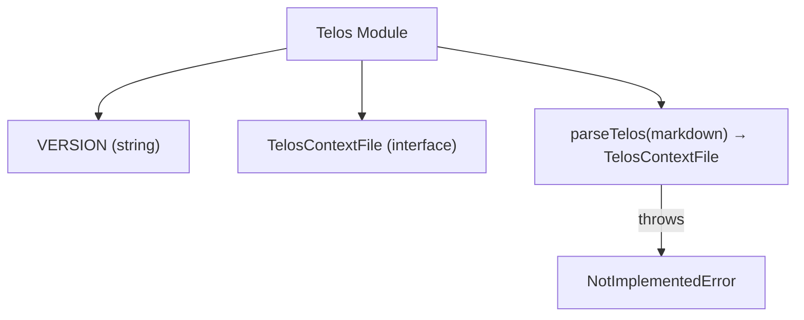

# Telos

# Telos Module Documentation

## Overview
The **Telos** module (`apps/telos/src/index.ts`) is the entry point for the Deep Context Framework runtime. It defines the core data contract (`TelosContextFile`) that represents a complete Telos context and provides a placeholder parser (`parseTelos`) for future Markdown‑to‑Telos conversion. The module also exports a semantic version string (`VERSION`).

> **Note:** The current implementation is a scaffold. The parser is not yet functional and will be introduced in Roadmap Phase 2.

---

## Exported Constants

| Name | Type | Description |
|------|------|-------------|
| `VERSION` | `string` | Semantic version of the Telos package (currently `"0.1.0"`). Used for runtime checks, logging, and compatibility validation. |

---

## Exported Types

### `TelosContextFile`

```ts
export interface TelosContextFile {
  entity: string;
  mission: string;
  problems: string[];
  goals: string[];
  kpis: string[];
  strategies: string[];
  risks: string[];
  narrative: string;
  projects?: string[];
  activityLog: string[];
}
```

**Purpose**  
Represents a fully‑specified Telos context. Each property maps to a distinct aspect of an organization’s strategic model:

| Property | Type | Meaning |
|----------|------|---------|
| `entity` | `string` | The name or identifier of the organization / unit. |
| `mission` | `string` | High‑level purpose statement. |
| `problems` | `string[]` | List of key challenges the entity faces. |
| `goals` | `string[]` | Desired outcomes that address the problems. |
| `kpis` | `string[]` | Quantitative metrics used to measure goal attainment. |
| `strategies` | `string[]` | Planned approaches to achieve the goals. |
| `risks` | `string[]` | Known threats that could impede success. |
| `narrative` | `string` | Human‑readable story tying the above elements together. |
| `projects?` | `string[]` (optional) | Optional collection of project identifiers that implement the strategies. |
| `activityLog` | `string[]` | Chronological log of actions taken, useful for audit trails. |

The interface is deliberately flat to simplify serialization (e.g., JSON) and to keep the parser output predictable.

---

## Exported Functions

### `parseTelos(_markdown: string): TelosContextFile`

```ts
export function parseTelos(_markdown: string): TelosContextFile {
  // TODO: implement markdown parser
  throw new Error("Not implemented — see Roadmap Phase 2");
}
```

**Description**  
Intended to ingest a Markdown document that follows the Telos specification and return a `TelosContextFile` instance. The function currently throws an error to signal that the implementation is pending.

**Future Implementation Goals**
1. **Markdown AST Generation** – Use a library such as `remark` or `markdown-it` to parse the source.
2. **Section Mapping** – Detect headings (`# Entity`, `## Mission`, etc.) and map their content to the corresponding fields.
3. **Validation** – Enforce required sections, type constraints, and cross‑field consistency (e.g., each `goal` must be referenced by at least one `strategy`).
4. **Error Reporting** – Provide line‑level diagnostics for malformed input.

**Signature**  
- **Input**: `string` – raw Markdown text.  
- **Output**: `TelosContextFile` – fully populated context object.  

**Error Handling**  
- Throws `Error` with a clear message if the parser is invoked before implementation.  
- Future versions will throw `ParseError` (custom) with location data.

---

## Usage Example

```ts
import { VERSION, TelosContextFile, parseTelos } from '@aigency/telos';

console.log(`Telos runtime version: ${VERSION}`);

const markdown = `
# Acme Corp

## Mission
Deliver innovative solutions that empower our customers.

## Problems
- Market saturation
- Legacy system debt

## Goals
- Increase market share by 5%
- Reduce technical debt by 30%

## KPIs
- Quarterly revenue growth
- Mean time to resolve incidents

## Strategies
- Launch new product line
- Refactor core services

## Risks
- Regulatory changes
- Talent attrition

## Narrative
Acme Corp aims to ... (full story)

## Activity Log
- 2024-01-01: Initiated project X
`;

try {
  const context: TelosContextFile = parseTelos(markdown);
  console.log(context);
} catch (e) {
  console.error('Parser not yet implemented:', e.message);
}
```

*Running the above code will currently throw the placeholder error. Once the parser is implemented, the `context` object will contain the structured representation of the Markdown document.*

---

## Integration Points

| Component | Interaction |
|-----------|--------------|
| **CLI commands** (future) | Will invoke `parseTelos` to load context files for validation or execution. |
| **Web UI dev server** (future) | Will import `TelosContextFile` definitions to render forms and visualizations. |
| **Interview engine** (future) | Will consume `TelosContextFile` objects to drive conversational flows. |
| **Markdown → HTML renderer** (future) | May reuse the same Markdown parser pipeline, sharing AST utilities. |

At present, the module has **no internal or external runtime calls**; it serves as a static contract.

---

## Architecture Diagram



*The diagram illustrates the module’s exported symbols and the current error path of `parseTelos`.*

---

## Roadmap & Future Work

| Phase | Target | Deliverable |
|-------|--------|-------------|
| **Phase 1** (current) | Scaffold | Exported types, version constant, placeholder parser. |
| **Phase 2** | Markdown parser | Fully functional `parseTelos` with validation and error reporting. |
| **Phase 3** | CLI integration | Commands for `telos validate <file>` and `telos render <file>`. |
| **Phase 4** | Web UI | Development server that loads a Telos context and provides live editing. |
| **Phase 5** | Interview engine | Runtime that uses the context to drive AI‑assisted interviews. |

Contributions should align with the phase milestones. New features must be covered by unit tests and documentation updates.

---

## Contributing

1. **Clone the repository**  
   ```bash
   git clone https://github.com/aigency/telos.git
   cd telos/apps/telos
   ```

2. **Install dependencies**  
   ```bash
   npm install
   ```

3. **Implement `parseTelos`**  
   - Add a new file `src/parser.ts` (or extend `index.ts`) that uses a Markdown parser library.  
   - Export a helper `extractSection(ast, heading)` to keep the logic testable.  
   - Write Jest tests covering each required section and error cases.

4. **Run tests**  
   ```bash
   npm test
   ```

5. **Submit a PR**  
   - Follow the repository’s contribution guidelines.  
   - Ensure the PR updates this documentation to reflect any new public API.

---

## License

The Telos module is released under the same license as the parent repository (see `LICENSE` at the repository root).