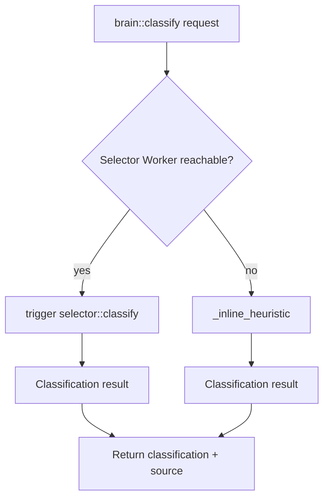

# Brain Worker

## Overview
The **Brain Worker** is a Python III worker that classifies incoming model requests as `SIMPLE` or `COMPLEX`. It is the intelligence layer that decides which execution path a request should take. When the selector worker is reachable, the brain delegates classification to `selector::classify`; otherwise it falls back to a deterministic inline heuristic so the system remains operational even when dependencies are partitioned.

Key responsibilities:
- Expose `brain::classify` for request classification.
- Expose `brain::status` for health checks.
- Delegate to the **Selector Worker** when available.
- Provide a local fallback heuristic for resilience.

## Architecture Diagram

## Core Components

### 1. `_inline_heuristic(data)`
- **Purpose**: Local fallback when `selector::classify` cannot be invoked.
- **Rules**
  - A request is **SIMPLE** if it contains zero or one messages.
  - A request is **COMPLEX** if it contains more than one message.
- **Confidence**: `0.9` for simple, `0.75` for complex.
- **Return value**: `{ classification, confidence, model, message_count }` with `source: 'brain-fallback'` added by the caller.

### 2. `create_brain_worker(url)`
- **Purpose**: Registers the brain functions with the III engine.
- **Registered functions**
  - `brain::classify`
  - `brain::status`
- **Behavior**
  - On `classify`, it first attempts to `iii.trigger({ function_id: 'selector::classify', payload: data, timeout_ms: 2000 })`.
  - If the selector responds, the brain maps the result to its own output shape and sets `source: 'selector-worker'`.
  - On any exception (selector offline, timeout, etc.), it logs the failure and runs `_inline_heuristic`, setting `source: 'brain-fallback'`.
  - `status` returns `{ status: 'healthy', worker: 'brain', engine_url }`.

### 3. `main()`
- Creates the worker with `ENGINE_URL` (default `ws://127.0.0.1:49134`, overridable via `III_URL`).
- Registers SIGINT/SIGTERM handlers that call `iii.shutdown()` and exit cleanly.
- Blocks on `signal.pause()`.

## Function Reference

| Function | Input | Output |
|----------|-------|--------|
| `brain::classify` | `{ model, messages[], enforce_json?, max_tokens? }` | `{ classification: 'SIMPLE' \| 'COMPLEX', confidence, model, message_count, source }` |
| `brain::status` | `void` | `{ status, worker, engine_url }` |

## Error Handling
- Selector failures are caught and converted to the heuristic fallback.
- All exceptions are logged with the worker name.
- The response shape is always consistent, regardless of which path produced the classification.

## Testing
- `workers/brain/src/test_brain.py` covers classification wiring and status responses.
- Run with `pytest workers/brain/src/test_brain.py` or the worker's own test command.

## Integration Points
- **Selector Worker**: `selector::classify` is the preferred source of truth.
- **Telemetry / Sugar DB**: Classification events may be logged downstream by the gateway or selector workers.
