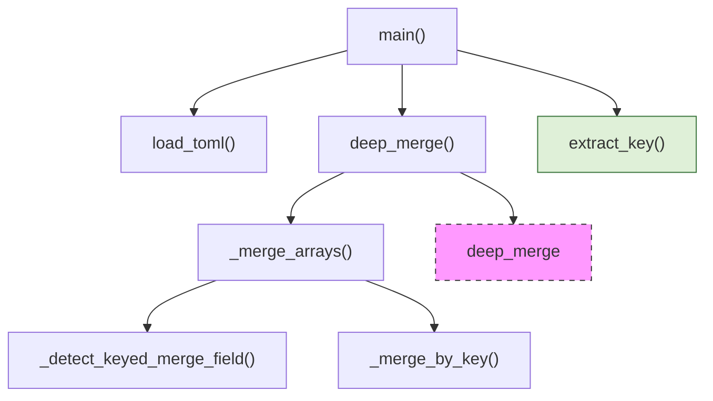

# Configuration Scripts

# Configuration Scripts

The **Configuration Scripts** module provides two command‑line utilities that resolve BMad configuration data from layered TOML files into a single JSON document:

* `resolve_config.py` – merges the *central* BMad configuration (four layers).
* `resolve_customization.py` – merges a *skill*‑specific customization (three layers).

Both scripts are pure‑Python, require only the standard library (`tomllib`), and output deterministic JSON suitable for downstream tooling.

---

## Table of Contents
1. [Purpose & Scope](#purpose--scope)  
2. [File Overview](#file-overview)  
3. [Command‑Line Interface](#command‑line-interface)  
4. [Core Merge Algorithm](#core-merge-algorithm)  
5. [Key Functions](#key-functions)  
6. [Error Handling & Exit Codes](#error-handling--exit-codes)  
7. [Integration Points](#integration-points)  
8. [Extending / Maintaining the Scripts](#extending--maintaining-the-scripts)  
9. [Mermaid Diagram – Execution Flow](#mermaid-diagram)  

---

## Purpose & Scope

BMad stores configuration in TOML files that are layered by ownership and priority:

| Layer | Location | Owner | Priority |
|------|----------|-------|----------|
| **Team (installer)** | `_bmad/config.toml` | Installer team | 1 |
| **User (installer)** | `_bmad/config.user.toml` | Installer user | 2 |
| **Team (project)** | `_bmad/custom/config.toml` | Project team (committed) | 3 |
| **User (project)** | `_bmad/custom/config.user.toml` | Project user (git‑ignored) | 4 |

`resolve_config.py` merges these four layers, applying a deterministic deep‑merge strategy.  
`resolve_customization.py` performs a similar merge for a skill, using three layers:

| Layer | Location | Owner | Priority |
|------|----------|-------|----------|
| **User (skill)** | `<project>/_bmad/custom/<skill>.user.toml` | Skill user | 1 |
| **Team (skill)** | `<project>/_bmad/custom/<skill>.toml` | Skill team | 2 |
| **Defaults** | `<skill>/customize.toml` | Skill author | 3 |

Both utilities can output the full merged configuration or a subset selected via dotted keys (e.g. `core.logging.level`).

---

## File Overview

| File | Primary Role | Exported Symbols |
|------|--------------|------------------|
| `scripts/resolve_config.py` | Resolve central BMad config | `main`, `load_toml`, `deep_merge`, `_merge_arrays`, `_detect_keyed_merge_field`, `_merge_by_key`, `extract_key` |
| `scripts/resolve_customization.py` | Resolve per‑skill customization | `main`, `load_toml`, `deep_merge`, `_merge_arrays`, `_detect_keyed_merge_field`, `_merge_by_key`, `extract_key`, `find_project_root` |

Both scripts share identical merge semantics; the only differences are the source file locations and the presence of `find_project_root` in the customization script.

---

## Command‑Line Interface

Both scripts expose a small, self‑documenting CLI built with `argparse`.

### `resolve_config.py`

```bash
python3 resolve_config.py --project-root /abs/path/to/project
python3 resolve_config.py --project-root /abs/path/to/project --key core
python3 resolve_config.py --project-root /abs/path/to/project --key agents
```

* `--project-root` (`-p`) **(required)** – Absolute path to the project root that contains the `_bmad/` directory.
* `--key` (`-k`) – Dotted field path to extract. Repeatable; if omitted the full merged config is printed.

### `resolve_customization.py`

```bash
python3 resolve_customization.py --skill /abs/path/to/skill-dir
python3 resolve_customization.py --skill /abs/path/to/skill-dir --key agent
python3 resolve_customization.py --skill /abs/path/to/skill-dir --key agent.menu
```

* `--skill` (`-s`) **(required)** – Absolute path to the skill directory (must contain `customize.toml`).
* `--key` (`-k`) – Same semantics as in `resolve_config.py`.

Both utilities write the resulting JSON to **stdout** and all diagnostics to **stderr**.

---

## Core Merge Algorithm

The merge algorithm is *structural* (no field‑specific logic) and works recursively:

1. **Scalars** (`str`, `int`, `float`, `bool`) – the later layer **overrides** the earlier one.
2. **Tables (dicts)** – deep merge: each key is merged according to these same rules.
3. **Arrays** – two sub‑cases:
   * **Keyed arrays** – if *every* element of the combined array is a table that contains the same identifier field (`code` **or** `id`), the array is merged **by that key**: matching items replace the base item; new keys are appended.
   * **Other arrays** – simple concatenation (`base + override`). No removal semantics are provided.

The algorithm is implemented by `deep_merge`, which delegates to `_merge_arrays` for list handling and `_merge_by_key` for keyed merges. `_detect_keyed_merge_field` decides whether a given array qualifies for keyed merging.

---

## Key Functions

### `load_toml(file_path: Path, required: bool = False) -> dict`
* Reads a TOML file using `tomllib.load`.
* Returns an empty dict on missing optional files.
* On a missing **required** file or a parsing error, writes an error to `stderr` and exits with status `1`.

### `deep_merge(base, override)`
* Recursively merges `override` into `base` following the rules described above.
* Handles dict‑vs‑dict, list‑vs‑list, and fallback to `override` for mismatched types.

### `_merge_arrays(base, override) -> list`
* Normalises inputs to lists.
* Calls `_detect_keyed_merge_field` to decide between keyed merge and simple concatenation.

### `_detect_keyed_merge_field(items) -> str | None`
* Returns `'code'` or `'id'` if **all** items are dicts and each contains the same identifier field.
* Returns `None` for mixed or non‑dict items, causing a plain append.

### `_merge_by_key(base, override, key_name) -> list`
* Implements the keyed‑merge semantics:
  * Builds an index of base items by `key_name`.
  * Replaces existing items with matching keys from `override`.
  * Appends new items (including those without the key).

### `extract_key(data, dotted_key: str) -> Any`
* Traverses a nested dict using a dotted path (`a.b.c`).
* Returns a sentinel (`_MISSING`) if any segment is absent; callers filter out missing values.

### `find_project_root(start: Path) -> Path | None` *(customization only)*
* Walks up the directory tree from `start` until a directory containing `_bmad` or `.git` is found.
* Returns `None` if the walk reaches the filesystem root.

### `main()`
* Parses CLI arguments.
* Loads the appropriate TOML layers via `load_toml`.
* Performs successive `deep_merge` calls in priority order.
* If `--key` is supplied, builds a dict of the requested keys using `extract_key`.
* Serialises the result to JSON (UTF‑8, pretty‑printed) and writes to `stdout`.

---

## Error Handling & Exit Codes

| Condition | Message (stderr) | Exit Code |
|-----------|------------------|-----------|
| Python < 3.11 (no `tomllib`) | `error: Python 3.11+ is required …` | `3` |
| Required TOML file missing | `error: required … not found` | `1` |
| Required TOML file fails to parse | `error: failed to parse …` | `1` |
| Optional TOML file missing or unparsable | `warning: …` (non‑fatal) | `0` (script continues) |
| Unexpected exception (IO, etc.) | Propagates as a warning/error depending on `required` flag | `0` or `1` as above |

All error messages are written directly to `stderr`; the JSON output is always written to `stdout` (or omitted on fatal error).

---

## Integration Points

* **BMad Core** – The central configuration resolved by `resolve_config.py` is consumed by the BMad runtime to configure logging, agents, core services, etc. The JSON format matches the internal configuration schema, so downstream code can `json.load` the output without further transformation.
* **Skill Loader** – `resolve_customization.py` is invoked by the skill‑loading subsystem when a skill is instantiated. The merged customization is passed to the skill’s runtime as a dict.
* **CI / Build Pipelines** – Both scripts are lightweight enough to be run in CI to validate that configuration files are syntactically correct and that merges behave as expected.
* **Testing** – Unit tests can import the helper functions (`deep_merge`, `_merge_arrays`, etc.) directly to verify merge semantics without invoking the CLI.

---

## Extending / Maintaining the Scripts

1. **Add a new merge rule** – Extend `deep_merge` or `_merge_arrays`. Keep the function pure (no side effects) to preserve testability.
2. **Support additional identifier fields** – Update `_KEYED_MERGE_FIELDS` tuple in both modules and adjust `_detect_keyed_merge_field` accordingly.
3. **Change output format** – Replace the final `json.dumps` call with another serializer (e.g., YAML) while preserving the same data structure.
4. **Add new CLI flags** – Modify the `argparse` definition in `main()`; ensure any new flag is reflected in the help text and documentation.
5. **Version bump** – The scripts have no explicit version metadata; consider adding a `__version__` constant if downstream tooling needs it.

All changes should be accompanied by unit tests that exercise:
* All merge edge‑cases (scalar override, deep table merge, keyed array merge, plain array append).
* Error paths (missing required file, malformed TOML).
* CLI behaviour (argument parsing, stdout vs. stderr).

---

## Mermaid Diagram – Execution Flow



*The diagram shows the primary call chain for both scripts. The `deep_merge` node recurses on nested structures, while `_merge_arrays` decides between keyed merge (`_merge_by_key`) and simple concatenation (`_detect_keyed_merge_field`).*

---