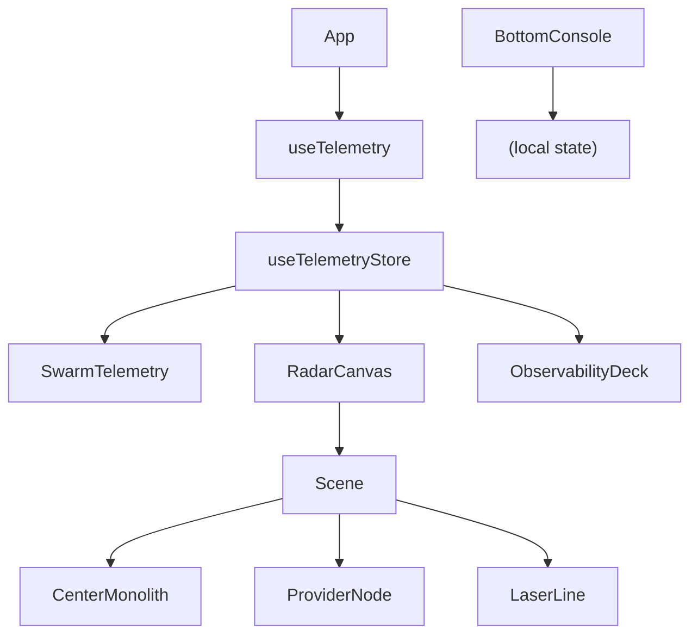

# Dashboard UI

# Dashboard UI Module

## Overview
The Dashboard UI renders a real‑time monitoring interface for the Aigency OS. It consists of a top‑level `App` component that wires together four visual panels:

| Panel | Component | Responsibility |
|------|-----------|-----------------|
| Left | `SwarmTelemetry` | Live list of SSE events with colour‑coded classes |
| Center | `RadarCanvas` | 3‑D scene visualising routes and provider nodes |
| Right | `ObservabilityDeck` | API‑key quota status extracted from `QUOTA_WARNING` events |
| Bottom | `BottomConsole` | Interactive mode selector (AUTO, DEEP SWARM, FAST TRACK) |

All panels share a common telemetry store (`useTelemetryStore`) populated by the `useTelemetry` hook, which maintains an SSE connection to the SugarDB backend.

---

## Core Architecture

### Component Tree
```
App
├─ useTelemetry()                ← establishes SSE connection
├─ SwarmTelemetry
├─ RadarCanvas
│  └─ Scene
│     ├─ CenterMonolith
│     ├─ OrbitalRing
│     ├─ ProviderNode (×3)
│     └─ LaserLine (×3)
├─ ObservabilityDeck
│  └─ QuotaBar (×N)
└─ BottomConsole
```

### Data Flow


* `useTelemetry` → `addEvent` / `setConnected` updates the Zustand store.  
* `SwarmTelemetry`, `RadarCanvas`, and `ObservabilityDeck` read `events` (and `connected`) via selector hooks.  
* `RadarCanvas` interprets specific event classes (`FAST_TRACK_ROUTE`, `DRIFT_HEALED`) to trigger visual effects.  
* `ObservabilityDeck` filters `QUOTA_WARNING` events to build a list of `QuotaInfo` objects displayed by `QuotaBar`.  

---

## Detailed Component Documentation

### `src/App.tsx`
- **Purpose**: Root component that defines the layout grid and mounts the telemetry connection.
- **Key Logic**:
  ```tsx
  useTelemetry(); // side‑effect only, runs once on mount
  ```
- **Layout**: CSS grid with three columns (20% / 1fr / 20%) and a bottom row spanning all columns.

### `src/hooks/useTelemetry.ts`
- **Exports**: `useTelemetry` (React hook).
- **Behaviour**:
  1. Creates an `EventSource` to `SSE_URL` (env‑controlled, defaults to `http://127.0.0.1:3115/events`).
  2. On `open` → `setConnected(true)`.
  3. On `message` → parses JSON into `SugarEvent` and calls `addEvent(event)`.
  4. On `error` → `setConnected(false)`, closes the stream, and retries after `RECONNECT_DELAY_MS` (3 s).
- **State Interaction**: Uses `useTelemetryStore` selectors `addEvent` and `setConnected`.

### `src/store/telemetry.ts`
- **Exports**: `useTelemetryStore` (Zustand store) and `type SugarEvent`.
- **State Shape**:
  ```ts
  interface TelemetryState {
    events: SugarEvent[];      // newest first, capped at MAX_EVENTS (100)
    connected: boolean;
    addEvent(event: SugarEvent): void;
    setConnected(connected: boolean): void;
    classCounts(): Record<string, number>;
  }
  ```
- **Utility**: `classCounts` aggregates event frequencies for potential analytics.

### `src/components/SwarmTelemetry.tsx`
- **Purpose**: Render a scrollable list of recent events.
- **Key Features**:
  - Uses `useTelemetryStore` to read `events` and `connected`.
  - Auto‑scrolls to the bottom when `events` change (`useEffect`).
  - Formats timestamps via `formatTime`.
  - Applies colour classes from `CLASS_COLORS` (e.g., `FAST_TRACK_ROUTE` → `text-phosphor-green`).
- **Performance**: Limits rendering to the latest 50 events.

### `src/components/BottomConsole.tsx`
- **Purpose**: UI for selecting the system mode.
- **State**: Local `activeMode` (`ModeId`) managed with `useState`.
- **Modes**: Defined as a constant tuple (`auto`, `deep-swarm`, `fast-track`) with labels and tooltips.
- **Styling**: Conditional Tailwind classes toggle active/inactive button appearance.

### `src/components/ObservabilityDeck.tsx`
- **Purpose**: Show API‑key quota usage per provider.
- **Data Extraction**:
  ```ts
  const quotas = (() => {
    const byProvider = new Map<string, QuotaInfo>();
    for (const ev of events) {
      if (ev.event_class !== 'QUOTA_WARNING') continue;
      // parse payload_snapshot JSON → provider, key_count, usage_percent
    }
    return Array.from(byProvider.values());
  })();
  ```
- **Rendering**:
  - If no quota events → placeholder message.
  - Otherwise, a header and a list of `QuotaBar` components.
- **Helper Functions**:
  - `barColor(pct)` and `textColor(pct)` return Tailwind colour classes based on usage thresholds (≤80 % green, 80‑95 % amber, >95 % red).

#### `QuotaBar`
- **Props**: `{ info: QuotaInfo }`.
- **Behaviour**: Clamps `usagePercent` to `[0,100]`, displays a labelled progress bar with colour derived from `textColor` / `barColor`.

### `src/components/RadarCanvas.tsx`
- **Purpose**: 3‑D visualisation of the routing “radar” using `react-three-fiber`.
- **Key Sub‑components**:
  - **`Scene`**: Sets up lights, groups, and orchestrates child objects.
  - **`CenterMonolith`**: Rotating cube that flashes on `DRIFT_HEALED`.
  - **`ProviderNode`**: Small rotating sphere with a semi‑transparent ring label.
  - **`OrbitalRing`**: Thin ring indicating the orbit radius.
  - **`LaserLine`**: Animated line from the monolith to each provider; opacity animates based on `active` flag.
- **State & Effects**:
  - `activeRoute` (boolean) toggles laser visibility for 1.5 s after a `FAST_TRACK_ROUTE` event.
  - `flash` (boolean) triggers a brief emissive intensity boost on the monolith after a `DRIFT_HEALED` event.
  - `useEffect` watches `events` (most recent event is `events[0]`) to set the above flags.
- **Post‑processing**: `EffectComposer` with Bloom, Scanline, and ChromaticAberration to achieve a CRT‑style look.
- **Controls**: `OrbitControls` with limited pan/zoom and constrained polar angles.

### `src/main.tsx`
- **Bootstrap**: Renders `<App />` into the DOM element with id `root` inside a `<React.StrictMode>` wrapper.

---

## Interaction with the Rest of the Codebase

1. **Telemetry Ingestion**  
   - `useTelemetry` is invoked once at the top of the component tree (`App`).  
   - It populates `useTelemetryStore.events` and updates `connected`.  
   - All UI panels read from this store, ensuring a single source of truth.

2. **Event‑Driven Visual Updates**  
   - `RadarCanvas` reacts to two event classes:
     - `FAST_TRACK_ROUTE` → `activeRoute` true → laser lines become visible.
     - `DRIFT_HEALED` → `flash` true → monolith emissive flash.
   - `SwarmTelemetry` displays any event, colour‑coded via `CLASS_COLORS`.
   - `ObservabilityDeck` extracts only `QUOTA_WARNING` events to build quota bars.

3. **Mode Selection**  
   - `BottomConsole` maintains its own UI state; currently it does **not** affect other components. Future integration can read `activeMode` via a context or store to adjust routing logic.

---

## Extending the Dashboard

### Adding a New Provider Node
1. Append the provider name to the `PROVIDERS` constant in `RadarCanvas.tsx`.
2. The orbit calculation (`ORBIT_SPACING`) automatically distributes the new node.
3. No further changes required unless custom visual behaviour is needed.

### Supporting a New Event Class
- **Display in SwarmTelemetry**: Add a colour entry to `CLASS_COLORS` (or rely on `DEFAULT_COLOR`).
- **RadarCanvas Reaction**: Extend the `useEffect` in `RadarCanvas` to handle the new class and set appropriate UI flags.
- **ObservabilityDeck**: If the new class carries quota data, adjust the filter condition (`ev.event_class !== 'QUOTA_WARNING'`) accordingly.

### Persisting Mode Selection
- Replace the local `useState` in `BottomConsole` with a global store entry (e.g., add `mode: ModeId` to `TelemetryState` or create a separate Zustand slice).  
- Expose a selector `useTelemetryStore((s) => s.mode)` for other components to read.

---

## Performance Considerations

- **Event Buffer**: The store caps `events` at `MAX_EVENTS = 100` to prevent unbounded memory growth.
- **Render Limiting**: `SwarmTelemetry` only renders the latest 50 events; `RadarCanvas` renders a fixed set of three provider nodes and three laser lines.
- **Memoisation**: `providerPositions` is memoised with `useMemo` to avoid recomputation on each frame.
- **Animation**: `LaserLine` uses a `useRef` to directly mutate material opacity each frame, avoiding React re‑renders.

---

## Testing & Debugging Tips

- **SSE Connectivity**: Verify `SSE_URL` is reachable; the connection status is shown in the left panel (`● SSE` green when connected, `○ SSE` red when disconnected).
- **Event Payloads**: `ObservabilityDeck` expects `payload_snapshot` to be valid JSON with `provider`, `key_count`, and `usage_percent`. Malformed payloads are silently ignored.
- **3‑D Scene**: Use browser dev tools to inspect the Three.js scene graph if visual artefacts appear. The `Scene` component is the root of the Three.js hierarchy.

---