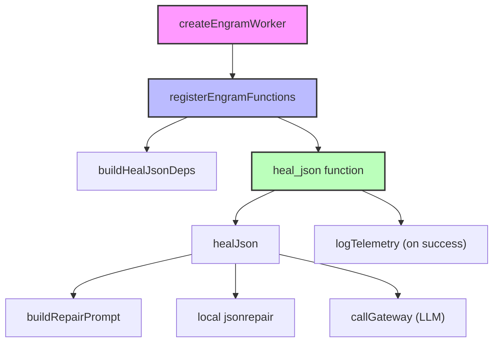

# Engram Worker

# Engram Worker – JSON Drift Repair & Pipeline Integration

## Overview
The **Engram Worker** is a self‑contained service that provides:

* **Automatic repair of malformed JSON** emitted by open‑source LLMs (`healJson`).
* **A composable pipeline** (`EngramPipeline`) that can be extended with additional processing stages.
* **SDK registration** (`createEngramWorker`) that wires the worker into the III runtime, exposing functions such as `engram::heal_json`, `engram::status`, `engram::record`, and `engram::recall`.
* **Telemetry emission** for successful drift repairs.

All components are deliberately pure or dependency‑injected to enable unit testing and easy substitution of the LLM gateway, local JSON repair library, and logger.

---

## Architecture Diagram


*The diagram shows the registration flow, the dependency wiring, and the internal repair loop.*

---

## Core Components

### 1. `healJson`
```ts
export async function healJson(
  input: HealJsonInput,
  deps: HealJsonDeps = {}
): Promise<HealJsonResult>
```
**Purpose** – Convert a possibly malformed JSON string into a valid JavaScript value.

**Algorithm**
1. **Fast path** – `JSON.parse`. If it succeeds, return immediately (`attempts: 0`).
2. **Local repair** – Run `jsonrepair` (npm package or injected alternative). If the repaired string parses, return it (`attempts: 0`).
3. **LLM repair loop** – If a `callGateway` function is supplied:
   * Build a system‑prompt + user‑prompt via `buildRepairPrompt`.
   * Call the LLM up to `maxRetries` (default 3) using the configured `model` (default `fast`).
   * Attempt to parse the LLM response directly; if that fails, run `jsonrepair` on the response.
   * On success, return the parsed data and the number of attempts.
4. **Failure** – After exhausting retries or encountering a gateway error, return `{ success: false, error, attempts, partial? }`.

**Logging** – Every major step emits a structured event via the injected `log` function (defaulting to `console.log(JSON.stringify(...))`). Events include:
* `drift_detected`
* `drift_healed` (method: `local_jsonrepair`, `llm`, `llm+jsonrepair`)
* `drift_healing` (per attempt)
* `drift_failed` (gateway error or final exhaustion)

**Error handling** – The function never throws; it always returns a `HealJsonResult`. The custom `JsonDriftError` class is provided for callers that prefer exception semantics.

### 2. `buildRepairPrompt`
```ts
export function buildRepairPrompt(broken: string): Message[]
```
Creates a two‑message prompt for the LLM:
* **System** – Instruction to act as a JSON repair specialist and output *only* valid JSON.
* **User** – The malformed JSON string prefixed with “Repair this malformed JSON:”.

The prompt is deliberately minimal to keep the LLM’s output parsable.

### 3. Dependency Interfaces (`HealJsonDeps`)
```ts
export interface HealJsonDeps {
  callGateway?: (model: string, messages: Message[]) => Promise<string>
  jsonrepair?: (s: string) => string
  log?: (event: Record<string, unknown>) => void
}
```
* **`callGateway`** – Bridges to the III gateway (`gateway::route_llm`). Returns the raw LLM response string.
* **`jsonrepair`** – Allows swapping the local repair implementation (e.g., a mock in tests).
* **`log`** – Structured logger; defaults to JSON‑encoded console output.

### 4. `DriftCorrectorStage` (Pipeline)
```ts
export class DriftCorrectorStage implements PipelineStage
```
* Implements the `PipelineStage` interface.
* Validates that the incoming payload is a string, then delegates to `healJson`.
* Emits start/completion events via the pipeline’s `context.log`.
* On failure, throws an `Error` which aborts the pipeline and propagates the failure upstream.

### 5. `EngramPipeline`
```ts
export class EngramPipeline {
  addStage(stage: PipelineStage): this
  process(input: unknown, context: PipelineContext): Promise<PipelineResult>
}
```
* Holds an ordered list of `PipelineStage`s.
* Executes each stage sequentially, collecting stage names.
* Returns a success object with the final data and the list of executed stages, or a failure object with the error and the stage that failed.

### 6. Worker Registration (`index.ts`)
* **`createEngramWorker(url?)`** – Instantiates an `ISdk` via `registerWorker`, registers all engram functions, and returns the SDK.
* **`registerEngramFunctions(iii)`** – Registers:
  * `engram::status` – health check.
  * `engram::record` – simple event recording.
  * `engram::recall` – placeholder for future streaming queries.
  * `engram::heal_json` – the public entry point that validates input, builds deps (`buildHealJsonDeps`), calls `healJson`, and fires telemetry on success.
* **`buildHealJsonDeps(iii)`** – Returns a `HealJsonDeps` object where `callGateway` invokes `iii.trigger('gateway::route_llm', …)`. The gateway response is normalized to a string.

### 7. Telemetry (`logTelemetry`)
On a successful JSON repair, `engram::heal_json` emits a `DRIFT_HEALED` event via the shared telemetry helper. The telemetry payload includes:
* `attempts` – number of repair attempts.
* `model` – LLM model used (or `null` if default).
* `sourceWorker: 'engram'`.

---

## Interaction Flow

### A. Direct Repair via SDK
```ts
const iii = createEngramWorker(); // registers functions
const result = await iii.trigger('engram::heal_json', {
  jsonString: malformedJson,
  model: 'gpt-4o-mini' // optional
});
```
* The SDK forwards the request to `engram::heal_json`.
* Input validation occurs, then `healJson` runs with the injected gateway.
* On success, telemetry is emitted; the result contains `{ success: true, data, attempts }`.

### B. Pipeline Usage
```ts
const pipeline = new EngramPipeline()
  .addStage(new DriftCorrectorStage({ maxRetries: 2, model: 'fast' }));

const ctx: PipelineContext = {
  requestId: 'req-123',
  metadata: {},
  log: (event, data) => console.log(`[${event}]`, data),
};

const pipelineResult = await pipeline.process(malformedJson, ctx);
```
* The pipeline executes the `drift_corrector` stage, which internally calls `healJson`.
* If the stage succeeds, `pipelineResult` contains `{ success: true, data, stages: ['drift_corrector'] }`.
* If the stage fails, the pipeline aborts and returns `{ success: false, error, failedStage: 'drift_corrector' }`.

---

## Extending the Worker

### Adding New Stages
1. Implement `PipelineStage`:
   ```ts
   export class MyStage implements PipelineStage {
     readonly name = 'my_stage';
     async process(input: unknown, ctx: PipelineContext) {
       // custom logic
       return transformed;
     }
   }
   ```
2. Register the stage in a pipeline instance:
   ```ts
   const pipeline = new EngramPipeline()
     .addStage(new DriftCorrectorStage())
     .addStage(new MyStage());
   ```

### Exposing New SDK Functions
* Add a new `iii.registerFunction('engram::my_func', async (input) => { … })` inside `registerEngramFunctions`.
* Follow the same pattern of input validation, dependency construction, and optional telemetry.

### Swapping the JSON Repair Library
Provide a custom `jsonrepair` implementation when calling `healJson` or constructing a `DriftCorrectorStage`:
```ts
const customDeps: HealJsonDeps = {
  jsonrepair: (s) => myRepairAlgorithm(s),
  // keep other deps as defaults
};
await healJson({ jsonString: broken }, customDeps);
```

---

## Testing Guidance

* **Unit tests** should mock `HealJsonDeps`:
  * Provide a stub `callGateway` that returns a predetermined string.
  * Provide a stub `jsonrepair` that returns a known‑good JSON.
  * Verify that `healJson` returns the expected `success` payload and that the correct number of attempts is reported.
* **Pipeline tests** can instantiate `EngramPipeline` with a `DriftCorrectorStage` that receives a mocked `deps` object, allowing deterministic outcomes without network calls.
* **Worker registration tests** should import `registerEngramFunctions` with a mock `ISdk` that records calls to `registerFunction` and `trigger`. Verify that:
  * `engram::heal_json` validates its input.
  * `buildHealJsonDeps` correctly forwards the LLM request to `iii.trigger('gateway::route_llm', …)`.
  * Telemetry is triggered exactly once on success.

---

## Runtime Considerations

* **Maximum retries** – Configurable per call (`maxRetries` in `HealJsonInput`) and per pipeline stage (`DriftCorrectorConfig`). The default of 3 balances latency and repair success rate.
* **Model selection** – The `model` string is passed directly to the gateway. Use the worker’s default (`fast`) for the quickest provider, or specify a higher‑quality model for critical workloads.
* **Logging overhead** – The default logger serializes each event to JSON; replace it with a structured logger (e.g., Winston, Bunyan) for production environments.
* **Graceful shutdown** – When the worker is run directly (`node workers/engram/src/index.ts`), it listens for `SIGTERM` and calls `iii.shutdown()` to close the WebSocket connection cleanly.

---

## Summary of Public API

| Export | Type | Description |
|--------|------|-------------|
| `healJson` | `(input, deps?) => Promise<HealJsonResult>` | Core JSON repair routine. |
| `buildRepairPrompt` | `(broken) => Message[]` | Generates LLM prompt. |
| `JsonDriftError` | `class extends Error` | Optional error type for callers that prefer exceptions. |
| `DriftCorrectorStage` | `class implements PipelineStage` | Ready‑to‑use pipeline stage for JSON drift correction. |
| `EngramPipeline` | `class` | Composable pipeline container. |
| `createEngramWorker` | `(url?) => ISdk` | Entry point for running the worker. |
| `registerEngramFunctions` | `(iii) => void` | Registers all engram SDK functions. |
| `buildHealJsonDeps` | `(iii) => HealJsonDeps` | Constructs LLM gateway dependency. |

All other symbols are internal helpers (`defaultLog`, constants, etc.) and are not part of the public contract.