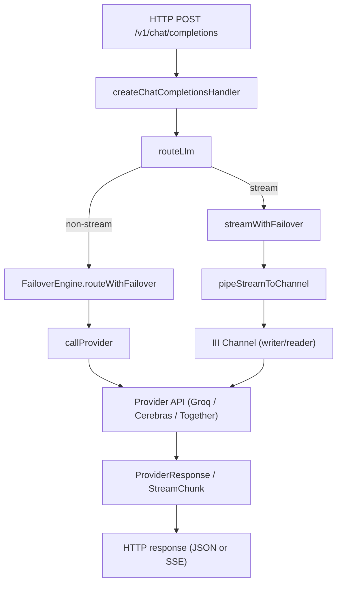

# Gateway Worker

# Gateway Worker Module

## Overview
The **Gateway Worker** is the entry point for routing OpenAI‑compatible chat completion requests to multiple downstream LLM providers (Groq, Cerebras, Together AI). It resolves the canonical model name, retrieves provider API keys, performs failover handling, and streams results back to the client using Server‑Sent Events (SSE) when requested.

Key responsibilities:
- **HTTP endpoint** `/v1/chat/completions` (OpenAI‑compatible)  
- **Model resolution** via the `translator::resolve` function.  
- **API key retrieval** via the `vault::retrieve` function.  
- **Failover logic** that retries alternative providers on rate‑limit, auth, or server errors.  
- **Streaming support** using III SDK channels to pipe provider SSE streams to the HTTP response.  
- **Structured logging** and optional telemetry emission.

## Architecture Diagram


## Core Components

### 1. `FailoverEngine` (`src/failover.ts`)
- **Purpose**: Sequentially attempts providers until one succeeds, applying cooldowns for transient failures.
- **Public API**
  - `constructor(getKey: GetKeyFn, callProvider: CallProviderFn)`
  - `isInCooldown(provider: string): boolean`
  - `setCooldown(provider: string, durationMs: number): void`
  - `getCooldowns(): Map<string, number>` – returns a cleaned map of active cooldowns.
  - `routeWithFailover(providerArray, model, messages, options): Promise<RouteResult>`
- **Cooldown policy**
  - 429 → 60 s, 403 → 5 min, 500/503 → 30 s.  
  - 401 (invalid key) does **not** trigger cooldown.
- **Result Types**
  - `RouteSuccess` – `{ success: true, provider, response }`
  - `RouteFailure` – `{ success: false, message, failures }`
- **Error handling**: Catches `ProviderError`, records status/reason, and continues to the next provider.

### 2. `routeLlm` (`src/index.ts`)
- **Signature**: `async function routeLlm(input: RouteLlmInput, deps: RouteLlmDeps): Promise<RouteResult | StreamingRouteResult>`
- **Flow**
  1. **Model resolution** – `deps.resolveModel(model)` returns `{ model, providers, resolved }`.
  2. If `stream && deps.createChannel` → `streamWithFailover`.
  3. Otherwise → instantiate `FailoverEngine` and call `engine.routeWithFailover`.
  4. Logs success/failure via `logEvent`.
- **Dependency Injection**
  - `resolveModel`: calls `translator::resolve`.
  - `getKey`: calls `vault::retrieve`.
  - `createChannel`: creates an III channel for streaming.
  - `callProvider`: optional override (useful for tests).

### 3. Streaming Path – `streamWithFailover` (`src/index.ts`)
- **Purpose**: Mirrors the non‑streaming failover loop but pipes the provider’s async generator into an III channel.
- **Key Steps**
  1. Iterate `providerArray` (same “provider/model” parsing as `FailoverEngine`).
  2. Retrieve API key and config.
  3. Call `deps.callProvider` (or default `callProvider`) with `stream: true`.
  4. Create a channel via `deps.createChannel()`.
  5. `pipeStreamToChannel` converts each `StreamChunk` into an SSE‑compatible JSON string (`buildSSEChunk`) and sends it over the channel.
  6. Return `{ stream: true, channelRef, reader, provider }` for the HTTP handler to attach to the response.

### 4. `pipeStreamToChannel` (`src/index.ts`)
- **Signature**: `async function pipeStreamToChannel(stream: AsyncGenerator<StreamChunk>, writer: ChannelWriter): Promise<void>`
- **Behavior**
  - Iterates the async generator, transforms each chunk with `buildSSEChunk`, and calls `writer.sendMessage`.
  - Sends a final `data: [DONE]` message and closes the writer.
  - On error, logs `stream_error` and sends an error SSE payload before closing.

### 5. HTTP Handler – `createChatCompletionsHandler` (`src/http-handler.ts`)
- **Registers** as `gateway::chat_completions` trigger for POST `/v1/chat/completions`.
- **Validation**: Ensures `model` and non‑empty `messages`.
- **Telemetry**: Fires a fire‑and‑forget `brain::classify` trigger.
- **Dependency Construction**: Builds `RouteLlmDeps` using the III SDK (`iii.trigger`, `iii.createChannel`).
- **Routing**: Calls `routeLlm`.
  - **Streaming**: Sets SSE headers, pipes `reader.onMessage` to `res.stream`, handles client disconnect, and logs `route_success`.
  - **Non‑streaming**: Formats the `ProviderResponse` into an OpenAI‑compatible JSON payload (`OpenAICompletionResponse`) and writes it via `writeJSONResponse`.
- **Error handling**: Uses `writeErrorResponse` for validation errors, upstream failures (502), and internal errors (500).

### 6. Provider Client – `callProvider` (`src/provider-client.ts`)
- **Exports**
  - `ProviderConfig`, `Message`, `StreamChunk`, `ProviderResponse`
  - `getProviderConfig(provider)`, `parseProviderModel`
  - `callProvider(config, apiKey, model, messages, options)`
- **Behavior**
  - Builds request body, injects optional `fetchFn` for testing.
  - Throws `ProviderError` on non‑2xx responses (captures status, body, URL).
  - For `stream: true` returns an async generator (`streamResponse`) that parses SSE lines into `StreamChunk`.
  - For non‑streaming returns a parsed `ProviderResponse`.

### 7. Worker Bootstrap – `createGatewayWorker` (`src/index.ts`)
- Registers internal functions:
  - `gateway::echo`, `gateway::status`, `gateway::route`, `gateway::route_llm`.
- Registers the HTTP trigger for chat completions.
- Emits telemetry (`logTelemetry`) for successful routes and quota warnings (429 failures).
- Handles graceful shutdown on `SIGTERM`.

## Logging & Telemetry
- **Structured logging** via `logEvent` (JSON lines with `timestamp`).
- Events include: `chat_completions_request`, `brain_classification`, `model_resolved`, `streaming_started`, `streaming_ended`, `route_success`, `route_failed`, `stream_error`.
- **Telemetry** (`logTelemetry`) is invoked from `gateway::route_llm` after routing completes, sending events to SugarDB.

## Error Handling Strategy
| Source | Error Type | Action |
|--------|------------|--------|
| `ProviderError` (status 429) | Rate‑limit | Set cooldown (60 s) and try next provider. |
| `ProviderError` (status 403) | Forbidden / revoked key | Set cooldown (5 min). |
| `ProviderError` (status 500/503) | Server error | Set cooldown (30 s). |
| `ProviderError` (status 401) | Invalid API key | Record failure, **no** cooldown. |
| Other `ProviderError` | Unknown HTTP status | Record failure, no cooldown. |
| Non‑`ProviderError` | Unexpected exception | Record failure with `status: null`. |
| All providers fail | `RouteFailure` | HTTP 502 with OpenAI error format. |
| Validation error (missing model/messages) | HTTP 400 | OpenAI error format. |
| Internal exception in handler | HTTP 500 | OpenAI error format. |

## Extending the Gateway
1. **Add a new provider**  
   - Extend `PROVIDER_CONFIGS` in `provider-client.ts` with `baseUrl` and `envKey`.  
   - Ensure the provider’s API follows the OpenAI chat completion schema (or add a custom adapter).  

2. **Custom failover policy**  
   - Subclass `FailoverEngine` or replace it in `routeLlm` by providing a different `callProvider` implementation.  

3. **Additional request parameters**  
   - Extend `RouteOptions` / `CallProviderOptions` and propagate through `createChatCompletionsHandler` → `routeLlm` → `callProvider`.  

4. **Telemetry enrichment**  
   - Modify the telemetry payload in `gateway::route_llm` or add new `logEvent` calls where needed.

## Testing Hooks
- **Dependency injection**: `callProvider`, `fetchFn`, and `createChannel` can be overridden for unit tests.
- **Cooldown inspection**: `FailoverEngine.getCooldowns()` returns the current cooldown map (used in `failover.test.ts`).
- **Provider mocks**: Tests import `provider-client.ts` functions directly (e.g., `getProviderConfig`, `parseProviderModel`).

## Key Types

```ts
// Input to routeLlm
export interface RouteLlmInput {
  model: string;
  messages: Message[];
  stream?: boolean;
  maxTokens?: number;
  temperature?: number;
}

// Dependencies injected into routeLlm
export interface RouteLlmDeps {
  resolveModel: (model: string) => Promise<{ model: string; providers: string[]; resolved: boolean }>;
  getKey: (providerId: string) => Promise<string | null>;
  createChannel?: () => Promise<{ writer: { sendMessage: (msg: string) => void; close: () => void };
                                 reader: ChannelReader; writerRef: StreamChannelRef }>;
  callProvider?: typeof callProvider;
}

// Result of a successful streaming route
export interface StreamingRouteResult {
  stream: true;
  channelRef: StreamChannelRef;
  reader: ChannelReader;
  provider: string;
}

// Non‑streaming result (also returned by FailoverEngine)
export type RouteResult = RouteSuccess | RouteFailure;
```

## Execution Flow Summary (Non‑Streaming)

1. **HTTP request** → `createChatCompletionsHandler`.
2. **Model resolution** via `deps.resolveModel`.
3. **FailoverEngine** iterates providers:
   - Checks cooldown (`isInCooldown`).
   - Retrieves API key (`getKey`).
   - Calls provider (`callProvider`).
   - On success → returns `RouteSuccess`.
   - On failure → records reason, possibly sets cooldown, continues.
4. **Response** → `writeJSONResponse` (or error response).

## Execution Flow Summary (Streaming)

1. **HTTP request** → `createChatCompletionsHandler` (with `stream: true`).
2. **Model resolution** → `deps.resolveModel`.
3. **streamWithFailover** iterates providers:
   - Retrieves key & config.
   - Calls provider with `stream: true`.
   - Creates an III channel (`deps.createChannel`).
   - Pipes provider async generator into channel (`pipeStreamToChannel`).
   - Returns `StreamingRouteResult`.
4. **HTTP handler** attaches `reader.onMessage` to the SSE response, handling client disconnect and final `[DONE]` marker.

--- 

**End of documentation**