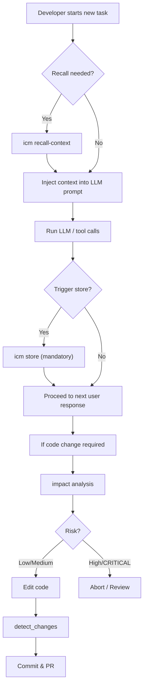

# Other — AGENTS.md

# Other – AGENTS.md

## Overview
`AGENTS.md` defines the operational policies that every contributor must follow when working with this repository. It covers two orthogonal concerns:

1. **Persistent memory (ICM)** – a mandatory, project‑wide knowledge base used to record high‑value events across sessions.  
2. **GitNexus code‑intelligence** – the tooling required for safe code modification, impact analysis, and change verification.

Both sections are enforced by the CI pipeline; violations will cause the build to fail.

---

## 1. Persistent Memory (ICM)

ICM is a shared, searchable store that survives process restarts. It is used to capture decisions, errors, user preferences, and other high‑impact information so that future runs can retrieve context without re‑deriving it.

### 1.1. Core Commands

| Command | Description | Typical Use |
|--------|-------------|-------------|
| `icm recall "<query>"` | Full‑text search across all topics. | Find prior knowledge before starting a new task. |
| `icm recall "<query>" -t "<topic>"` | Same as above, but limited to a specific topic. | Narrow search to a domain (e.g., `errors-resolved`). |
| `icm recall-context "<query>" --limit N` | Returns results formatted for prompt injection. | Directly embed past memories into LLM prompts. |
| `icm store -t <topic> -c "<description>" -i <importance> [-k "<kw1,kw2>"]` | Persists a new memory entry. | See **1.2. Store Triggers**. |
| `icm update <id> -c "<updated content>"` | In‑place edit of an existing entry. | Correct or enrich a previously stored fact. |
| `icm health` | Audits topic hygiene (orphaned topics, duplicate entries). | Run periodically to keep the knowledge base tidy. |
| `icm topics` | Lists all existing topics. | Quick overview of the taxonomy. |

*All commands are executed from the repository root.*

### 1.2. Mandatory Store Triggers
A memory **must** be stored **before** any response is sent to the user. The following events trigger an `icm store` call:

| # | Trigger | Recommended Topic | Example Command |
|---|---------|-------------------|-----------------|
| 1 | **Error resolved** | `errors-resolved` | `icm store -t errors-resolved -c "Fixed X by Y" -i high -k "keyword1,keyword2"` |
| 2 | **Architecture / design decision** | `decisions-<project>` | `icm store -t decisions-myproj -c "Switched to event‑driven model" -i high` |
| 3 | **User preference discovered** | `preferences` | `icm store -t preferences -c "User prefers JSON over XML" -i critical` |
| 4 | **Significant task completed** | `context-<project>` | `icm store -t context-myproj -c "Implemented feature Z, 80% test coverage" -i high` |
| 5 | **Conversation exceeds ~20 tool calls without a store** | `progress-summary` | `icm store -t progress-summary -c "Reached 20 tool calls, summarizing state" -i high` |

**Do NOT store**:
- Trivial details (e.g., “ran `npm install`”).
- Information already captured in `CLAUDE.md`.
- Ephemeral state such as build logs or raw `git status`.

### 1.3. Retrieval Workflow
Typical usage before a new task:

```bash
# 1️⃣ Pull relevant context
icm recall-context "latest architecture decision for myproj" --limit 5

# 2️⃣ Inject the result into the LLM prompt
prompt=$(cat <<EOF
You are continuing work on myproj. Use the following context:
$(icm recall-context "latest architecture decision for myproj" --limit 5)
...
EOF
)

# 3️⃣ Run the LLM with the enriched prompt
```

---

## 2. GitNexus Code Intelligence

GitNexus provides a graph‑aware view of the codebase (`aigency-router-v2`). It is the single source of truth for impact analysis, change detection, and symbol‑level navigation.

### 2.1. Core CLI Utilities

| Utility | Purpose | Example |
|---------|---------|---------|
| `impact({target, direction})` | Computes the blast radius of a symbol. `direction` can be `"upstream"` (callers) or `"downstream"` (callees). | `impact({target: "Router.handle", direction: "upstream"})` |
| `detect_changes({scope, base_ref})` | Compares the current working tree against `base_ref` (default `main`) and reports affected symbols & execution flows. | `detect_changes({scope: "compare", base_ref: "main"})` |
| `query({query})` | Full‑text search over the indexed symbols, returning ranked execution flows. | `query({query: "authentication"})` |
| `context({name})` | Returns callers, callees, and participating execution flows for a given symbol. | `context({name: "AuthService.validate"})` |
| `rename({oldName, newName})` | Symbol‑aware rename that updates the call graph and all related metadata. | `rename({oldName: "OldRouter", newName: "NewRouter"})` |

All utilities are available via the `gitnexus` npm package. The repository includes a convenience wrapper script at `node .gitnexus/run.cjs`.

### 2.2. Mandatory Workflow for Code Changes

1. **Impact Analysis**  
   ```bash
   impact({target: "symbolName", direction: "upstream"})
   ```
   - Review the list of direct callers, affected processes, and the risk level (LOW / MEDIUM / HIGH / CRITICAL).  
   - If the risk is **HIGH** or **CRITICAL**, abort or seek a design review.

2. **Edit the Symbol**  
   - Perform the change **only after** the impact step.  
   - Use `rename` for any renaming operation; never use a blind find‑and‑replace.

3. **Detect Changes**  
   ```bash
   detect_changes({scope: "compare", base_ref: "main"})
   ```
   - Verify that only the intended symbols and execution flows were touched.  
   - The command will fail the CI if unexpected symbols are modified.

4. **Commit**  
   - Include the impact report in the PR description.  
   - The CI gate will reject the PR if `detect_changes` was not run or if the impact risk was not addressed.

### 2.3. Prohibited Actions

| Prohibited Action | Reason |
|-------------------|--------|
| Editing a symbol without a prior `impact` run | Guarantees no surprise blast radius. |
| Ignoring a HIGH/CRITICAL risk warning | Prevents regressions in critical paths. |
| Blind find‑and‑replace for renames | Breaks the call graph; use `rename` instead. |
| Committing without `detect_changes` | Ensures the change set matches expectations. |

### 2.4. Resources & Reference URLs

| Resource | Description |
|----------|-------------|
| `gitnexus://repo/aigency-router-v2/context` | High‑level overview of the repository. |
| `gitnexus://repo/aigency-router-v2/clusters` | Logical grouping of functional areas. |
| `gitnexus://repo/aigency-router-v2/processes` | All defined execution flows. |
| `gitnexus://repo/aigency-router-v2/process/{name}` | Detailed step‑by‑step trace for a specific flow. |

For deeper guidance, consult the skill files under `.claude/skills/gitnexus/` (e.g., `gitnexus-impact-analysis/SKILL.md`).

---

## 3. Interaction Diagram



The diagram illustrates the two parallel enforcement loops:

* **Memory loop** – always recall before work, always store after a qualifying event.  
* **Code‑safety loop** – impact → edit → detect → commit.

---

## 4. Maintenance Checklist

- **[ ]** Verify ICM index freshness (`icm health`) weekly.  
- **[ ]** Run `gitnexus run.cjs analyze` after any large merge to keep the graph up‑to‑date.  
- **[ ]** Review all `icm store` calls in recent PRs for compliance with the trigger table.  
- **[ ]** Ensure every PR contains an `impact` output and a `detect_changes` verification step.  
- **[ ]** Update the topic taxonomy (`icm topics`) when new domains emerge (e.g., a new microservice).  

---

## 5. Frequently Asked Questions

| Question | Answer |
|----------|--------|
| *Can I store a memory after the response is sent?* | **No.** The policy requires storing **before** any user‑facing output. |
| *What if a tool call exceeds 20 without a store?* | Immediately invoke `icm store -t progress-summary …` to capture a progress snapshot. |
| *Is `impact` required for documentation‑only changes?* | Yes. Even pure comment updates are considered symbol edits and must pass impact analysis. |
| *How do I suppress a HIGH risk warning?* | You cannot. The only valid path is to redesign or obtain explicit stakeholder approval, which must be recorded in a new ICM entry. |
| *Where can I see the full call graph for a symbol?* | Use `context({name: "symbolName"})` or browse `gitnexus://repo/aigency-router-v2/process/{name}`. |

--- 

**End of AGENTS.md documentation**.