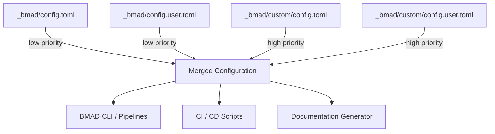

# Other — _bmad

# Other — `_bmad` Module

## 1. Purpose
The `_bmad` directory contains the **BMAD (Business‑Model‑Architecture‑Documentation)** configuration that drives the automated generation of project artifacts, test assets, and team‑specific agents. It is a *read‑only* artifact produced by the installer; developers should never edit the files directly. Instead, custom overrides are placed under `_bmad/custom/` to tailor the configuration without risking loss on reinstall.

## 2. Configuration Files

| File | Description | Editable? |
|------|-------------|-----------|
| `_bmad/config.toml` | Base configuration generated by the installer. Contains core project settings, module‑specific paths, and default agent definitions. | **No** – regenerated on each install. |
| `_bmad/config.user.toml` | User‑scoped answers captured during installation (e.g., name, language). | **No** – regenerated on each install. |
| `_bmad/custom/config.toml` | Team‑level overrides (committed to VCS). | **Yes** – persists across installs. |
| `_bmad/custom/config.user.toml` | Personal overrides (git‑ignored). | **Yes** – persists across installs. |

### 2.1 Placeholder Syntax
Values may contain the placeholder `{project-root}` which is resolved at runtime to the absolute path of the repository root. All path values are expressed relative to this placeholder for portability.

## 3. Core Section (`[core]`)

| Key | Meaning | Default |
|-----|---------|---------|
| `project_name` | Human‑readable identifier for the repository. | `"aigency-router-v2"` |
| `document_output_language` | Language used for generated documentation. | `"English"` |
| `output_folder` | Destination for all generated artifacts. | `"{project-root}/_bmad-output"` |
| `user_name` *(user file)* | Name of the installer operator. | `"REID"` |
| `communication_language` *(user file)* | Preferred language for generated prose. | `"English"` |

## 4. Module Settings

### 4.1 BMM Module (`[modules.bmm]`)
Defines locations for Business‑Model‑Mapping artifacts.

| Key | Description |
|-----|-------------|
| `planning_artifacts` | Path for planning‑phase deliverables. |
| `implementation_artifacts` | Path for implementation‑phase deliverables. |
| `project_knowledge` | Path to the project's documentation repository (e.g., `docs`). |

### 4.2 TEA Module (`[modules.tea]`)
Controls test‑automation configuration.

| Key | Description |
|-----|-------------|
| `test_artifacts` | Root folder for all test‑related outputs. |
| `tea_use_playwright_utils` | Enable Playwright helper utilities (`true`/`false`). |
| `tea_use_pactjs_utils` | Enable Pact‑JS utilities (`true`/`false`). |
| `tea_pact_mcp` | Pact mock‑consumer‑provider mode (`"none"` by default). |
| `tea_browser_automation` | Browser automation strategy (`"auto"` selects best‑available). |
| `tea_execution_mode` | Execution mode (`"auto"` selects CI/Local automatically). |
| `tea_capability_probe` | Run a capability probe before test execution (`true`). |
| `test_stack_type` | Stack selection (`"auto"`). |
| `ci_platform` | CI platform detection (`"auto"`). |
| `test_framework` | Test framework detection (`"auto"`). |
| `risk_threshold` | Risk level that triggers a failure (`"p1"`). |
| `test_design_output` | Folder for generated test‑design artifacts. |
| `test_review_output` | Folder for test‑review artifacts. |
| `trace_output` | Folder for traceability matrices. |

## 5. Agent Definitions (`[agents.*]`)

Agents are *persona* objects used by BMAD pipelines to generate content in a role‑aware style. Each agent is bound to a module (`bmm` or `tea`) and a team.

| Agent ID | Module | Team | Name | Title | Icon | Description |
|----------|--------|------|------|-------|------|-------------|
| `bmad-agent-analyst` | `bmm` | `software-development` | Mary | Business Analyst | 📊 | Applies Porter’s Five Forces and Minto’s Pyramid Principle; evidence‑driven. |
| `bmad-agent-tech-writer` | `bmm` | `software-development` | Paige | Technical Writer | 📚 | Generates CommonMark, DITA, OpenAPI; prefers diagrams. |
| `bmad-agent-pm` | `bmm` | `software-development` | John | Product Manager | 📋 | Drives Jobs‑to‑Be‑Done, focuses on user value. |
| `bmad-agent-ux-designer` | `bmm` | `software-development` | Sally | UX Designer | 🎨 | Crafts user‑centric stories, iterates from simple to complex. |
| `bmad-agent-architect` | `bmm` | `software-development` | Winston | System Architect | 🏗️ | Prioritises stability, ties tech decisions to business value. |
| `bmad-agent-dev` | `bmm` | `software-development` | Amelia | Senior Software Engineer | 💻 | Enforces test‑first discipline, concise commit messages. |
| `bmad-agent-tea` | `tea` | `software-development` | Murat | Master Test Architect | 🧪 | Provides risk‑based testing strategy, supports Playwright, Pact, k6, etc. |

### 5.1 Accessing Agent Metadata
Agents are consumed by the BMAD pipelines via a simple TOML deserialization step:

```python
import tomllib  # Python 3.11+ or toml library for older versions

with open("_bmad/config.toml", "rb") as f:
    cfg = tomllib.load(f)

agents = cfg["agents"]
# Example: agents["bmad-agent-analyst"]["description"]
```

The same pattern applies to the user‑level and custom overrides; later files overlay earlier ones (custom > user > base).

## 6. Customization Workflow

1. **Never edit** `_bmad/config.toml` or `_bmad/config.user.toml`.  
2. To **pin a value** regardless of installer answers, create or edit:
   - `_bmad/custom/config.toml` (team‑wide, version‑controlled) **or**
   - `_bmad/custom/config.user.toml` (personal, git‑ignored).
3. The installer merges files in the following precedence (high → low):
   ```
   custom/config.toml
   custom/config.user.toml
   config.user.toml
   config.toml
   ```
4. After editing a custom file, re‑run any BMAD generation command; the parser will automatically pick up the overridden values.

## 7. Integration Points

- **BMAD Pipelines**: The BMAD CLI (`bmad generate …`) reads the merged configuration to locate output folders, decide which test utilities to enable, and select the appropriate agent persona for each generation step.
- **CI/CD**: CI scripts reference `modules.tea.ci_platform` and `modules.tea.test_framework` to auto‑detect the environment and select the correct test runner.
- **Documentation Generation**: The `document_output_language` and `project_name` values are injected into generated Markdown/DITA files.

> **Note:** The `_bmad` module does not contain executable code; it is a pure data source. Consequently, there are no internal or external call graphs.

## 8. Example Override

```toml
# _bmad/custom/config.toml
[core]
project_name = "aigency-router-v2‑custom"

[modules.bmm]
implementation_artifacts = "{project-root}/custom-impl-artifacts"

[agents.bmad-agent-dev]
description = "Focuses on TDD, strict linting, and micro‑service boundaries."
```

The above overrides change the project name, redirect implementation artifacts, and refine the senior engineer’s description without touching the installer‑generated files.

## 9. Diagram (Optional)



*The diagram shows the precedence order of configuration files and the three primary consumers of the merged configuration.*

## 10. Best Practices

- **Version‑control custom overrides** (`custom/config.toml`) to keep team‑wide defaults reproducible.
- **Keep personal overrides** (`custom/config.user.toml`) out of the repository; they are ideal for local development quirks.
- **Never commit changes** to the installer‑generated files; they will be overwritten on the next `bmad install`.
- **Validate TOML syntax** after editing custom files (`toml-lint` or IDE support) to avoid pipeline failures.
- **Leverage placeholders** (`{project-root}`) for all path values to maintain portability across machines and CI agents.

## 11. Frequently Asked Questions

| Question | Answer |
|----------|--------|
| *Can I add new agents?* | Yes. Add a new `[agents.<id>]` table in a custom config file. Ensure the `module` field matches an existing module (`bmm` or `tea`). |
| *What happens if a key is missing?* | The BMAD pipelines fall back to the installer defaults. Missing keys in custom files simply do not override the base values. |
| *How do I change the language of generated docs?* | Edit `core.document_output_language` in a custom config file (e.g., `"Spanish"`). |
| *Is there a programmatic API to read the config?* | The module is data‑only; any language with TOML support can deserialize the merged file. No dedicated API is provided. |

--- 

*End of `_bmad` module documentation.*